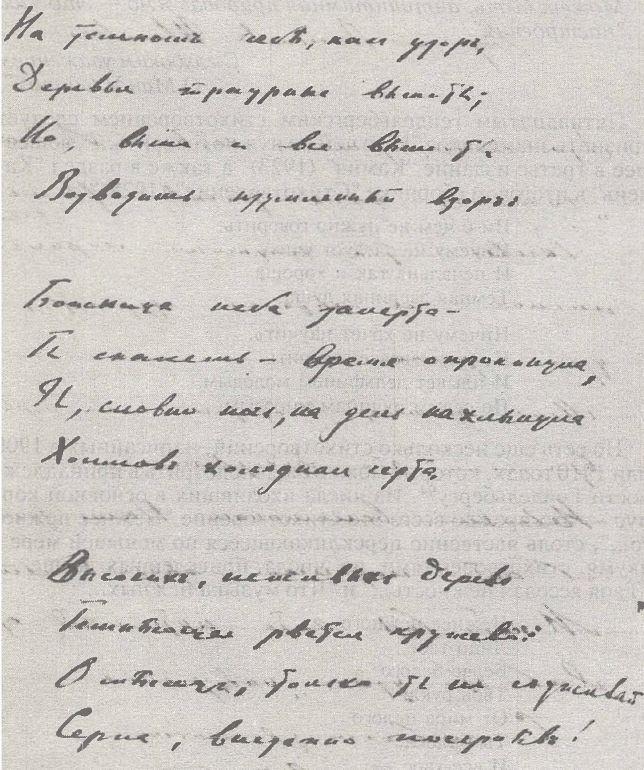

# ПОЭТ 

> Ничего не надо говорить, 
> Ничему не следует учить...
>
> О. Мандельштам[^71]

...Мы не знаем, как Мандельштам учился, сколь исправно он посещал лекции и семинары — хотя бы те, на которые записался и за которые заплатил. Но мы точно знаем, что был он занят и другим, и, может статься, это другое как раз и было для него самым главным уже тогда.

Другое — это, конечно, стихи.

Вернемся в Россию, в начало 1909 года.

Весной Мандельштам, вероятно, познакомился с Гумилевым (если только они не были знакомы годом раньше — с того времени, когда оба находились в Париже). 23 апреля он впервые попадает в квартиру Вячеслава Иванова на Таврической, на заседание "Академии стиха” в знаменитой ивановской "Башне”, но стихов своих в этот раз он, кажется, не читал. Его литературное крещение в ивановской "Проакадемии" состоялось вскоре — 16 мая. Присутствовали, кроме него и хозяина, М.Замятнина, Е.Дмитриева, П.Потемкин, В.Ивой- лов(Княжнин), Б.Мосолов, В.Гофман, В.Пяст, Е.Герцык. Пяст написал об этом вечере в своих мемуарах: "...Однажды пришел... Виктор Гофман в сопровождении совсем молодого стройного юноши в штатском костюме, задиравшего голову даже не вверх, а прямо назад: столько чувства собственного достоинства бурлило и просилось наружу из этого молодого тела. Это был Осип Мандельштам. По окончании лекции и ответов аудитории ему предложили прочесть стихи. Не знаю, как другим (Вяч.Иванов, конечно, хвалил, — но ведь это было его всегдашним обыкновением!), но мне чрезвычайно понравились его стихотворения"[^72].

Второе майское событие, которое хочется отметить, — это сдача 27 мая экзамена по латыни за 8 классов мужской гимназии[^73]. И, хотя, по-видимому, сам экзамен не принес особой радости ни экзаменатору, ни абитуриенту, но еще один необходимый шаг для получения права на университетское образование был сделан.

Можно предположить, что встреча с Вячеславом Ивановым и его похвала произвели на 19-летнего поэта сильнейшее впечатление, заставили привязаться к этой безусловно незаурядной личности — признанному метру и теоретику символизма. Вне всякого сомнения и то, что в это время Мандельштам прочел если не все, то почти все, что писал и печатал его знаменитый старший современник. Поэтому столь простым и естественным казалось ему поддерживать установившиеся отношения и на расстоянии: не будучи в Петербурге, он завязывает с ним серьезную и вместе с тем весьма странную переписку. Странную уже потому, что Иванов, кажется, так ни разу и не ответил ни на одно письмо — может быть, по занятости, а может, — будучи шокирован тем граничащим с непочтительностью тоном поэтического, "братского” равноправия, в котором к нему обращался молодой, даровитый, конечно, но вместе с тем и столь "невоспитанный" поэт, не чувствующий установленной им, метром, дистанции. Первое письмо Мандельштама было отправлено 20 июня из Павловска (в Царском Селе Мандельштам жил до отъезда за границу):

> Ваши семена глубоко запали в мою душу, и я пугаюсь, глядя на громадные ростки. Радую себя надеждой встретить Вас где-нибудь летом. Почти испорченный Вами, но... исправленный
>
> Осип Мандельштам[^74].

Одним из таких семян, быть может, был и совет поехать учиться в Германию: подозревать в этом совете Вячеслава Иванова, берлинского ученика Теодора Моммзена, не покажется натяжкой.

Следующая зафиксированная летописью дата — 28 июля, а если сделать поправку на новый стиль, то 9 августа. Этим числом датирована посланная из Берлина открытка брату Александру в Мустамяки (дача Чебакова). На ней изображена открытая терраса винного заведения (Weinhaus) "Rheingold"; текст гласит:

> Дорогой Шурочка!
>
> Сижу тут и дожидаюсь поезда. Вспомнил о тебе и решил послать тебе это вещественное доказательство своих губительных наклонностей. Одновременно пишу маме.
>
> Твой Ося[^75].

Поезд, которого дожидался Осип Эмильевич, всего вероятнее, отправлялся в Швейцарию. Это явствует из второго письма Мандельштама В.Иванову, посланного 13(26) августа из знаменитого курорта Монтрё, что на берегу Лемана — Женевского озера[^76]:

> ...Две недели я жил в Beatenbergе[^77], но потом решил провести несколько недель в санатории и переехал в Montreux. Теперь я наблюдаю странный контраст: священная тишина санатории, прерываемая обеденным гонгом — и вечерняя рулетка в казино: faites vos jeux, messieurs! — remarquez, messieurs! — rien ne va plus![^78] — восклицания croupiers[^79] — полные символического ужаса. У меня странный вкус: я люблю электрические блики на поверхности Лемана, почтительных лакеев, бесшумный полет лифта, мраморный вестибюль Hotels и англичанок[^80], играющих Моцарта с двумя-тремя официальными слушателями в полутемном салоне. Я люблю буржуазный, европейский комфорт и привязан к нему не только физически, но и сантиментально. Может быть, б этоле виновато слабое здоровье? Но я никогда не спрашиваю себя, хорошо ли это.
> <...> Напишите мне также, В<ячеслав> И<ванович>, какие теперь в Германии есть лирики. Кроме Dhemel'я[^81], я не знаю ни одного. Немцы тоже не знают — а лирики все-таки должны быть.

К письму приложены стихотворения "Истончается тонкий тлен...", "Ты улыбаешься кому..." и "В просторах сумеречной залы...". Первое из них вошло в состав подборки, с которой Мандельштам спустя год дебютировал на страницах "Аполлона"[^82].

Четырьмя днями позже из Монтрё улетело еще одно письмо в Россию — открытка Иннокентию Анненскому в Царское Село:

> Глубокоуважаемый г.Анненский!
> Сообщаю Вам свой адрес на случай, если он будет нужен редакции "Аполлона'”. Montreax-Tearitat Sanatorium l'Abri.
> С глубоким почтением Осип Мандельштам[^83].

Похоже на то, что из Монтрё Мандельштам одно время собирался заехать в Петербург. Думать таким образом заставляют выдержки из дневника В.И.Иванова за 5-6 сентября 1909 года. Вот запись от 5.09.1909 :"Секретарь Маковского <Зноско-Боровский — П.Н.> пишет, что Аполлон благодарит за доставленное. Я устроил стихи Верховского туда, так что больной <Маковский — П.Н.> просит заехать к нему (собираюсь завтра, чтобы передать стихи Бородаевского и устроить комнату для Мандельштама, о чем просил сегодня Ауслендер)".

Запись от 6.09.1909: "Был у больного Маковского... Устроено тотчас для Мандельштама (он велел секретарю послать 25 рублей)"[^84].
Во всяком случае 6(19) сентября Мандельштама в Петербурге не было, раз деньги — а это скорее всего гонорар за стихи, принятые в "Аполлон" еще весной или в начале лета — нужно было куда-то посылать.

Куда? В Монтрё?

Может быть, но вероятнее всего — уже в Гейдельберг. За это говорит встреча Мандельштама с Д.С.Мережковским в Гейдельберге, о которой Мандельштам писал Волошину[^85]. Судя по календарю Мережковских, она могла состояться только между 9(22) и 16(29) сентября[^86].

Вот упомянутое письмо Волошину, открывающее вереницу гейдельбергских писем поэта:

> Глубокоуважаемый Макс Александрович!
> Оторванный от стихии русского языка — более чем когда-либо, — я вынужден составить сам о себе ясное суждение. Те, кто отказывают мне во внимании, только помогают мне в этом. Так помог мне Мережковский[^87], который на этих днях, проездом в Гейдельберг, не пожелал выслушать ни строчки моих стихов, помог мне милый Вячеслав Ивановичу который, яри искреннем ко мне доброжелательстве, не ответил мне на письмо, о котором просил однажды. С Яялш я только встретился. Но почему-то я надеюсь, что Ваше участие в моей трудной работе будет немного иным. пожелаете обрадовать меня своим отзывом и советом — лшя адрес: Heidelberg, Anlage 30. Stud. phil. Mandelstam".

К письму приложено пять стихотворений: "В холодных переливах лир...”, "Твоя веселая нежность...”, "Не говорите мне о вечности...", "На влажный камень возведенный..." и "В безветрии моих садов...". Думается, что можно рискнуть отнести эти стихотворения к числу написанных — не позднее 20-х чисел сентября 1909 — в Гейдельберге.

Вчитаемся в тексты. Не будем при этом наивно надеяться, что встретим в стихах непременно те или другие гейдельбергские реалии — Мандельштам крайне редко мгновенно откликался на события, непосредственно предшествовавшие стиху. И тем не менее!..

> В холодных переливах лир 
> Какая замирает осень!
> Как сладостен и как несносен 
> Ее золотострунный клир!
> 
> Она поет в церковных хорах 
> И в монастырских вечерах 
> И, рассыпая в урны прах,
> Печатает вино в амфорах.

> Как успокоенный сосуд 
> С уже отстоенным раствором,
> Духовное — доступно взорам,
> И очертания живут.

> Колосья, так недавно сжаты,
> Рядами ровными лежат;
> И пальцы тонкие дрожат,
> К таким же, как они, прижаты.

В стихотворении узнается сравнительно ранняя — "золотая" — осень, когда завершается уборочная страда и природа замирает, словно из солидарности с земледельцами.

Любовная линия, обозначенная в конце (прижатые друг к другу пальцы), возобладала в следующем стихотворении, которое производит впечатление наброска, написанного по горячим следам:

> Твоя веселая нежность 
> Смутила меня.
> К чему печальные речи,
> Когда глаза Горят, как свечи,
> Среди белого дня?
>
> Среди белого дня...
> И та — далече —
> Одна слеза,
> Воспоминание встречи;
> И, плечи клоня,
> Приподымает их нежность.

В третьем стихотворении, если понимать его в гейдельбергском контексте, обозначен новый этап переживаний влюбленного студента — этап, которого вполне можно было ожидать: учебные обязательства и лирическое чувство вступили друг с другом в конфликт[^88].

> Не говорите мне о вечности —
> Я не могу ее вместить.
> Но как же вечность не простить 
> Моей любви, моей беспечности?
>
> Я слышу, как она растет 
> И полуночным валом катится,
> Но — слишком дорого поплатится,
> Кто слишком близко подойдет.
>
> И тихим отголоскам шума я 
> Издалека бываю рад —
> Ее пенящихся громад, —
> О милом и ничтожном думая.

Но любовная история развивается явно не так, как мечталось бы Мандельштаму. О мстительности угрюмо-каменного и недобродушного Амура и о страданиях живого поэта — в следующем стихотворении:

> На влажный камень возведенный,
> Амур, печальный и нагой,
> Своей младенческой ногой 
> Переступает, удивленный
>
> Тому, что в мире старость есть —
> Зеленый мох и влажный камень —
> И сердца незаконный пламень —
> Его ребяческая месть.
>
> И начинает ветер грубый 
> В наивные долины дуть:
> Нельзя достаточно сомкнуть 
> Свои страдальческие губы.

В нем же, кстати, узнаваема и топография Гейдельберга: обдуваемые ветрами "наивные долины". (Впрочем, поиски в городе реального фонтана с занесенной для шага ножкой люоверазящего младенца оказались тщетными; не исключено, что таковой и был во времена Мандельштама, когда фонтанчики и как бы текущие из скалы или стены дома роднички служили не только декорациями и были здесь почти что на каждом шагу).

В пятом — и последнем из числа посланных Волошину — стихотворении совершается процесс мнимой самоизоляции лирического героя, попытки вытеснения столь дорогого недавно образа чем-то иным, быть может, метафизикой собственных переживаний, замыканием на самого себя. Мандельштам как бы осекается в конце — ввиду явной угрозы сорваться в привычно-лирическое, не утратившее своей болезненности русло.

> В безветрии моих садов 
> Искусственная никнет роза;
> Над ней не тяготит угроза 
> Неизрекаемых часов.
>
> В юдоли дольней бытия 
> Она участвует невольно;
> Над нею небо безглагольно 
> И ясно, — и вокруг нея
>
> Немногое, на чем печать 
> Моих пугливых вдохновений 
> И трепетных прикосновений,
> Привыкших только отмечать.

По поводу пятого стиха Мандельштам написал Волошину еще раз. Первоначально там было: "В безвыходности бытия". Сообщив поправку, автор отозвался о первоначальном варианте так: он "торчит, как оглобля".

Следующая надежная веха — письмо Вячеславу Иванову из Гейдельберга от 13(26) октября:

> Дорогой Вячеслав Иванович!
> Если вам хочется мне написать и вы не отвечаете мне по какой-нибудь внешней причине, то все-таки напишите мне. Я хочу многое вам сказать, но не могу, не умею до этого.
> Любящий вас Осип Мандельштам,.
> Heidelberg. Anlage 30.

Любящий Мандельштам напоминает о своем двухмесячной давности письме из Монтрё, как бы откладывая еще недели на две вопрос о своей вероятной обиде на молчание метра. Но 22 октября(4 ноября) Мандельштам снова пишет В.Иванову — забыв или отбросив обещание обидеться (а может быть, получив какую-нибудь весточку с "Башни" на Таврической — в чем, впрочем, заставляет усомниться вызывающее "по-прежнему" в начале этого письма). Итак:

> По-прежнему дорогой Вячеслав ИвановичI
> Не могу не сообщить вам свои лирические искания и достижения. Насколько первыми я обязан вам — настолько вторые принадлежат вам по праву, о котором вы, быть может, и не думаете.
> Ваш Осип Мандельштам.

К письму приложены стихотворения: "В холодных переливах лир...", "Озарены луной ночевья...", "Твоя веселая нежность...", "Не говорите мне о вечности...", "На влажный камень возведенный..." и "Бесшумное веретено...". Четыре из них нам уже знакомы по письму Волошину (текстуальных разночтений между ними нет), новыми являются лишь два — "Озарены луной ночевья...” и "Бесшумное веретено..." (их, стало быть, можно датировать временем не позднее начала ноября 1909 г.).

Первое из них написано как будто перед распахнутым в холодную ночь окном (к слову сказать, рябина, хотя и редко, но встречается на склонах Гайсберга):

> Озарены луной ночевья 
> Бесшумной мыши полевой;
> Прозрачными стоят деревья,
> Овеянные темнотой, —
>
> Когда рябина, развивая 
> Листы, которые умрут,
> Завидует, перебирая 
> Их выхоленный изумруд, —
>
> Печальной участи скитальцев 
> И нежной участи детей;
> И тысячи зеленых пальцев 
> Колеблет множество ветвей.

Во втором — поэт как бы отдает дань отвергнутой им ради любви философии и пытается философски взглянуть именно на любовь (одновременно он не может отказать себе в трудном удовольствии решить формальную задачу оригинальнозаковыристой строфы на две сквозные рифмы)[^89]:

> Бесшумное веретено 
> Отпущено моей рукою.
> И — мною ли оживлено —
> Переливается оно 
> Безостановочной волною —
> Веретено.
> 
> Все одинаково темно;
> Все в мире переплетено 
> Моею собственной рукою;
> И, непрерывно и одно,
> Обуреваемое мною 
> Остановить мне не дано —
> Веретено.

Итак, Мандельштам послал В.Иванову шесть, а Волошину — пять стихотворений, причем четыре из них совпадают. Можно предположить, что все эти стихи объединяет и место их написания: рискнем утверждать, что это Гейдельберг. Об этом же говорит и наличие некоего сюжета в сложившейся таким образом подборке.

Но семью этими стихотворениями выделяемый нами сугубо условно гейдельбергский цикл (мы отдаем себе отчет в том, что такое настоящий цикл!) далеко не ограничился.

Следующее из дошедших до нас писем В.Иванову — приблизительно от 11-12(24-25) ноября — не что иное, как записка, приложенная еще к четырем стихотворениям:

> Дорогой Вячеслав Иванович!
> Вот еще — стихи. Неизменно вас любящий
> Осип Мандельштам".

Впрочем, письмо примечательно и тем, что начато в вагоне поезда Франкфурт — Карлсруэ — Базель и закончено в Гейдельберге. Едва ли это говорит о поездке в Швейцарию — мало ли куда идут поезда, в которые мы садимся, но определенно фиксирует поездку во Франкфурт, — быть может, аукнувшуюся в 1932 году в стихотворении "К немецкой речи” строчками: ’’Еще во Франкфурте отцы зевали, Еще о Гете не было известий...."!

Какие же стихотворения были приложены к письму? Это — "Если утро зимнее темно...", "Пустует место. Вечер длится...", "В смиренномудрых высотах...", "Дыханье вещее в стихах моих..." (соответственно, все эти стихи написаны не позднее 12 ноября 1909 года — дня имматрикуляции).

> Если утро зимнее темно,
> То — холодное твое окно 
> Выглядит, как строгое панно:
>
> Зеленеет плющ перед окном;
> И стоят под ледяным стеклом 
> Тихие деревья под чехлом —
>
> Ото всех ветров защищены,
> Ото всяких бед ограждены 
> И ветвями переплетены.
> 
> Полусвет становится лучист.
> Перед самой рамой — шелковист —
> Содрогается последний лист.

Окно — то же самое, но уже не по-летнему распахнутое и не по-осеннему приоткрытое, а по-зимнему затворенное. И все-таки — еще зелен плющ (как это характерно для Гейдельберга!) и не сорвался еще последний дрожащий лист!

> Пустует место. Вечер длится,
> Твоим отсутствием томим.
> Назначенный устам твоим,
> Напиток на столе дымится.
>
> Так ворожащими шагами 
> Пустынницы не подойдешь;
> И на стекле не проведешь 
> Узора спящими губами;
>
> Напрасно резвые извивы —
> Покуда он еще дымит —
> В пустынном воздухе чертит 
> Напиток долготерпеливый.

О зиме здесь — длящийся вечер и пустынный воздух. Все остальное — о любви: ее не пускают в дверь, а она проникает в стихи с горячим паром дымящегося кофе или, возможно, шоколада.

> В смиренномудрых высотах 
> Зажглись осенние Плеяды.
> И нету никакой отрады,
> И нету горечи в мирах.
>
> Во всем однообразный смысл 
> И совершается свобода:
> Не воплощает ли природа 
> Гармонию высоких числ?
>
> Но выпал снег — и нагота 
> Деревьев траурною стала;
> Напрасно вечером зияла 
> Небес златая пустота;
>
> И — белый, черный, золотой —
> Печальнейшее из созвучий —
> Отозвалося неминучей 
> И окончательной зимой.

После того как выпал снег, зима, как видим, названа уже "окончательной". Белизна снега, чернота деревьев и золото звезд в черноте ночи — таким колористическим аккордом предстает поэту зимний Гейдельберг. Но взгляд его не останавливается на городе, а скользит все выше и выше, углубляясь в гармонию освобожденной ото всего природы. (Возможно, что в этом или следующем стихотворении отозвалось что- нибудь из услышанного поэтом на лекциях[^90]).

> Дыханье вещее в стихах моих 
> Животворящего их духа,
> Ты прикасаешься сердец каких —
> Какого достигаешь слуха?
> 
> Или пустыннее напева ты 
> Тех раковин, в песке поющих,
> Что круг очерченной им красоты 
> Не разомкнули для живущих?

Это стихотворение не скрывает своих многочисленных связей со стихотворениями так называемого основного корпуса — включенными поэтом позднее в первое или последующие издания "Камня" (сравните, к примеру со стихотворением "Дано мне тело — что мне делать с ним..." — см. ниже).
Еще два стихотворения были приложены к следующему письму (записке?) В.Иванову из Гейдельберга, от 13/26 декабря:

> Дорогой Вячеслав Иванович!
> Может быть, Вы прочтете эти стихи? С глубоким уважением
> Осип Мандельштам.
> Р.5. Извините за все дурное, что Вы от меня получили\

Это — "Нету иного пути..." и "Что музыка нежных..." (которые можно датировать также не позднее 13 декабря 1909 года).

> Нету иного пути,
> Как через руку твою —
> Как же иначе найти 
> Милую землю мою?
>
> Плыть к дорогим берегам,
> Если захочешь помочь:
> Руку приблизив к устам,
> Не отнимай ее прочь.
>
> Тонкие пальцы дрожат;
> Хрупкое тело живет:
> Лодка, скользящая над 
> Тихою бездною вод.

И это, и следующее стихотворения подхватывают прежде всего любовную тему цикла:

> Что музыка нежных
> Моих славословий 
> И волны любови 
> В напевах мятежных,
>
> Когда мне оттуда 
> Протянуты руки,
> Откуда и звуки 
> И волны откуда, —
>
> И сумерки тканей 
> Пронизаны телом —
> В сиянии белом 
> Твоих трепетаний?

Завершающее 1909 год письмо к В.Иванову, трактующее "природу ямба", содержало стихотворение "На темном небе, как узор...":

> На темном небе, как узор,
> Деревья траурные вышиты.
> Зачем же выше и все выше ты 
> Возводишь изумленный взор?
>
> — Вверху — такая темнота, —
> Ты скажешь, — время опрокинула 
> И, словно ночь, на день нахлынула 
> Холмов холодная черта.
>
> Высоких, неживых дерев 
> Темнеющее рвется кружево:
> О, месяц, только ты не суживай 
> Серпа, внезапно почернев!

К письму приложен еще один автограф, разнящийся от основного текста в двух местах: в стихе 3 — "Но выше и все выше ты" и в стихе 5 — "Божница неба заперта.—". О самом стихотворении говорится, что оно

> "...хотело бы быть "romance sans paroles". (Dans Гinterminableennui...)[^91]. "Paroles"[^92]— m.e. интимнолирическое, личное — я пытался сдержать, обуздать уздой ритма. Меня занимает, достаточно ли крепко взнуздано это стихотворение? Невольно вспоминаю Ваше замечание об антилирической природе ямба. Может быть, антиинтимная природа? Ямб — это узда "настроения".
> С глубоким уважением О. Мандельштам.

Пятнадцатым гейдельбергским стихотворением следует признать знаменитое "Ни о чем не нужно говорить...", вошедшее в третье издание "Камня" (1923), а также в раздел "Камень" в итоговом сборнике "Стихотворения" (1928)[^93].

> Ни о чем не нужно говорить,
> Ничему не следует учить,
> И печальна так и хороша 
> Темная звериная душа:
>
> Ничему не хочет научить,
> Не умеет вовсе говорить 
> И плывет дельфином молодым 
> По седым пучинам мировым.

Но есть еще несколько стихотворений, написанных в 1909 или 1910 годах, которые можно бы заподозрить в принадлежности Гейдельбергу[^94]. Из числа входивших в основной корпус — это прежде всего это стихотворение "Нежнее нежного...", столь явственно перекликающееся по меньшей мере с двумя стихотворениями из числа приведенных выше — "Твоя веселая нежность..." и "Что музыка нежных...":

> Нежнее нежного 
> Лицо твое,
> Белее белого 
> Твоя рука,
> От мира целого 
> Ты далека,
> И все твое —
> От неизбежного.
>
> От неизбежного —
> Твоя печаль 
> И пальцы рук 
> Неостывающих,
> И тихий звук
> Неунывающих
> Речей,
> И даль 
> Твоих очей.

К числу "подозрительных" можно отнести еще два стицеломудренные чары..." угадывается эллинский пантеон, неплохо представленный в античной коллекции Гейдельбергского университета (в то же время "часы внимательных закатов" у "тщательно обмытых ниш" заставляют думать и о Швейцарии, о Монтрё):

> Есть целомудренные чары:
> Высокий лад, глубокий мир;
> Далеко от эфирных лир 
> Мной установленные лары.
>
> У тщательно обмытых ниш 
> В часы внимательных закатов,
> Я слушаю моих пенатов 
> Всегда восторженную тишь.
>
> Какой игрушечный удел,
> Какие робкие законы 
> Приказывает торс точеный 
> И холод этих хрупких тел!
>
> Иных богов не надо славить:
> Они как равные с тобой!
> И, осторожною рукой,
> Позволено их переставить.

Еще теснее перекличка со стихотворением "Дано мне тело — что мне делать с ним...", вошедшим в первое издание "Камня" (1913) под заглавием "Дыхание":

> Дано мне тело — что мне делать с ним.
> Таким единым и таким моим?
>
> За радость тихую дышать и жить 
> Кого, скажите, мне благодарить?
>
> Я и садовник, я же и цветок,
> В темнице мира я не одинок.
>
> На стекла вечности уже легло 
> Мое дыхание, мое тепло.
>
> Запечатлеется на нем узор,
> Неузнаваемый с недавних пор.
>
> Пускай мгновения стекает муть —
> Узора милого не зачеркнуть.

Из стихотворений 1909 года, не включенных в основной корпус, по крайней мере те, что были отправлены В.Иванову из Монтрё, написаны до Гейдельберга: "Истончается тонкий тлен...", "Ты улыбаешься кому..." и "В просторах сумеречной залы...".

Все остальные — весьма и весьма "подозрительны”. Вот стихотворение "В морозном воздухе растаял легкий дым...":

> В морозном воздухе растаял легкий дым,
> И я, печальною свободою томим,
> Хотел бы вознестись в холодном, тихом гимне, 
> Исчезнуть навсегда, но суждено идти мне
>
> По снежной улице, в вечерний этот час —
> Собачий слышен лай и запад не погас 
> И попадаются прохожие навстречу...
> — Не говори со мной! Что я тебе отвечу?

Это очевидно "зимнее" стихотворение, датированное по дневнику С.П.Каблукова, впрочем, могло быть написано и в начале 1909 года — периоде, о котором мы мало что знаем.

Стихотворение "Сквозь восковую занавесь..." по-своему перекликается со стихотворением "На темном небе, как узор..." — кажется, что и оно имеет задачу обуздать свой размер.

> Сквозь восковую занавесь,
> Что нежно так сквозит,
> Кустарник из тумана весь 
> Заплаканный глядит.
>
> Простор, канвой окутанный,
> Безжизненней кулис,
> И месяц, весь опутанный,
> Беспомощно повис.
>
> Темнее занавеситься,
> Все небо охватить:
> И пойманного месяца 
> Совсем не отпустить.

Стихотворение "Здесь отвратительные жабы..." — по сочетанию размера и содержания — служит мостом между стихотворениями "Озарены луной ночевья..." и "Бесшумное веретено":

> Здесь отвратительные жабы 
> В густую прыгают траву.
> Когда б не смерть, так никогда бы 
> Мне не узнать, что я живу.
>
> Вам до меня какое дело,
> Земная жизнь и красота?
> А та напомнить не сумела,
> Кто я и кто моя мечта.

Соглашаясь с датировкой "1909м, данной по стилистическим признакам в литпамятниковском "Камне" стихотворениям "Музыка твоих шагов..." и "Пилигрим", отметим, что отнести их предположительно к гейдельбергскому периоду заставляет главным образом содержание (холод, снег, мороз):

> Музыка твоих шагов 
> В тишине лесных снегов,
>
> И, как медленная тень 
> Ты сошла в морозный день.
>
> Глубока, как ночь, зима,
> Снег висит, как бахрома.
>
> Ворон на своем суку 
> Много видел на веку.
>
> А встающая волна 
> Набегающего сна
>
> Вдохновенно разобьет 
> Молодой и тонкий лед,
>
> Тонкий лед моей души —
> Созревающей в тиши.

> ПИЛИГРИМ
>
> Слишком легким плащом одетый,
> Повторяю твои обеты.
>
> Ветер треплет края одежды —
> Не оставить ли нам надежды?
> 
> Плащ холодный — пускай скитальцы 
> Безотчетно сжимают пальцы.
>
> Ветер веет неутомимо,
> Веет вечно и веет мимо.

Таким образом, число стихотворений, написанных предположительно в Гейдельберге, внушительно: от пятнадцати до двадцати трех. Может быть, их было и больше, может, и меньше, но в любом случае мы столкнулись с явлением самого интенсивного творческого подъема у раннего Мандельштама: вплоть до своих феноменальных тридцатых годов он ничего подобного не испытывал![^95]

Сведения о том, как провел Мандельштам ту часть зимнего семестра, что пришлась на 1910 год, исключительно скудны. По существу, единственной надежной датой может послужить лишь доклад А.Штейнберга "Искусство и критика”, состоявшийся 10 февраля (28 января?) 1910 года, по-видимому, в Пироговской читальне.

Арон Штейнберг и его старший брат Исаак и были теми двумя российскими евреями из трех (третьим был Йозеф Мандельштам), что записались не на медицинский, не на именно на философский факультет. Они были одними из тех немногих соотечественников, с кем учеба в Гейдельберге свела Мандельштама достаточно близко. Почти ровесник Мандельштама (он родился 12 июня 1891 года в Двинске), А.Штейнберг в Гейдельберге появился еще в зимнем семестре 1907/1908 года, учился сначала все-таки на юридическом[^96], потом на философском факультетах (жил — вместе с братом[^97] — на Унтер-Неккарштрасе, 28, у госпожи Зайлер). Будущий сотрудник философского отдела "Русской мысли", один из учредителей петроградской Вольной Философской ассоциации (Вольфилы), сокамерник Блока во время его ареста Петроградской ЧК 15/16 февраля 1919 года, эмигрант с 1924 года и впоследствии активнейший деятель Всемирного еврейского конгресса, — он оказался, по сути, единственным человеком, свидетельствующим о гейдельбергской жизни Мандельштама.

Отголоски этой жизни вкраплены в книгу его воспоминаний, начинающуюся столь для интригующе для нашей темы:

"В 1910 году я был уже третий год студентом философского факультета Гейдельбергского университета в Германии. В это же время я начал увлекаться русской поэзией и меня стал одолевать порыв самому писать стихи. Увлечение поэзией мешало занятиям в университете. Иногда бьешься-бьешься над каким-нибудь философским вопросом, кажется, никогда не постигнешь того, что хотел сказать Кант своей трансцендентальной дедукцией категорий, а тут промелькнет облачко на закатном небе — напишешь строчку-другую, и кажется тебе, что никаких проблем и не существовало, что они расплывутся, вот так же, как это облачко над долиной Неккара... Одно мешало другому. И я решил: если какой-нибудь уважаемый и признанный мастер русского стихосложения скажет мне откровенно, что в моих стихотворных упражнениях есть какой-то смысл, я начну заниматься поэзией, а если он посоветует мне заниматься чем угодно, но не стихами, я и тут послушаюсь его"[^98].

Увы, в книге нет ни единого упоминания о поэте, который учился вместе с Ароном Штейнбергом — о Мандельштаме![^99]

И все-таки благодаря Штейнбергу нам известны имена еще нескольких людей, с которыми Мандельштам встречался и общался в Гейдельберге. Так, в устной беседе Арон Захарович назвал — а Кларенс Браун обнародовал (с пометкой: "для будущих исследователей") — имена двух соотечественников, игравших, по-видимому, заметную роль в жизни русской колонии. Это — Борис Давидович Камков (настоящая фамилия — Кац) и Александр Иванович Хаинский (не исключено, что это тоже революционный псевдоним, как Камков или Ленин). Мы еще вернемся к ним, а пока продолжим изложение рассказа Штейнберга, тем более, что на русском языке он еще не публиковался[^100].

Итак, примерно за месяц до окончания зимнего семестра, а именно — 10 февраля 1910 года, Штейнберг прочитал в русском кружке доклад на тему ’’Искусство и критика”. Кларенс Браун вспоминал, как Штейнберг показывал ему листок с пометами, сделанными по ходу состоявшегося после доклада обсуждения; там было и имя Мандельштама. Основным тезисом (Браун подчеркивает его нетривиаль- ность для 1910 года) Штейнберга было утверждение, что произведение искусства должно рассматриваться как автономное целое, как система в собственном смысле слова, именно с этих позиций должна строиться и его критика как таковая, независимо от субъективных и биографических соображений. Штейнберг улыбался, вспоминая, каким гипнотическим оратором был Мандельштам, как он умел направить внимание всех на то, что говорит он сам, никому не давая ни слова сказать! Прикрыв глаза, Штейнберг медленно извлекал из памяти суть того, что говорил тогда Мандельштам. Эта суть сводилась примерно к тому, что и сама критика (этой части темы доклада он уделил гораздо больше внимания, чем другой) может быть таким же органическим целым, как и то, чему она посвящена, и не важно, насколько она субъективна. Ее значимость может зиждиться и на ее собственном праве: праве быть произведением искусства. Характерность этого высказывания для критических статей самого Мандельштама в пояснениях не нуждается. Достаточно вспомнить статью "Франсуа Биллон”, датированную, кстати, 1910 годом.

Штейнберг вспоминает также, что двумя излюбленными темами Мандельштама были философия и еврейский вопрос. Мандельштам, как показалось Штейнбергу, своим еврейством был смущен и подавлен. На вопрос, не родственником ли ему известный окулист Мандельштам, отвечал, что родней не интересуется[^101].

Что касается названных Штейнбергом Б.Каца (Камкова) и А.Хаинского, то в архиве Гейдельбергского университета можно найти некоторые свидетельства о них.

Согласно матрикулу, Борис Давидович Кац родился в г.Кобилне 20.05.1883 г. Будущий юрист — видный левый эсер, деятель июльского восстания 1918 года, — он проучился здесь два семестра в 1907/1908 году; два следующих семестра — во Фрайбурге, а затем еще два семестра в Гейдельберге — в то же время, что и Мандельштам[^102]; в 1909 году он защитил дипломную работу у Лилиенталя на тему "Проблема свободы воли и уголовное право”.

Гораздо меньше известно об Александре Ивановиче Хаин- ском. Ни его матрикула, ни иных официальных записей, говорящих именно об учебе в Гейдельберге, обнаружить не удалось. Но в небольшом собрании документов о "Русской Пироговской в г. Гейдельберге читальне" его имя встречается не один раз. Так, им как заведующим подписан датированный маем 1909 г. "Отчет о состоянии кассы с 25 февраля по 8 мая 1909 г." (вместе с ним расписались члены правления: М.Островская, Александр, М.Шанканов(?), А.Ляшперт, члены ревизионной комиссии: Л.Салова, Г.Гурвич). Но в другом документе, датированном 1.08.1909 г., заведующим значился уже Яков Орховский. По всей вероятности, это связано с инцидентом — и не одним! — происшедшим между А.И.Ха- инским и неким товарищем Александром (фамилия, предположительно, Брюллов), членом правления. Из протоколов третейского суда видно, сколь малозначительными были причины и поводы для этого разбирательства. В первом случае (май 1909 года; стороны: тов.Александр, Островская, Мальцев против т.Хаинского; представители сторон: тов.Ланц и Медиш) суд вынес обоим порицание за взаимную некорректность[^103].

Во втором случае разбирался очередной конфликт между т.Александром и Хаинским в связи с инциндентом, возникшим на собрании 6 ноября 1909 года. Едва ли Мандельштам присутствовал на этой разборке (хотя и исключить этого тоже нельзя: в Гейдельберге он в это время определенно был), но приведем все же текст постановления и этого третейского суда, настолько выразительно передает этот документ безоговорочную личную порядочность того поколения русских революционных интеллигентов (ох уж эта терминология: "товарищ Александр"), их хрупкую незащищенность и наивность, детскость, если угодно. Многим из них позднее, когда подготовляемая ими революция вырвалась из их рук и закрутила, засвистела над Россией снеговыми метельными столбами, эти свойства характера стоили жизни.

Итак, читаем: "В словах "Тов.Новомисский предупреждал меня о Вас, тов.Александр!", произнесенных т.Хаинским на публичном заседании третейского суда в мае 1909 года, суд лжи не усматривает. Тов.Новомисский, давая о тов. Александре в своей беседе с тов.Хаинским похвальный отзыв во всех отношениях, упомянул между прочим и о некоторых мелких недостатках т.Александра как члена правления, чисто технического характера.

В вышеприведенных словах т.Хаинского суд поэтому видит большое преувеличение того, что ему было сказано т.Но- вомисским.

Преувеличение это допущенно однако т.Хаинским неумышленно и при повышенной атмосфере собрания.

Суд считает необходимым подчеркнуть крайнюю неосторожность заявления, сделанного т.Хаинским в условиях, не допускавших немедленной проверки, и в такой форме, которая при недоговоренности могла дать повод к самым различным толкованиям.

Переходя к инциденту, разыгравшемуся на собрании 6-го ноября 1909 года, суд находит, что оскорбление, нанесенное т.Александром т.Хаинскому, является незаслуженным.

Хотя суд видит смягчающее вину т.Александра обстоятельство в том, что оскорбление было нанесено им в субъективной уверенности в своей правоте и в пылу раздражения, вызванного чувством обиды и приподнятого настроения собрания (чему способствовало отчасти и поведение т.Хаинского), суд тем не менее находит его поступок некультурным и недопустимым, тем более что ему дана была возможность т.Хаинским восстановить истину при помощи третейского суда.

Суд поэтому постановляет, чтобы т.Александр извинился публично перед т.Хаинским в выработанной самим судом форме. Подписи: Гр.Гурвич, М.Островская, т.Борис, Л.Левин, Г.Ланц".

Ну, не буря ли это в стакане воды? Конечно, она самая, но сколько, согласитесь, в ней чистоты, порядочности, культуры и вместе с тем страсти — всего того, чего так недоставало вскоре разыгравшимся бурям иного рода! Разве что в страсти недостатка не ощущалось. Атмосфера, запечатленная в этом документе, кажется уже навсегда и утраченной.

...Февраль 1911 года был заполнен стихами, дружескими встречами с Сергеем Платоновичем Каблуковым, версткой новой подборки стихов в "Аполлоне" и всякой всячиной. Санкт-петербургский университет в январе бастовал и был еще, кажется, закрыт. Но уже созрело решение поступать в этот домашний университет, и в середине апреля (по старому стилю; 1 мая — по новому стилю, если быть точными) Мандельштам примет формальное крещение в методистской кирхе выборгского пастора Розена. Вскоре — 7 мая — из этого же университета будет уволен Гумилев — конечно же как не внесший платы. И с самим Мандельштамом это еще произойдет, причем дважды: в общей сложности за шесть лет он проучится восемь семестров , но университетского диплома так и не получит.

Во всяком случае вряд ли бы он смутился, получи он из далекого Гейдельберга с сургучной печатью конверт и узнав, что 25 февраля 1911 года подписи господина ректора, действительного тайного советника Ганса фон Шуберта и дисциплинарного чиновника доктора Макса Кастенхольца скрепили его, Йозефа Мандельштама, из Гейдельбергского университета исключение.

Разумеется, как не внесшего плату за обучение.

...Он не смутился бы, но гейдельбергские видения и воспоминания — как знать! — посетили бы его в этот день.

[^71]: Из одноименного стихотворения, написанного в Гейдельберге в декабре 1909 г.

[^72]: В.ПЯСТ. Встречи. М., 1929, с. 139. О том, что стихи Мандельштама "были приветствуемы Вяч.Ивановым", записал позднее (18.08.1910, возможно, со слов Мандельштама) в своем дневнике и С.П.Каблуков.

[^73]: Свидетельство N 10153 о сдаче с оценкой "удовлетворительно" (ЛГИА, ф.14, оп.З, ед.хр.59170, л.6). В Тенишевском коммерческом училище, которое Мандельштам окончил в 1907 году, латынь и греческий не изучались.

[^74]: Здесь и далее цитаты из писем В.Иванову даются по публикации: А.А.Морозов. Письма О.Э.Мандельштама к В.И.Иванову. // Записки отдела рукописей ГБЛ. Вып.34. М., 1973, с.258-274. Автографы писем и приложенных к ним стихотворений Мандельштама хранятся в архиве В.И.Иванова (ГБЛ. ф.109, к.29, ед.хр.66 и к.45, ед.хр.37).

[^75]: См. О.Э.Мандельштам в переписке семьи (публ. Е.П.Зенкевич, А.А.Мандельштама и П.М.Нерлера).//Слово и судьба. М., 1991, с.55-56.

[^76]: Группа курортов Монтрё расположена в кантоне Ваад, столицей которого является Лозанна. Превосходную связь с Лозанной, Женевой и всем миром призван олицетворять весьма торжественный, хотя и крохотный вокзал, построенный в 1901-1902 г. Высящийся над городом пик Рошерш-де-Найе (2045 м.) очень величествен и красив. Монт- рё — климатический и водный курорт (хлористо-магнезийные, щелочно-соленые, теплые серные источники), популярный у легочных, золотушных, малокровных и нервных больных. Мягкий, стабильный, умеренно-влажный микроклимат, великолепный столовый виноград Местность Montreux-Territet, где жил Мандельштам (по всей видимости, вместе с матерью и младшим братом) — юго-восточная оконечность Монтрё. Во времена Мандельштама это была маленькая деревушка с восхитительным видом на горы, озеро и опоясанный пальмовым променадом мыс, на котором расположились казино и все шикарные отели собственно Монтрё (они действовали круглый год, точнее, с перерывом на два зимних месяца — декабрь и январь). За алтарем англиканской церкви (см. ниже) притулилась нижняя станция фуникулера, ведущего в деревушки Глион (Glion) и Ко (Саих). Основанный в 1883 году, он скрипел и при Мандельштаме (старинный, тех времен, вагончик стоит нынче на вечном приколе своеобразным памятником; современные же, без водителей и контролеров, шныряют вверх-вниз каждые четверь часа, суля за три с половиной франка и за четыре минуты вознести любого желающего на плато над Монтрё). В Террите находились и корты теннисного клуба, основанного в 1890 году (они располагались в тесном треугольнике между променадом и вознесенной на опорах железной дорогой). Поразителен сам променад, связывающий Террите с центром курорта: даже зимой — самшит, пальмы, магнолии, аромат вечнозеленого. На горах между тем снег; на озере часто густой туман; очертания противоположного берега едва угадываются, хотя к полудню солнце уже знает, что делать с туманом. Публика на променаде классически праздная, нарядная: и в самую солнечную погоду можно встретить даму, а то и кавалера в норковой шубе до пят. Очень ласково и преданно плещется Леман; на галечном пляже много уток и чаек, но чайки помалкивают, не кричат. Исключительной красоты зрелище являют собой местные закаты: солнце заходит за гористый горизонт противоположного берега озера.
Найти сведения о пансионе L’Abri пока не удалось.

[^77]: Беатенберг — горный курорт на возвышенной террасе у Тунского озера в Бернском кантоне, в 5 км от Интерлакена. Славился лучшими в Швейцарии климатическими условиями и великолепным видом на Бернские Альпы.

[^78]: "Делайте ставки, господа! — внимание, господа, ставок больше нет!" (франц.).

[^79]: Крупье (франц.) — распорядитель в игорном доме: следит за игрой, выдает выигрыши и забирает проигрыши.

[^80]: Английская община, по-видимому, была примечательной особенностью Монтрё. Возле железнодорожной станции Terri tet расположена англиканская церковь святого Иоанна. Небольшой садик перед ней украшен великолепным мраморным памятником в память и в честь приезда сюда Ее Величества королевы Елизаветы Английской (скульптор Ант.Хиатоне, Лугано).

[^81]: Рихард Демель (1863-1920) — немецкий поэт, вместе с А.Стриндбер- гом входивший в группу "Черный поросенок", друг Д.фон Лилиенкро- на. Находясь под сильным влиянием философии Ницше, воспевал несокрушимую власть Эроса, был одним из основателей журнала "Пан". Творчески примыкал к импрессионизму. Выходу в 1906-1909 гг. собрания его сочинений предшествовали сборники "Стихотворения" (1891), "О любви" (1893), "Листья жизни" (1895), "Женщины и мир" (1896); в 1913 г. вышел сборник "Прекрасный дикий мир".

[^82]: К слову сказать, сам журнал должен был как раз появиться на свет: его первый номер вышел 25.10.1909.

[^83]: Автограф — ЦГАЛИ, ф.6, on. 1, ед.хр.350 (почтовая карточка).

[^84]: Нам сообщены А.А.Морозовым. Комментаторы "Камня" ссылаются на следующий источник: ИВАНОВ В.И. Собр. соч. в 4 томах. Брюссель, 1974, т.2, с.801-803. Приведем также выдержки из записной книжки В.И.Иванова: "Флора Мандельштам. Моховая, 27, кв.55 (до 24 сентября), потом Загородный пр., 70; Мандельштам Осип Эмильевич. Heidelberg Continental Anlagen 30".

[^85]: Автограф этого и другого письма Волошину — ИРЛИ, ф.562, оп.З, ед.хр.818; стихи хранятся отдельно (оп.6, ед.хр.149). Оба письма (правда, второе в качестве приписки к первому) были опубликованы в статье В.Н.Купченко "Осип Мандельштам в Киммерии". // Вопросы литературы. 1987, N 7, с.187-188.

[^86]: См.: О.МАНДЕЛЬШТАМ. Камень. Л., 1990, с.344. К сожалению, комментаторы не указывают источник своих сведений. Мы вынуждены принять их датировку, не имея иных сведений о поездке Д.С.Мережковского и З.Н.Гиппиус за границу. Аргументом з а эту датировку является то, что реалии стихотворения "В холодных переливах лир...", первым приложенного к письму Мандельштама Волошину, ближе скорее к сентябрю (молодое вино, сжатые колосья), чем к ноябрю; аргументом против является то, что поэт подписался студентом философского факультета: все-таки вряд ли бы он это сделал до имматрикуляции, а она, как было уже показано, состоялась только 12-13 ноября 1909 года. Однако следующая поездка Мережковских в Германию, сведениями о которой мы располагаем, состоялась в августе 1910 г.: Мережковский во Фрайбурге — вместе с Л.Шестовым, Ф.Степу- ном, С.Гессеном и Н.Бубновым — участвовал в организованном Рик- кертом обсуждении замысла русского издания международного философско-культурологического журнала "Логос", издававшегося в Тюбингене (ШТЕИНБЕРГ, ук. соч., с.222-223).

[^87]: Вероятно, проездом из Франкфурта-на-Майне в Берлин. В начале 20-х числе сентября Д.С.Мережковский был уже в Петербурге. См.: О.МАНДЕЛЬШТАМ. Камень. Л., 1990, с.344.

[^88]: Наверное, возможна аналогия с ситуацией, столь примерно, возвышенно и обстоятельно описанной Борисом Пастернаком в "Охранной грамоте" и стихах марбургской поры; у Пастернака спор также решился не в пользу философии (как, впрочем, и не в пользу предмета увлечения). Заметим, что эпидемия влюбленности буквально свирепствовала среди российского студенчества в Гейдельберге: приезжая сюда нередко в возрасте 19 или 20 лет, по существу впервые предоставленные самим себе, без какой бы то ни было опеки со стороны семьи, студенты, в сущности, были обречены! Разумеется, это касалось не только поэтов: достаточно вспомнить те невероятные по насыщенности любовные переживания, которые выпали на долю Ф.Степуна или В.Зензинова, подробно описавших их в своих мемуарах.

[^89]: Помета: "Heidelberg" на беловике этого стихотворения, по предположению А.Г.Меца, более поздняя, чем сам автограф (см. О.МАНДЕЛЬШТАМ. Камень. Л., 1990, с.318).

[^90]: А.Г.Мец — комментатор "Камня" — связывает идею числа как организующего начала с "Послезакониями" Платона (О.МАНДЕЛЬШТАМ. Камень. Л., 1990, с.318). Уместной представляется и ссылка на эссе А.Лурье "Детский рай", где сказано: "...в ней музыка чисел и образов, как у Платона и пифагорейцев, находящаяся вне личного переживания или чувства" (Воздушные пути. Альм. 3. Нью-Йорк, 1963, с. 170).

[^91]: "Песней без слов". (В безбрежной тоске...) (франц.) — начало стихотворения П.Верлена из его книги "Песни без слов”.

[^92]: "Слова" (франц.).

[^93]: Известна первоначальная редакция этого стихотворения. Приводим ее целиком, поскольку она очевидно относится к гейдельбергскому периоду:
> Ни о чем не нужно говорить,
> Ничему не следует учить,
> Ибо, если в жизни смысла нет,
> Говорить о жизни нам не след.
> Я еще довольно сердцем дик.
> Скучен мне понятный наш язык.
> И печальна так и хороша 
> Темная звериная душа:
> Ничему не хочет научить,
> Не умеет вовсе говорить 
> И плывет дельфином молодым 
> По седым пучинам мировым.

[^94]: Вне "подозрений", например, такие стихотворения из основного корпуса как "На бледно-голубой эмали..." и "Невыразимая печаль..." (по содержанию относятся к весне).

[^95]: Справедливости ради, мы должны были бы упомянуть еще два стихотворения, приходящихся на первую половину 1910 года. Это стихотворение "Когда мозаик никнут травы...", автограф которого вклеен в дневник С.П.Каблукова за 24 сентября 1910; на автографе помета — "Лугано", и, по-видимому, прав А.А.Морозов, относящий это стихотворение к началу года и ко времени поездки Мандельштама из Гейдельберга в Италию. Более чем вероятно предположить, что Мандельштам отправился в Италию в наступившие по окончании семестра каникулы и оттуда уже перебрался в Россию. Второе стихотворение — "Листьев сочувственный шорох..." — твердо датируется маем 1910 года, когда Мандельштама наверняка в Гейдельберге не было.

[^96]: А.ШТЕЙНБЕРГ. Друзья моих ранних лет (1911-1928). Париж: Синтаксис. 1991, с.19. Ср. далее там же: ’’Чтобы получить право на жительство, я должен был сдать в русском университете госудаоственные экзамены. По философии я не мог их сдать, так как такого факультета не существовало. Значит, нужно было перейти на какой-нибудь другой факультет, для меня самый легкий — юридический. Поэтому в Гейдельберге я сразу же записался на оба факультета, в предвидении будущих событий..."

[^97]: Исаак Штейнберг учился в Гейдельберге одновременно с братом; был видным деятелем партии левых эсеров; возглавлял наркомат юстиции в первом большевистско-левоэсеровском правительстве 1917-1918 годов. См. его книгу "От февраля по октябрь 1917 г." (Берлин, изд."Скифы", 1922) и статью "Дангоново и Робеспьерово начало в революции" (в сборнике "Пути революции" // Берлин, изд. "Скифы", 1923). Тогда же в Гейдельберге учился и другой министр этого правительства — Борис Камков (см.ниже). Стоит отметить, что в Гейдельберге учились и некоторые члены Временного правительства, сметенного большевистским переворотом, в частности Абрам Рафаилович Гоц (1882-1940; в Гейдельберге — три летних семестра 1901, 1902 и 1904 гг.) и легендарный Борис Викторович Савинков (1879-1925; в Гейдельберге — летний семестр 1901 и зимний 1901/1902).
Роза-Мейер Левине, вдова германского революционера (русского происхождения) Евгения Левине, пишет в своих воспоминаниях о муже: "Впервые я увидела Евгения Левине в Гейдельберге в начале 1910 года. Город был полон русскими революционерами"(R.MEYERLEVINE. Levine: Leben und Tod eines Revolutionärs. Carl Hanser Verlag, München, 1972, s.7-9; она упоминает имена братьев Штейнбергов, революционного писателя Олы-ина и др.). Само по себе такое средоточие "эсеровского элемента" в русском Гейдельберге знаменательно и вряд ли случайно. И особенно наивными представляются в этом свете тайные упования бедных еврейских родителей, посылавших своих сыновей за границу не только ради университетского образования, но еще и уберегая их от опасной для молодых голов революционной заразы!

[^98]: ШТЕЙНБЕРГ, ук. соч., с.5. В своем очерке о Льве Шестове Штейн- берг подробно рассказывает о его приезде в Гейдельберг в августе 1910 года ради знакомства с заочным почитателем, предложившим ему услуги переводчика "Философии трагедии" и "Апофеоза беспочвенности" на немецкий язык. Несколько неожиданно для Штейнберга "бес- почвенник" оказался рыжебородым киевским евреем (того, что настоящая фамилия Шестова — Шварцман, Штейнберг не знал). Штейн- берг водил соотечественника по городу и по замку, показывал ему "тропу философов" (Philisophenweg) на противоположном берегу и соперничавшую славой с университетом знаменитую "царь-бочку", как он ее окрестил.

[^99]: И дело, как мне кажется, не в том, что Мандельштам был на виду у Штейнберга в 1909/10 годах, а воспоминания начинаются с 1911 года! Неупоминание Мандельштама, которого он хорошо знал, представляется мне сознательным и продуманным: ведь даже Ахматовой и Гумилеву, с которыми Штейнберг был едва знаком, посвящены целые абзацы и страницы. Думается, что сыграла свою роль своеобразная солидарность Штейнберга с Андреем Белым (на которого Мандельштам в 1922-1923 гг. несколько раз нападал в печати) и с Аркадием Горн- фельдом, чей конфликт с Мандельштамом в 1928 году достаточно хорошо известен, а может быть, — и отношение к своему еврейству, о котором вспоминает сам Штейнберг. Тем не менее осмелимся высказать предположение, что упоминания Мандельштама могут обнаружиться в письмах Штейнберга родителям из Гейдельберга (частично они хранятся в Лондоне у его ближайшей сотрудницы последних лет жизни, Анны Григорьевны Клаузнер), а также в его архиве, поступившем, по предположению А.Г.Клаузнер, в The Store of Old Papers в Израиле.

[^100]: Cl.BROWN. Mandelstam. Cambridge University Press. London, 1973, h.45-46. Обстоятельную ссылку на этот эпизод содержат комментарии А.Г.Меца к изданию "Камня” в серии "Литературные памятники".

[^101]: Рассказ Штейнберга завершался замечаниями о посещении Мандельштамом лекций Неймана, Виндельбанда и Ласка (мы уже коснулись этого выше). Что касается подлинного отношения Мандельштама к еврейстзу, то об этом он ярко и откровенно написал в собственной автобиографической прозе "Шум времени".

[^102]: См. примечания к опубликованным В.Захаровым (А.Рогинским) воспоминаниях Б.А.Бабиной "Февраль 1922" (Минувшее. Исторический альманах. Выпуск 2. Париж, 1986, с.39-43). Заметим также, что позиции гейдельоержца и левого эсера, члена первого и последнего послеоктябрьского коалиционного правительства Камкова во многом совпадали с позицией другого гейдельбержца и члена того же правительства Исаака Штейнберга, писавшего дипломную работу — "Учение о преступлении в талмуде. Юридическо-догматическая штудия" — у того же профессора Лилиенталя (1910).

[^103]: Цитирую (с сохранением стиля и пунктуации) "Постановление":
"Вывешивание т.Александром объявления признается... неправильным, но не объявляется проступком, так как существовали преценден- ты и отсутствовал злой умысел...
Поступок т.Хаинского с разрыванием объявления признается некорректным. Но еще более некорректными признаются дальнейшие выражения т.Александра "ложь" и т.п. Таким образом в полной некорректности виноваты оба.
В нарушении обязанностей т.Александр признается виновным, так как 1) не мог считать, что обычные обязанности заключаются только в дежурстве и что техническое заведывание читальней входит в число сверхурочных, и 2) не мог считать себя освобожденным от этих последних по одному слову т.Хаинского, сказанному в пылу спора. 3) благодаря этому, из-за личной обиды страдали интересы читальни.
В объявлении специального собрания т.Хаинский формально вполне прав, хотя суд считает, что предварительное обсуждение этого в правлении было необходимым.
Запись т.Мальцева об "удивлении" суд считает совершенно недопустимой; но этот инцидент исчерпан тем, что тов. Мальцев желал примирения и предложил извиниться, чему т.Хаинский не пошел навстречу, что было также некорректным. Тов.Мальцев вел себя впоследствии безупречно.
Т.Островская подтвердила, что у нея были обязанности согласьем их продолжать. Суд считает ее, как и т. Александра, не исполнившими своих обязанностей".