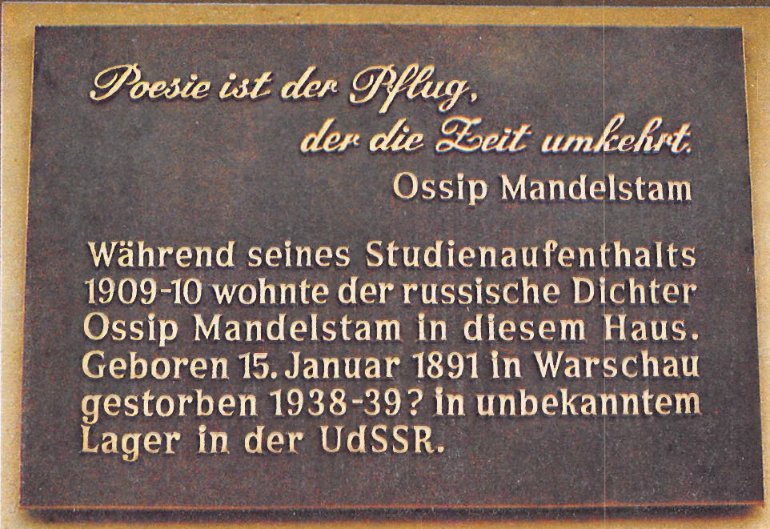

# ЗАКЛЮЧЕНИЕ

16 января 1993 года на том гейдельбергском доме, где жил Осип Мандельштам, была открыта мемориальная доска.

На доске — в немецком переводе — цитата из статьи Мандельштама «Слово и культура»:

«ПОЭЗИЯ - ПЛУГ, ВЗРЫВАЮЩИЙ ВРЕМЯ».

Далее следует текст:

«Во время учебы в Гейдельбергском университете в 1909-1910 в этом доме жил русский поэт Осип Мандельштам, Родился 15 января 1891 в Варшаве, умер 1938-39 ? в неизвестном лагере в СССР».

Вопросительность последних слов — не неточность, а своего рода знак сложившегося восприятия на Западе судьбы Мандельштама.

