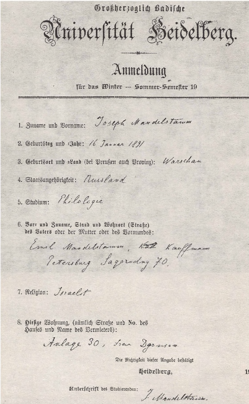
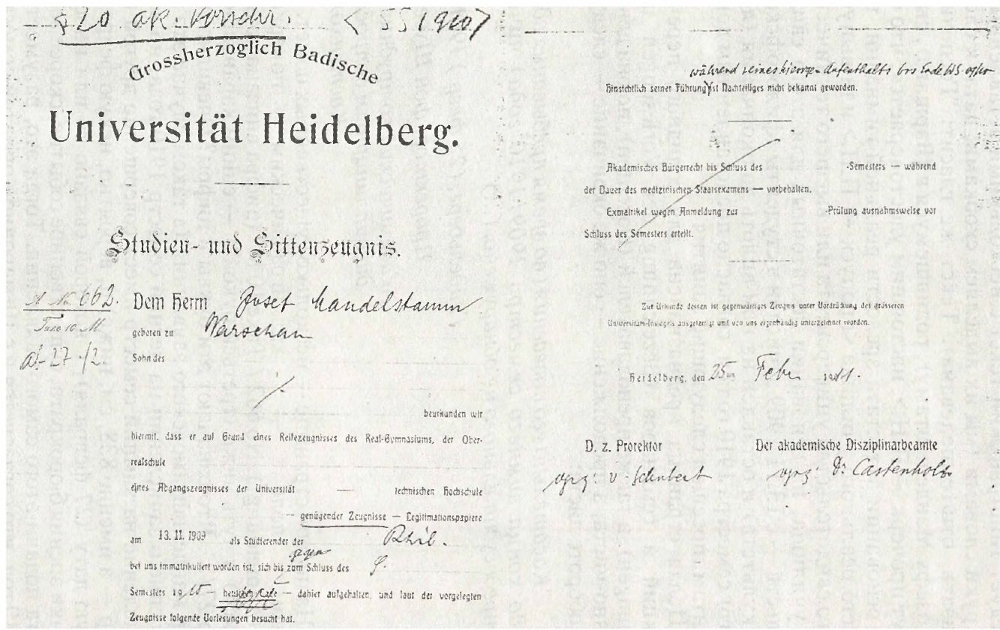
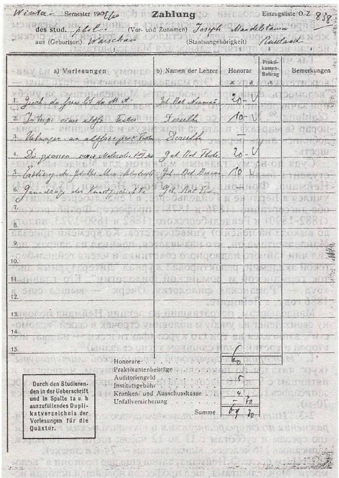

# СТУДЕНТ

> Не слишком ли преждевременно теперь думать об университетских хлопотах? Ведь их и невозможно начать раньше осени? А если меня не примут — я поступлю в один из немецких университетов...
> и согласую занятия литературой с занятиями философией 
> О. Мандельштам[^38]

...Уже около семи недель, как он в Гейдельберге, а до сих пор еще не подал заявления о зачислении в студенты! Все медлил, все тянул, словно присматривался к чему-то с тайной надеждой: не испугает ли что, не насторожит ли? Думал, что приглядывается, привыкает к городу, к реке, к лесу, заглядывающему прямо в окно, к комнате, к хозяйке, а оказалось, на самом-то деле — что к самому себе.

Но, к счастью, ничего такого не происходило, чем можно было бы воспользоваться как причиной или поводом для побега из этого профессорско-студенческого рая.

А дело оказалось проще простого. Пришел в университетскую канцелярию со своими бумагами, получил бланк Anmeldung‘a — прошения о зачислении в студенты — и, присев к массивной чернильнице, тут же его и заполнил. Много времени это не отняло, всего восемь вопросов, а о том, что в конце полагается ставить дату, и вовсе забыл — так и отдал в окошко.

Приглядимся к бесхитростной анкетке и мы.

Первый вопрос: "Фамилия и имя".

Ответ: "Йозеф Манделыитамм" — последовал в обратном испрашиваемому порядке и с лишней буквой "м" в транскрибировании фамилии (что, впрочем, имеет соответствие в немецком же stamm — "ствол").

Вопрос второй: "День и год рождения".

Ответ: "16 января 1891". Но это не описка и не ошибка счета. Примерив на себя повсеместный на Западе григорианский календарь (новый стиль), Мандельштам, видимо, не учел, что разница между этим календарем и календарем юлианским (старый стиль) — величина от века к веку переменная: в двадцатом веке — и это он, вероятно, запомнил — отличие составляло 13 дней, но в девятнадцатом — на один день меньше и т.д.[^39]

Вопрос третий: "Место и страна рождения (если Пруссия, то укажите провинцию)". — "Варшава" — укоротил свой ответ Мандельштам.

Зато исчерпывающими были ответы на четвертый и пятый вопросы: "Гражданство" и "Занятия (Studium)": "Россия' и "Филология'.

Следующий вопрос: ’’Имя, фамилия, общественное состояние и место жительства (укажите улицу) отца, матери или опекуна".

Мандельштам ответил: ’’Эмиль Манделыитамм, торговец, Петербург, Загородный 70а"[^40].

Вопрос седьмой: ’’Религия".

Мандельштам ответил: "Israelit", что соответствовало принятой в России формуле "иудейскаго вероисповедания".

И последний, восьмой вопрос: "Место проживания в настоящий момент (укажите улицу, номер дома и имя владельца)". Слегка путаясь в немецком написании английской фамилии, Мандельштам ответил: "Anlage 30, frau Dgonson".

Проигнорировав дату в заключающем анкету обороте: "Правильность сообщенных сведений подтверждается. Гейдельберг, _______19__. Подпись учащегося" — Мандельштам собственноручно расписался.

Впрочем, дата теперь известна. 12 ноября — именно под этим числом и под номером 556 значится его имя в Album Matriculum — столетиями ведомой, необъятных размеров и непомерного веса торжественнейшей книге в переплете красной кожи с золотым тиснением и металлическими уголками. Каждый студент в те годы собственноручно записывал в нее основные сведения о себе. Мандельштам заполнил свою строчку:

• Фамилия и имя: Мандельштам Иосиф;
• Возраст: 19;
• Место рождения: Варшава;
• Состояние и местожительство отца, матери или опекуна: торговец, Петербург;
• Вероисповедание: иудейское;
• Факультет: философский;
• Прежде посещавшийся университет: -
• Такса: 20 марок"[^41].

После этого только и оставалось, что посетить квестуру и уплатить все причитающиеся с него взносы, сборы и пошлины. Что и было сделано в тот же или на следующий день: во всяком случае матрикул, то есть официальная регистрационная запись университета, датирована не 12, а 13 ноября. Мандельштам раскачивался все-таки на удивление долго — почти два месяца!

...Приехал Мандельштам в Гейдельберг скорее всего в сентябре, во второй его половине, и прожил здесь осень, зиму и весну, по крайней мере ее начало.

Не будем гадать, дождался ли он той поры, когда знакомые бурые холмы, столь угрюмые зимой, зазеленели и заклубились, словно сливки, вишневым и миндальным цветом[^42].

Насчет зимы и ранней весны мы уверены, а это не так мало: соловьи, бывает, начинают свои коленца уже в феврале!

Зима в Гейдельберге, хоть и мягкая, но довольно мрачная, в комнатах прохладно: двойные рамы не приняты, печка мерцает начищенным кафелем, но заслонки в ней нет, тепло она не держит — быстро нагревается и столько же остывает. Топили — за отдельную плату — буковыми дровами.

Как тут не прийдет на ум Италия? Вот где, несомненно, тепло, вот где хорошо: не съездить ли?

Пофантазируем и дальше. Воскресенье: Мандельштам лежит на кровати с книгой, набросив на ноги плед; вдруг сбрасывает ноги и подходит к столу у окна, что-то записывает; не отрываясь от книги, подходит к печке, еще не остывшей после утренней топки: как славно приложить руку к разогретому кафелю — сначала одну, потом, переметнув книгу, другую.

Постучалась хозяйка — рубенсовский типаж, — рыжеватая фрау с едва заметным английским акцентом, спросила с необоримой вежливостью: "Wollen Sie Kaffe, Herr Mandelstam?"[^43], а в ответ — как и вчера, как позавчера и, как, конечно же, завтра, — твердо-застенчивое, с угловатым русским акцентом: "Данке шен, фрау Джонсон, герне"[^44].

Мандельштам полюбил этот неизменный, уютный и какой-то домашний разговор: он словно отдыхал в нем после казенного бархата застрявшей в ушах — еще с первых гейдельбергских дней, когда он никого и ничего не знал здесь — фразочки: "Das tut mir leid, aber..."[^45] Со временем он возненавидел мелодию этой фразы — за ее лицемерие и фальшь: ну, право, не гнусно ли — смягчать, скрадывать и тотчас же наносить проникающий, разящий удар в виде отказа, запрета или еще какой-нибудь гадости?..

Найти квартиру в те времена было достаточно просто. Тот же Ф.Степун вспоминает, что в 1902 году весь старый Гейдельберг был сплошным студенческим отелем[^46].

Семейный пансион фрау Джонсон "Континенталь"[^47] размещался в чистеньком, слегка вычурном особняке на Leopoldstrasse, 30. У этой улицы имелось и другое название, которое хоть и указывалось в справочниках в скобках, но было, кажется, употребительнее основного: Anlage, что ближе всего соответствовало понятиям "бульвар", "аллея" (Grune Anlage)[^48].

Это одновременно в центре и на краю. Старый город — через улицу, два-три раза в неделю небольшая площадь[^49] заполнялась гвалтом традиционного овощного базара. До вокзала (тогдашнего), реки и ратушной площади — какие- то сотни метров, не больше. И вместе с тем это самый край города: дом стоял у подножья Гайсберга — поросшей корабельным лесом горы. Окошко комнаты, где жил Мандельштам, судя по всему, выходило сюда же, на гору. От самого дома завивался вверх Riesenstemweg ("Тропинка огромных камней”); петляя по лесу, пересекаясь с другими тропами и дорожками, она могла бы привести к полуразрушенному замку с его конюшнями и непомерных объемов "царь-бочкой" на 22 тысячи ведер вина[^50], к старым заброшенным шахтам, к сторожкам и кострам лесорубов, на вершину Кенигштуля — куда угодно. Впрочем, с Кенигштуля было особенно приятно спускаться.

У фрау Джонсон, надо полагать, Мандельштам и столовался: наверняка завтракал и, вероятно, обедал и ужинал; и пансион, и ресторанчик капитанши, похоже, был у русских на примете. Так, в зимнем семестре 1905/06 гг. здесь жили Б.Кистяковский и Живаго, а в летнем семестре 1908 г. — Ольжский. Именно здесь, в ресторанчике "Континенталь" Ф.Степун впервые увидел свою будущую жену[^51].

Но Мандельштаму в соседи достались одни немцы. Обычно в пансионе "Континенталь" жило человек восемь-десять студентов. В зимнем семестре 1909/1910 годов их, вместе с Йозефом Мандельштамом, было восьмеро. Пятеро были из соседнего Гессена, причем четверо из Майнца: медики Франц Дюнгез, Вилли Шмидт, Филипп Крайсс и естественник Якоб Альбрехт, а пятый, тоже медик — Антон Росси — был родом из Оффенбаха; еще двое были уроженцами Пруссии — студент факультета камералистики[^52] Генрих Германне из Кельна и студент философского Карл Ломе- рер из Санкт-Йоханнесбурга. Ломерер и Росси учились в Гейдельберге уже целый год, а Вилли Шмидт — целых три![^53]

Желание матери посмотреть, как же устроился в чужом городе и чужой стране ее первенец, естественно, а если речь идет о еврейской семье — то и едва ли не священно. Уклониться, как говорится, не дано. Короче, известия о том, что по дороге в Россию из Монтрё в Гейдельберг приезжают Флора Осиповна с младшим из сыновей Евгением, следовало ожидать. Сам Е.Э.Мандельштам вспоминал об этом визите: "С осени Осип уехал в Гейдельберг, где занимался у профессоров знаменитого университета. И мы с ним вновь встретились уже в этом старинном городе, куда мать приехала проведать сына и посмотреть, как он устроился. Брат показывал мне город и замок, где находился музей. В окружении такой средневековой старины я был впервые. Мне, мальчишке, конечно, запомнились лица сту- дентов-корпорантов со шрамами — следами дуэлей, частых среди членов разных корпораций, и разноцветные шапочки, удостоверяющие их принадлежность к тому или другому землячеству"[^54].

Площадь, на которой стоят оба главных университетских здания (старое и новое) да еще университетская библиотека, невозможно не назвать Университетской. От пансиона фрау Джонсон до этого места — считаные минуты ходьбы.

Читальные залы (здание библиотеки было построено всего за несколько лет до приезда Мандельштама) были открыты всю неделю с 9 утра до 6 вечера (с часу до трех обед), в субботу — только в первой половине дня; абонемент работал ежедневно с 11 до часа, а в среду — с трех до пяти часов. В будние дни библиотека была открыта с 9 утра до 9 вечера (с часу до двух — перерыв на обед), а в выходные — с 11 утра до часу дня (впрочем, в зимнем семестре к этому прибавлялись еще 4 вечерних часа — с 4 до 8). Читальня была платной и стоила студентам и слушателям 1 марку за семестр, преподавателям и служащим университета — 8 марок за год, прочим интересующимся — уже 10 марок плюс особое разрешение.

При желании студенты могли также посетить университетскую античную археологическую коллекцию[^55], ботанический сад (зимний и летний) и обсерваторию на Кенигсштуле (586 метров над уровнем моря), куда в 1908 г. был дотянут фуникулер.

В том же здании, что и библиотека, — в старом университетском корпусе (Augustiniengasse, 15) — размещался в те годы философский факультет. В 1902 году он поразил Степу- на "темноватой теснотой своего входа, узостью главной лестницы, маленькими аудиториями, неудобными скамейками... — одним словом, всем своим монастырским идиллическим аскетическим духом"[^56].

Но что представлял он собой осенью 1909 года? На чьи лекции десятками, а то и сотнями ломились студенты?

Среди заявленных на тот зимний семестр профессоров (штатных и заштатных) и приват-доцентов — филологи Болль (декан), Шолль, Браун, Нейман, Бецольд, Хоопе, Бартоломае, Улих, Леффман, Брандт, Вальдберг, Шниганс, Кале, Петш и Картилльери, философы Виндельбанд (проректор) и Ласк, искусствоведы Тоде и Пельтцер, музыкальный директор Вольфрум, историки Дюн, Домашев- ский, Онккен, Кох и Штелин, экономисты Готхайн, Хампе, братья Альфред и Макс Веберы, Лезер, Шотт и Яффе, географ Геттнер.

Сколько почтенных имен, сколько звезд наипервейшей величины! Теория штандортов Альфреда Вебера, например, или антропогеография Альфреда Геттнера — это же целые эпохи, принципиально новые парадигмы в своих дисциплинах! Может быть, еще более знаменитым был профессор экономики и финансовой науки — социолог Макс Вебер (1864-1920), но в манделынтамовском семестре он был свободен от лекций.

Еще совсем недавно философский Гейдельберг был славен знаменитыми на всю Германию курсами Куно Фишера. Из года в год весь Гейдельберг собирался в университетской ауле послушать его заключительную лекцию о гетевском "Фаусте"! Именно ради Куно Фишера десятилетием раньше Мандельштама направлялись именно в Гейдельберг и многие русские юноши (в их числе — и Владимир Зензинов и Федор Степун).

Во времена Мандельштама признанным лидером среди университетских философов был уже Виндельбанд, перебравшийся сюда из Страсбурга. Однако таких ярких звезд и оригинальных голов, как марбургский Коген или геттингенский Гуссерль, среди гейдельбергских профессоров в то время не было. Здесь культивировалось то, что называли "систематической философией" и рациональным "добыванием истины". Федор Степун был поражен той политической слепотой и индифферентностью лучших мыслителей на Гейдельберг- ском философском конгрессе в 1908 году (спустя три года после событий 1905 года!), той бестревожной дистанцией, на которой они позволяли отнюдь не безмолвному времени держать и удерживать себя; правда, оговаривается он, во вступительном своем слове Виндельбанд, президент конгресса, "...горячо говорил об опасности борьбы "всех против всех", которую несут с собой популяризация знания и демократизация общества; но, анализируя эти опасности и оптимистически предсказывая возврат человечества к разумно-гуманитарным идеалам XVIII века, он в гораздо большей степени волновался борьбою Сократа с софистами, о которой блестяще писал в своих прелюдиях, чем своей современностью. Социологическая незаинтересованность и политическая нечуткость были поистине потрясающими. Успокаиваясь на том, что Ницше — поэт и филолог, а Маркс — экономист и политик, маститые профессора философии или вообще не занимались этими мыслителями или занимались ими в целях приспособления их идей к положениям научной философии, что по тем временам значило — к Канту"[^57].

Следующий философский конгресс состоялся в 1911 году в Болонье и стал триумфом Анри Бергсона — уже вовсю набирал силу интерес и к бергсоновской "интуиции", и к кьеркего- ровской "философии жизни". Тот же Виндельбанд заявлял с кафедры, что со времен Декарта не знала Франция столь оригинального мыслителя, как Бергсон (Мандельштаму все это было тем более дорого, что его знакомство с работами Бергсона было сравнительно давним, глубоким и как бы личным: в 1907-1908 годах, живя в Париже и посещая лекции в Сорбонне, он, конечно же, не пропускал и блестящих лекторов Коллеж де Франс — Бергсона и Бедье, знаменитого медиевиста, заронившего в нем интерес к старофранцузской литературе) .

Но вернемся к документам.

Что представляет с собой матрикул? На первом листе, под шапкой университета и готическим заголовком "Studien- und Sittenzeugnis", что правильней всего перевести как "Свидетельство об успеваемости и благонравии", следует типографский текст с несколькими вставленными от руки словами (мы их выделяем скобками; дата, к слову сказать, отштемпелевана). Текст же гласит: "Господину (Йозефу Мандельштаму), родившемуся в (Варшаве), сыну <тут прочерк — П.Н.>, настоящим удостоверяется, что он, на основании аттестата зрелости реальной гимназии, высшего реального училища <пропуск — П.Н.> или выпускного свидетельства университета или высшеготехническо- го училища, на основании достаточных для этого свидетельств — с 13.11.1909 зачислен в студенты (философского факультета) и оставлен на нем вплоть до окончания (летнего) семестра 1910 года и, согласно представленным документам, посещал следующие занятия".

Целая страница предназначена для солидного перечня лекций и семинаров (Bezeichnung der Vorlesungen und Übungen), а также преподавателей (Dozenten), но она девственно-чиста, а продолжение — оно же окончание — следует на обороте листа:

> "Касательно его поведения (во время пребывания здесь до конца зимнего семестра 1909/1910 года) ничего предосудительного не обнаружено. (...)
>
> Гейдельбергу (25 февр.) 19(11).
> Проректор: фон Шуберт
> Академический сотрудник по дисциплинарным вопросам: Кастенхольц

На первой странице — несколько существенных помет. На левом поле — каллиграфическим почерком: "A(Anmeldung?). No 662 / Taxe 10 М" (цифра вписана другой рукой) и чуть ниже (третьей рукой?) — синим карандашом: "ab 27/2". Что означают эти буквы и цифры? Очевидно, номер мандельштамовского заявления (в таком случае это заявление о зачислении на летний семестр 1910 года, но ведь заявление на зимний семестр имеет совершенно другой номер — а именно 838, см. ниже) и, вероятно, некую февральскую дату (27 февраля), с которой связано то или иное, с точки зрения бюрократа, существенное событие, скорее всего дата подачи этого самого заявления. Тогда это, разумеется, 1910 год, что согласуется и с 10-марочной оплатой семестра (но нельзя исключать и другого, — если вспомнить о дате, когда ректор подписал отчисление Мандельштама, что это дата закрытия дела или передачи его в архив — и тогда это, конечно, 1911 год).

На той же странице, сверху — и тем же синим карандашом: ”§20 Akademish Vorschr<ift> / S<ommer> S<emester> 1910”.
Это, по-видимому, указание на параграф университетского (академического) кодекса, регулирующего вопросы оплаты,— иными словами, юридический повод для отчисления[^58].

Впрочем, мы изрядно засиделись в канцелярии. Заглянем же и в аудитории — ведь уместилось же в эти гейдельбергские недели нечто притягательное для Мандельштама!

Так что же?

Доверимся в таком случае еще одному документу из университетского архива. Это манделыитамовский Einzugslist — ’’ведомость” единовременной платы Мандельштама за учебу при зачислении, своего рода отчетная ведомость, ’’платежка” (Zahlung)[^59]. Из пяти ее граф — занятия; преподаватели; гонорар (в марках); плата за практикум и замечания — понадобились лишь первые три, из пятнадцати строк — только шесть.

Судя по всему, главным магнитом для Манделынтама- студента были лекции знаменитого филолога-романиста Неймана. Фридрих Генрих Георг Нейман (1854-1934) учился в Берлине и Гейдельберге; в Гейдельберге защитил обе диссертации (1876 и 1878); профессор Фрайбургского (1882-1890) и Гейдельбергского (1882 и 1890-1923, вплоть до выхода на пенсию) университетов. Ко времени приезда Мандельштама он, что называется, почивал на лаврах: носил чин тайного надворного советника и члена гейдельбергской академии, редактировал журнал ’’Литературный листок германской и романской филологии”. Его главный труд — "Романская филология. Очерк" — вышел еще в 1886 году, в Лейпциге.

Мандельштам, потративший на лекции Неймана половину своих денег на учебу и половину строчек в своей "ведомости", записался на три его курса (фактически — на два, ибо второй и третий были слишком тесно связаны)[^60].

1. "История средневековой французской литературы" (курс читался по понедельникам, вторникам, четвергам и пятницам с 9 до 10 часов; плата — 20 марок; всего на курс записалось 135(!) студентов, Мандельштам в списке значится 70-м).

2-3. "Интерпретация старофранцузского текстаи "Упражнения по старофранцузским и провансальским текстам' (по средам и субботам с 11 до 12 часов; плата — 10 марок; записалось 146 человек, Мандельштам — 74-й в списке).

Вторым после Ф.Неймана, заняв еще две позиции в "ведомости” Мандельштама, шел профессор новейшей истории искусств Генри Роберт Тоде (1857-1920). Он был женат на Даниэле фон Бюлов, племяннице Ференца Листа и падчерице Рихарда Вагнера. Уроженец Дрездена, он учился в Лейпциге, Вене, Берлине и Мюнхене, в Вене (1880) и Бонне (1886) защитил диссертации; в 1889-1891 — директор Франкфуртского института искусств, в 1893-1911 — профессор Гейдельбергского университета, член Гейдельбергской академии. Мандельштам застал его в чине тайного надворного советника, но уже годом позже Тоде получил чин тайного советника второго класса, после чего подал в отставку и стал ’’частным исследователем” (перешел на вольные хлеба, как выразились бы в России). Его основные труды были всемирно известны: книга "Франциск Ассизский и зачинатели искусства Ренессанса в Италии” (1885) выдержала четыре издания, двухтомная монография "Микеланджело и конец Ренессанса” (1902- 1903) — два издания. Его перу принадлежали и монографии "Нюрнбергская школа живописи XIV и XV столетий" (1891) и "Беклин и Фома" (1905).

Был он к тому же щеголем и великолепным оратором, перенявшим от Куно Фишера славу и слушателей, переполнявших зал на его публичных лекциях. Вот каким увидел его Ф.Степун: "По своей внешности, манерам и, главное, по стилю своего очарования Тоде показался мне, привыкшему представлять профессора скромно одетым бородатым интеллигентом, человеком совсем не профессорской среды. В Москве этого элегантного, всегда изысканно одетого человека с бритым, мягко освещенным грустными глазами лицом каждый принял бы скорее за актера, чем за ученого. Особенно живописно выглядел Тоде в берете и таларе на торжественных университетских актах... Он ежегодно читал в переполненном актовом зале цикл общедоступных лекций, на которые, как на концерты Никиша, собирался не только весь город, но приезжали даже слушатели из соседних городов. Прекрасные бледные руки лектора часто молитвенно складывались, ладонь к ладони. Длинные пальцы касались губ. Как все романтики, Тоде много и хорошо говорил о несказуемом и несказанном, о тайне молчания. По окончании лекции аудитория благодарила любимого лектора бурным топотом сотен ног"[^61].

Тоде не представлял себе, как можно изучать историю искусств без экскурсий и путешествий по Европе. Каникулы, в его понимании, были созданы исключительно для того, чтобы съездить в Италию, и, когда, например, он узнал, что тот же Ф.Степун из-за каких-то сердечных дел собирается не в Венецию, а — прости Господи! —• в Москву, то без обиняков посоветовал ему и думать забыть о серьезном искусствоведении[^62].

Мандельштам записался на два курса Г.Тоде.

4. "Великие веницианские художники XVI века" (по понедельникам и средам с 12 до 13, по вторникам — с 12 до 13ис 18 до 19 часов; плата — 20 марок; на курс записалось 45 студентов, имя Мандельштама — 33-е в списке).

6. "Основы истории искусства" (по понедельникам — с 18 до 19 часов; бесплатно, вход свободный)[^63].

Третьим гейдельбергским профессором в ведомости оказался знаменитый германист Теодор Вильгельм Браун (1850-1926). Выпускник Лейпцигского университета (1869), он и проработал в Лейпциге до 1880 г., защитив там обе свои диссертации; в 1880-1888 — профессор Гиссенского университета, а с марта 1888 — профессор и преемник Карла Бартша на посту директора романо-германского семинара в Гейдельберге, где проработал до 1919 года (в 1920-1923 гг. возглавлял академическую библиотеку). Был он и редактором журнала "Сообщения по истории немецкого языка и литературы", членом академий Страсбурга, Мюнхена и Гейдельберга; с 1909 — тайный надворный советник. Важнейшие работы выходили в Галле: "Готтская грамматика" (1880; 14 изданий до 1953 года!) и "Древневерхненемецкая грамматика" (1886; 8 изданий).

В манделыитамовской "ведомости" пятую позицию занимает курс Теодора Брауна "Разбор поэмы "Мейер Хельмб- рехт" (упражнения по древневерхнегерманской литературе для начинающих)" — по субботам с 9 до 10 и с 10 до 11 часов; плата — 10 марок; из 95 записавшихся на этот курс Мандельштам в списке 55-й.

Кто такой Мейер Хельмбрехт? Это герой сатирической поэмы Вернхера фон Гартенаэра, поэта второй половины XIII века (его имя и происхождение, как и исторические прототипы поэмы, до конца не выяснены). Во всяком случае, как чеканит об этом "Большой Брокгауз", он в совершенстве владел искусством дворцового стихосложения и обладал собственным взглядом на человеческие поступки. В поэме повествуется о крестьянском сыне, ставшем в конце концов разбойником[^64].

Но неужели Мандельштам записался на этот прикладной курс и проманкировал главный брауновский курс — "Историю средневерхненемецкой литературы ’? Затребовав соответствующий Zahlungslist Брауна, мы действительно обнаружили в нем имя Мандельштама (68-м в списке из 103 студентов) , но... зачеркнутым!.. В чем тут дело? В том, что плата за этот курс — еще 20 марок? Тогда объяснение простое: Мандельштам платить передумал, а на лекции ходил. Но выскажем и еще одну версию, по нашему мнению, более вероятную: Мандельштам отказался, когда узнал, в какие часы читался этот курс: от вторника до пятницы — с 8 до 9 часов утра!..

Но, конечно же, официальным списком перечень курсов, которыми интересовался Мандельштам и которые посещал, не исчерпывается. Нежданно-негаданно тому нашлись подтверждения и свидетельства.

В 1965 году, в Лондоне, старый гейдельбержец Арон Штейнберг рассказывал Кларенсу Брауну о Мандельштаме в Гейдельберге[^65]. Об этом еще будет сказано, но вот что существенно для нас сейчас: Осип Эмильевич никогда не пропускал лекций Неймана, но посещал занятия и других. В частности, он ходил —правда, нерегулярно — на показавшийся ему скучным курс Виндельбанда о Канте[^66]. Зато чудесными и даже поэтичными находил Мандельштам лекции Эмиля Ласка, молодого профессора философии; эти лекции, утверждал Штейнберг, во многом повлияли на складывавшееся в эти годы мировоззрение поэта.

"Скучный" лектор — тайный советник 2-го класса Генрих Вильгельм Виндельбанд — был в Гейдельберге, повторим, ни много ни мало проректором. Родился он 11 мая 1848 года, умер, немного не дотянув до 97-летия, в Берлине, 3 февраля 1945 года; учился в Йене, Берлине, Геттингене, член академии Лейпцига; преподавал в Цюрихе, Фрайбурге и Страсбурге; с ноября 1902 и до 1915 — в Гейдельберге.

А.Штейнберг называет его выдающимся историком философии, хорошим стилистом, широко образованным человеком. Но вместе с тем, как бы в тон Мандельштаму, вспоминает, что ходил слушать Виндельбанда больше из учтивости, чем из настоящего интереса: "Но я, молодой человек, посещавший его лекции, хорошо знал, что ничего не потеряю, если пропущу их, потому что достаточно взять его книги и почитать, может быть, даже с большей пользой"[^67].

В манделыптамовском семестре Виндельбанд читал два лекционных курса "Введение в философию" (по вторникам, средам, четвергам и пятницам, с 17 до 18 часов) и "Историю и систему теории познания" (по понедельникам и субботам, с 10 до 11 часов), кроме того, он вел философский семинар: "Кантовская критика силы суждения". Какой из курсов имел в виду А.Штейнберг, сказать непросто, но скорее всего — первый (второй вызывает сомнения еще и тем, что по субботам перекрывался по времени курсом Брауна). На "скучные" виндельбандовские курсы, заметим, записалось нешуточное количество студентов — соответственно 178(!) и 95 человек!

Гораздо проще с единственным курсом приват-доцента доктора Эмиля Ласка (профессором, вернее, исполняющим обязанности профессора он стал лишь в феврале 1910 года); на зимний семестр 1909/1910 он заявил курс "История новейшей философии до Канта включительно" (читался по понедельникам, вторникам, четвергам и пятницам, с 16 до 17; записавшихся на курс было 29 человек, в том числе и братья Штейнберги). Ласку было тогда всего 35 лет, семьи и детей не было, так что спустя пять с небольшим лет — 25 мая 1915 года — некому было оплакать смерть еврейского профессора-волонтера в бою при Турца Мата в Галиции (откуда, кстати, он был родом)[^68]

Сам он учился правоведению и философии в университетах Страсбурга и обоих Фрайбургов (швейцарского и германского), а с 1901 года уже преподавал в Берлине (до 1904 г.), что не помешало ему защитить (1902) диссертацию во Фрайбурге; с 1905 года Ласк в Гейдельберге: здесь он стал членом местной академии (1905) и получил должность — сначала исполняющего обязанности профессора (7 февраля 1910), затем (уже 31 марта того же года) — профессора. Ко времени приезда Мандельштама в Гейдельберг им уже были напечатаны по меньшей мере две книги — ’’Идеализм Фихте и история" (Гейдельберг, 1902) и "Философия права" (Гейдельберг, 1905). В 1910 году, в Тюбингене вышла еще одна его книга: "Логика философии и учение о категориях" (Тюбинген, 1910)[^69].

Итак, платежная ведомость позволила нам заглянуть не только внутрь манделыптамовского портфеля и расписания, но и отчасти в его кошелек.
О кошельке. За учебу в зимнем семестре в Гейдельберге (не считая платы за комнату — а это, судя по опыту Федора Степуна, — 10-15 марок в месяц[^70]) Мандельштам единовременно заплатил 69 марок и 30 пфеннигов: 60 марок стоили курсы, 5 марок — взнос за пользование аудиториями, еще 4 — единый страховой и комиссионный сбор (Kranken- und Ausschusskasse) и 30 пфеннигов — страхование от несчастного случая (все прочие сборы Мандельштама не касались).

Что касается графика занятий — а суммарно это от 4 до 6 лекционных или семинарских часов в будние дни и 2 часа в субботу, — то он, признаться, впечатляет, если, конечно, принимать его всерьез.

Не забудем, что на следующий семестр Мандельштам просто не явился!

[^38]: Из письма Осипа Мандельштама матери, Флоре Осиповне Мандельштам (урожденной Вербловской), из Парижа от 7/20 апреля 1908 года; цит. по: О.МАНДЕЛЬШТАМ. Собрание сочинений. Том IV-до- полнительный. Париж, 1981, с. 109). Об этом же, неделей позже, — в письме любимому тенишевскому наставнику — Владимиру Гиппиусу: "Лето я собираюсь провести в Италии, а вернувшись — поступить в университет и систематически изучать литературу и философию" (Лит. обозрение, 1986, N7, с. 109-110, публ. П.Нерлера).

[^39]: В России — кроме Прибалтики, Польши и Финляндии — вплоть до специального ленинского декрета от 14.02.1918 действовал юлианский календарь. Мы и далее будем держаться григорианского календаря, там же, где требуется также и юлианский, мы будем давать уточнения в круглых скобках.

[^40]: Семья Мандельштама переехала в квартиру по этому адресу осенью 1909 года.

[^41]: Судя по тому, что предыдущие записи датированы 5 ноября, а последующие 18 ноября, матрикуляция все-таки происходила в определенный день недели. В тот же день, что и Мандельштам, матрикулирова- лись более полусотни студентов. Среди них встречаем и тех, чьи имена еще всплывут ниже (например, Борис Кац).

[^42]: Все говорит за то, что — не дождался. Еще одно подтверждение тому обнаружилось в довольно-таки неожиданном месте — в протоколе допроса арестованного в мае 1934 года поэта. Отвечая на вопрос: "Вывалили вы за границей", он ответил, что "...был в 1910 году в Гейдельберге, где учился в университете — всего один семестр" (В.ШЕНТА- ЛИНСКИИ. Улица Мандельштама. // Огонек. 1991, N1, с.20).

[^43]: "Не желаете кофе, господин Мандельштам?" (нем.)

[^44]: "Большое спасибо, фрау Джонсон, с удовольствием" (нем.).

[^45]: "Мне очень жаль, но..." (нем.)

[^46]: Многие находили квартиру сами, некоторые прибегали к услугам академического квартирного комиссариата, расположенного в главном университетском здании. (Обращаться туда рекомендовалось непосредственно, без квартиросдатчиков. Поскольку начало и конец семестров приходились на 15-е числа, то и концом месяца при помесячной оплате считалось именно 15 число. Если обучение занимало более одного семестра, то студент, если он хотел сохранить за собой квартиру, должен был оплачивать и каникулярное время.)

[^47]: Сведения об этом мы находим в адресной книге Гейдельберга за 1909 год: Leopoldstrasse (Anlage), 30 — Johnson Marry, Kapitan Frau, Familienpension. В записной книжке Вячеслава Иванова значится: "Мандельштам Осип Эмильевич Heidelberg Continental Anlage 30" (Отдел рукописей Государственной библиотеки им.В.И.Ленина — сообщено А.А.Морозовым). Сам Мандельштам в письмах называл этот дом еще проще: Anlage, 30. В адресной книге Гейдельберга впервые фамилия Джонсон встречается в 1900, в последний — в 1916 году.: в обоих крайних случаях хозяйки в городе не было и она фигурировала лишь как владелица здания (в 1916 г. она жила в Карлсруэ), но в год, когда там жил Мандельштам, она вела пансион сама (в 1900 г., например, пансион вела вдова по имени Фрида Гирш)

[^48]: Идентифицировать здание удалось не сразу. Во-первых, иначе теперь называется сама улица — Friedrich-Ebert-Anlage — в честь государственного деятеля послевоенной Германии, уроженца Гейдельберга. Здание под номером 30 существует как центральная часть роскошного розовато-желтого особняка, в одной из которых и по сию пору расположена гостиница с интригующим в свете нашей темы названием: HOTEL ANLAGE. Во-вторых, смущала нумерация: старейшая из служащих отеля предполагала, что нумерация домов здесь после войны менялась. Этого рода сомнения рассеялись после получения подтверждения из гейдельбергского городского архива (письмо Д.Вебер автору этих строк от 16.03.1992). В этом же письме разъяснено, что номер 30 имел, как и теперь имеет, центральное из трех зданий, составляющих единое архитектурное целое. (Таким образом, не содержит ошибки то, что говорится в последнем из вышедших литературных путеводителей по Гейдельбергу: "В доме 30 по ул. Фридриха Эберта (Anlage 30), в семейном пансионе "Континенталь", владелица которого носила несколько англизированную фамилию Джонсон, осенью 1909 и в начале 1910 проживал русский лирик Осип Мандельштам" (M.BUSELMEJER. Literarishe Führungen durch Heidelberg. Eine Kulturgeschichte im Gehen. Winderhorn Verlag, 1991, s.29).

[^49]: Тогда она называлась Wrehl-Platz (в честь какого-то генерала); ныне — Friedrich-Ebert-Platz.

[^50]: Так называемая "Grüsser Fass", то есть "Великая бочка", объемом в 221726 литров, сооруженная — иначе и не скажешь — в 1751 г. при курфюрсте Карле Теодоре. Предание связывает ее с выходками знаменитого шута Перкео. Не менее удивительно, что, в отличие от московских "Царь-пушки" (никогда не стрелявшей) и "Царь-колокола" (никогда не звонившего), бочка эта с успехом служила, наполнялась и опорожнялась.

[^51]: Сама фрау Джонсон (Степун называет ее фрау Капитэн) предстает в его воспоминаниях эдаким рубенсовским типажем: "...хозяйка пансиона... нарядною, высокогрудою массою пышно восседала на конце стола" (СТЕПУН, ук. соч., с. 152). Этот эпизод его гейдельбергской жизни, наряду с прочими, фигурирует в автобиографическом романе Ф.Степуна "Николай Переслегин" (издательство "Современные записки", Париж, 1929), выстроенном в форме эпистолярного монолога. К слову сказать, живя в Гейдельберге, Степун, кажется, не изменял той же самой Leopoldsrasse: в 1905-1907 гг. он жил в доме 14, в 1907-1908 гг. — в домах 36 и 79.

[^52]: Так называли иногда отделение камералистики (соответствует современной политологии и социологии) на философском факультете.

[^53]: Многие из них остались и на летний семестр, например Я.Альбрехт,
Ф.Дюнгез, Г.Германне и — номинально — Йозеф Мандельштам. Известно, что двое сменили адрес: Ф.Крайсс переехал на
Unterneckarstrasse, 19, а А.Росси — на Bunsenstrasse, 4, следы еще двоих теряются. На место выбывших (возможно, в доме были и летние помещения) прибыло сразу шестеро новичков, так что число постояльцев фрау Джонсон возросло до десятка. Перебрался сюда Фридрих Адлер, студент камералистики, уроженец Страсбурга, столицы тогда еще немецкого Эльзаса (зимой он жил совсем рядом — на Leopoldstrasse, 34); вместе с братом Эрнстом, поступившим на юридический, переехал сюда и студент-медик Людвиг Леви из прусского тогда Позена (Познани) — в зимнем семестре Людвиг снимал жилье в Мангейме. Еще один новичок — медик Карл Демут (выходец из Пруссии). Двое новеньких — иностранцы: швейцарец из Лозанны Жорж Бурнье, записавшийся одновременно на юридический и теологический, и "австро-венгр" Курт Гольдшмидт из Находа, записавшийся на философский. (Эти сведения почерпнуты из двух выпусков Personal-Verzeichnis Ruprecht-Karl-Universitat in Heidelberg, выпущенных к зимнему семестру 1909/1910 и летнему 1910 годов).

[^54]: Далее младший брат продолжает: "В 1911 году Неточность: в 1910 — П.Н.> брат вернулся в Петербург. Закончить полный курс в Гейдельберге семья ему возможности не дала. И все же надо сказать, что занятия в Сорбонне и Гейдельберге брату очень многое дали, став основой его многогранного филологического образования. Немало дали ему они и как поэту. Мы должны быть благодарны матери, что она сумела выкроить из скудного бюджета семьи средства для учебы за границей своего даровитого первенца" (Е.Э.Мандельштам. Воспоминания. — Собрание Е.П.Зенкевич; цитаты впервые опубликованы в кн.: О.Мандельштам. Камень. 1990, с.345).

[^55]: Археологическая коллекция была открыта еще в 1848 году; ее другое название — Antiquarium Greuzerianum: в честь профессора древней истории Георга-Фридриха Грейцера (1771-1858), стоявшего у ее основания. Первоначально состояла исключительно из античных гемм и ваз, древнегреческих и римских монет. Коллекция постоянно пополнялась за счет дарений и приобретений (в том числе "дублетов" из раскопанной Шлиманом Трои, электротипий нумизматической коллекции Британского музея и т.д.). Во времена Мандельштама коллекция экспонировалась по адресу: Augustiniengasse, 7.

В 1910 году, после того как в Гейдельберге в течение долгих лет проработал профессор Август Айзенлор, здесь был основан и Институт египтологии и начала складываться коллекция, в наши дни выставленная для общественного обозрения. Можно предположить, что и античное, и египтологическое собрание могли быть в той или иной мере доступны и известны Мандельштаму, так или иначе повлияв на формирование отношения поэта к античной и египетской культуре. Это подтверждает также предположение А.А.Морозова о том, что в стихотворении 1931 года "Канцона" речь идет именно о Германии, о Гейдельберге:

> Там зрачок профессорский орлиный, —
> Египтологи и нумизматы...

[^56]: СТЕПУН, ук. соч., с. 100.

[^57]: СТЕПУН, ук. соч., с.147-148.

[^58]: Трудно отделаться от впечатления, что весь документ не составлялся в течение трех лет, а был написан в один или два присеста и был закончен единым махом торопливо-умелой рукой второго из подписавшихся. Иначе просто невозможно объяснить вопиющую скоропись и небрежность в его заполнении: ведь едва ли ими преследовалась цель несколько стилизоваться под не существовавшего и не существующего для них злостного — и поделом отчисляемого — неплательщика!

[^59]: На ведомости типографская помета: "Дубликат, заполняемый студентом в заголовке и в графах 1а и 16, содержит перечень лекций для квестуры". Стало быть, заполнена она самим Мандельштамом. В финансовой отчетности, откуда ее извлекли, она имела некий номер 838. Поскольку этот же номер — причем вслед за аббревиатурой "А" — фигурирует и во всех сводных выплатных листах (Zahlungsliste), заводившихся квестурой на каждый платный курс каждого профессора, то мы вправе сделать вывод: под этим номером фигурировало заявление, или прошение, Мандельштама именно на зимний семестр 1909/1910 года.

[^60]: Попутно исправляем некоторые неточности названий курсов в публикации Т.Бейера. Часы, когда курсы читались, а также подзаголовки некоторых из них, почерпнуты из справочника "Anzeige der Vorlesungen der Grosserzogischen Badischen Ruprecht-Karls-Universitat zu Heidelberg fur das WinterHalbjahr 1909/1910" (Heidelberg, 1909, s.21-25). Сведения о количестве записавшихся содержатся в сводных выплатных листах (Zahlungsliste), заводившихся квестурой на каждый платный курс каждого профессора.

[^61]: См.СТЕПУН, ук. соч., с.101-102.

[^62]: Сам он любил Италию настолько, что обзавелся там собственной виллой. В этой связи любопытна следующая указанная Г.Суперфином заметка: "Вдова немецкого историка искусств Генриха Тоде, скончавшегося в прошлом году в Копенгагене, вернулась недавно в Италию, где она собиралась поселиться в своей вилле. К своему удивлению, г-жа Тоде нашла свою виллу занятой писателем д’Аннунцио, который весь дом с ценными произведениями искусства "аннексировал", по собственному его утверждению, только временно. Все протесты г-жи Тоде и даже обращение ее к итальянскому правительству не привели ни к чему; д’Аннунцио разрешил г-же Тоде поселиться в маленьком домике во дворе. Г-жа Тоде через своего отца, известного датского юриста Шегнера, предприняла соответствующий шаги к освобождению своей виллы через датское Министерство иностранных дел" (Летопись Дома литераторов. 1921, N4, 20 декабря).

[^63]: Выплатной лист с поименной росписью студентов этого курса за зимний семестр 1909/1910 гг. в квестурном деле профессора Тоде отсутствует.

[^64]: Имеется несколько ее научных изданий и стихотворных и драматических переложений.

[^65]: Cl.BROWN. Mandelstam. London — New-York: Cambridge University Press, 1973, p.46.

[^66]: Вместе с тем, как заметил тот же Кларенс Браун, это не помешало Мандельштаму, готовящемуся к университетскому экзамену, попросить прислать ему книгу именно Вильденбанда по истории античной философии (О.Мандельштам. Собрание сочинений. Нью-Йорк, 1972, том 3, с. 197).

[^67]: См. великолепное описание Виндельбанда у Арона Штейнберга (ШТЕЙНБЕРГ, ук. соч., с. 103-104). В том же духе, хотя и гораздо более прочувствованно и пространно отзывается о Виндельбанде Ф.Степун: "Виндельбанд жил совершенно иначе, чем Тоде. Вместо лакея — скромная горничная. В квартире никаких далей: ни далей всемирного искусства, ни далей всемирной славы. В весьма буржуазной столовой, служившей и приемной, ждало уже несколько студентов в сюртуках. Горничная, как у врача, вызывала в кабинет профессора одного студента за другим. Не без трепета вошел я в доверху заставленный книгами и украшенный подвешенными под самым потолком — рамка к рамке — гравированными портретами великих философов, кабинет. С кресла у письменного стола навстречу мне слегка приподнялся грузный человек с очень большим животом и маленькою головкою на широких плечах; вместо шеи — красная складка над очень низким воротником. Таким я себе философа уж никак не представлял. Мое недоразумение длилось, однако, недолго. Сев в указанное мне бархатное кресло и взглянув в глаза ученого, я сразу же почувствовал, как этот "пивовар", как я сразу же окрестил его, — пивовар совершенно особенный. Передо мной сидел живой Сократ, каким Виндельбанд описал его в своих только что прочтенных мною "Прелюдиях": та же "втянутость головы в пухлые плечи", та же "внушительность висячего живота", та же характерная для грузных людей легкость движений. Сходство с Сократом почувствовалось мне и в невероятно живых, умных, остропроницательных, но отнюдь не созерцательных глазах и в настороженном выражении лица, точно ждущего ответа на "иронически" поставленный вопрос. Я слушал Виндельбанда в продолжение пяти лет и за это время так вжился в его философский пафос, так изучил его манеру чтения, привычку шарить правой рукой по животу в поисках висевшего на длинной тесемке пенснэ, вскидывать пенснэ на нос, разглаживать двумя пальцами левой руки лежавшую перед ним записную книжку... Виндельбанд был типичным немецким профессором своей эпохи, то есть преподавателем научной дисциплины, и только" (СТЕПУН, ук. соч., с.102-104). Ср. там же о речи Виндельбанда на открытии III Философского конгресса в Гейдельберге в 1908 году и об устном экзамене, который оказался "одною из самых интересных научно-философских бесед" в воспоминаниях Федора Степуна (там же, с. 147-148 и 177-178). Кстати, и Виндельбанд, и Ласк — оба жили на Landfriedstrasse (первый в доме 14, второй — в доме 8). Это очень близко от временного жилища Мандельштама.

[^68]: Между прочим, именно у Ласка писал свою докторскую работу *'Der Begriff der Realitaet" ("О понятии реального”) Арон Штейнберг. Защитить ее до начала войны он так и не успел, поскольку сам оказался в немецком гражданском плену (ШТЕЙНБЕРГ, ук. соч., с.173,175). С Эмилием, как он его называет (подчеркивая его еврейское происхождение) был хорошо знаком и даже дружен и Федор Степун (в одном из "гейдельбергских писем" его романа "Николай Переслегин" он выведен под фамилией Dehlis). О смерти Э.Ласка знал Ф.Степун, сам служивший артиллеристом в русской армии, к тому же в Галиции (см. его "Из писем прапорщика", с. 152-154). Вероятно, знал о ней и Осип Мандельштам; на это предположение наводят и паралелли к судьбе другого немецкого офицера, убитого в боях с русскими, — поэта Эвальда Кристиана Клейста; на ней "замешано" стихотворение "К немецкой речи".

[^69]: Уже после его смерти, в 1923-1924, в том же Тюбингене вышли его "Избранные сочинения в трех томах". См. об Э.Ласке также: К.НоЬе. Zwischen Rickert und Heidegger. Versuch über eine Perspektive des Denkens von Emil Lask.// Philosophisches Jahrbuch 78.Jg., 2 Halbband (1971), s.360-376; K.Hobe. Emil Lask‘s Rechtsphilosophie. // Archiv für Rechts- und Sozialphilosophie LIX/2 (1973), s.221-235. — H.Rosshoft. Emil Lask als Lehrer von Georg Lukach. //Abh. zur Philosophie, Psychologie und Pädagogik. Bonn, 1975.

[^70]: Небольшая комнатка на "Вилле Дорнрошн" на улочке Клингентайх близ замка стоила ему 13 марок, или шесть с половиной тогдашних рублей, в месяц, причем в цену входили утренний кофе, освещение и уборка. Пообедать — впрочем, невкусно — в дешевом ресторанчике можно было пфеннигов за шестьдесят (СТЕПУН, ух. соч., с.100-101 и 107-108).
