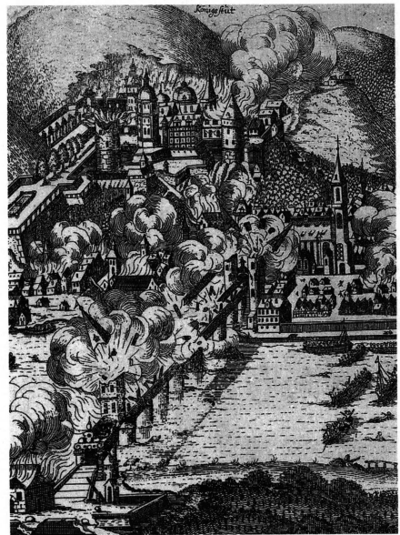
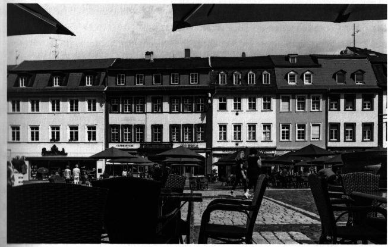

# Heidelberg in Mittelalter und Renaissance. Zur historischen Einführung

*Carla Meyer und Christoph Mauntel*

»Alt-Heidelberg« - so taufte der Dichter Victor von Scheffel die Neckarstadt in einem Gedicht aus dem Jahr 1854 und prägte damit den Namen für einen Sehnsuchtsort, der bis heute Touristen aus aller Welt nach Heidelberg zieht. Entdeckt wurde dieser >Ort« in der Romantik, als die Stadt unter der Schlossruine eine ganze Generation junger Lyriker inspirierte, unter ihnen Hölderlin, Brentano und Eichendorff. Ihre Aufmerksamkeit galt jedoch nicht der quirligen Wissenschaftsmetropole des 19. Jahrhunderts. »Alt-Heidelberg: - das war in den Augen der Romantiker die stolze Residenzstadt der Pfalzgrafen bei Rhein im Mittelalter und in der Renaissance, Epochen, die in den Trümmern auf dem Schlossberg noch zum Greifen nahe schienen.

Bis heute hinterlässt auch das enge Gassengewirr unterhalb des Schlosses den Eindruck einer mittelalterlichen Stadt. Dazu kommt der Blick von der anderen Flussseite auf Heidelbergs Panorama, das noch genauso kleinteilig und zugleich kompakt wirkt wie auf den großen Stadtdarstellungen von Sebastian Münster aus dem Jahr 1550 oder von Matthäus Merian aus dem Jahr 1620. Wer jedoch in den Straßen und auf den Plätzen steht, der schaut auf barocke Häuserreihen. Von den rund 900 denkmalgeschützten Objekten in der Altstadt stammen heute nur noch 22 Häuser, gerade einmal 2,4 Prozent, aus der Zeit vor dem 18. Jahrhundert. »Alt-Heidelberg< - dieser Name bezeichnet eine Stadt, die gar nicht Mehr steht, eine Stadt, die im neun Jahre wütenden Krieg um das pfälzische Erbe Ende des 17. Jahrhunderts untergegangen war.

Die französischen Truppen, die ab 1688 in die Pfalz eindrangen und sie beSetzten, konnten sich zwar am Ende gegen die Reichstruppen nicht behaupten; die Selbständigkeit der Kurpfalz wurde verteidigt. Doch der berühmt gewordene Befehl des Sonnenkönigs Ludwig XIV. »Brülez le Palatinat!« - »Brennt die Pfalz fileder!« ermächtigte das französische Heer zu einer systematischen Verwüstung der erstürmten Gebiete. Nicht nur pfälzische, auch württembergische Orte sowie die Reichsstädte Worms und Speyer gingen in Flammen auf. Heidelberg Wurde zweimal getroffen: 1689 wurde das Schloss gesprengt, 1693 die Stadt zu feinen Füßen in Schutt und Asche gelegt. Als die Truppen im Herbst 1693 abzoN, standen nur noch einige Dutzend Wohnhäuser. 

*Zerstörung Heidelbergs im Orleansschen Krieg 1689 auf einem zeitgenössischen Flugblatt*

Als man 1697 nach dem Frieden von Rijskwijk mit dem Wiederaufbau beginnen konnte, wurde Heidelberg eine andere Stadt: Den neuen Stadtherren aus der Neuburger Nebenlinie der Wittelsbacher, deren bisherige Territorien vorwiegend am Niederrhein lagen und die die Baufortschritte am liebsten von ihrer unzerstörten Kapitale Düsseldorf aus dirigierten, schwebte ein moderner Grundriss nach barockem Ideal mit begradigten Straßen und einheitlicher Architektur vor Augen. Statt in das zerstörte Schloss auf dem Jettenbühl zu ziehen, planten sie auf grüner Wiese in Bergheim am Neckar eine gigantische Residenz nach Versailler Vorbild. Die Mehrzahl der ehrgeizigen Projekte scheiterte jedoch am Widerstand der Heidelberger Einwohnerschaft. Schon aufgrund der Eigentumsverhältnisse, aber auch wegen der unter dem Schutt noch intakten Infrastrukturen entstand die Barockstadt stattdessen weitgehend auf dem Straßennetz und den Kellerfundamenten des Mittelalters.

Aber nicht nur der Wiederaufbau barg Konfliktpotential. Dazu kamen einmal mehr erbitterte konfessionelle Streitigkeiten zwischen den neuen katholischen Landesherren und der protestantischen Bevölkerung: Ihren symbolträchtigen Höhepunkt fanden sie im Ringen um die Nutzung der Heiliggeistkirche auf dem Marktplatz. 1720 verließ der erboste Herzog Karl Philipp daher Heidelberg mit der Verwünschung, auf Heidelbergs Gassen solle künftig das Gras wachsen. Fortan war die aufblühende »Quadratestadt: Mannheim der neue Herrschaftsmittelpunkt der Kurpfalz: Ihr auf dem Reißbrett geplanter Grundriss konnte ganz auf das neue, mit Versailles konkurrierende Schloss mit seinem riesigen Ehrenhof und einer Schaufront von über 400 Metern Länge ausgerichtet werden.

Durch die schweren Verwüstungen Heidelbergs im Orl&ansschen Krieg verlor die Stadt also einerseits ihre Silhouette, ihr Gesicht. Auch wenn die barocken Fassaden aus dem 18. Jahrhundert als Ensemble bis heute beeindrucken, konnten die in Dimension und Bauschmuck bescheidenen Neubauten an die Qualität der Gebäude aus Gotik und Renaissance nicht anknüpfen. Andererseits war auch das Selbstverständnis der Stadt tief getroffen. Eine der seit dem 13. Jahrhundert bedeutendsten Residenzstädte im deutschsprachigen Raum, die sich am Prag der Luxemburger und dem Wien der Habsburger gemessen hatte und selbst das Vorbild für umliegende Herrschaften gewesen war, sank zur Provinzstadt ab.

Mit diesem Stadtführer begeben wir uns auf Spurensuche nach dem verlorenen Heidelberg des Mittelalters und der Renaissance. Trotz der Zerstörungen und Umgestaltungen sind diese Epochen präsenter, als es auf den ersten Blick scheint: Hinter dem Putz der Fassaden schlummern Reste der Stadtmauer; die Keller in der Altstadt, die nach der Zerstörung nicht neu parzelliert wurden, weichen von den Grundrissen der heutigen Häuser ab und zeigen so die ursprünglichen Straßenverläufe. Aber auch überirdisch ist die »alte Stadt« noch zu erahnen, wenn man ihre Spuren zu lesen weiß. Ein Beispiel sind die großen Plätze der Altstadt wie der Universitäts- oder der Karlsplatz, die - mit Ausnahme des Marktplatzes - wegen der engen Bebauung in einer mittelalterlichen Stadt undenkbar waren. Einst standen auf ihnen ausgedehnte Klosterkomplexe: Unter dem Universitätsplatz liegen noch heute die Grundmauern des Augustinerklosters und für die Anlage des Karlsplatzes musste um 1800 das Franziskanerkloster weichen.

*Einheitliche Barockfassaden am Heidelberger Marktplatz, errichtet im frühen 18. Jahrhundert*

Es geht jedoch nicht nur um die Heidelberger Altstadt, die im Vergleich zu ihrer näheren Umgebung jung ist. Während der Stadtname »Haidelberch« erst um 1196 zu fassen ist, lassen sich die heute eingemeindeten, ursprünglich jedoch selbständigen Dörfer Handschuhsheim, Wieblingen oder Neuenheim bis ins 6. Jahrhundert zurückverfolgen. Die noch sichtbaren Spuren unter anderem auf dem Heiligenberg führen vereinzelt sogar noch weiter über die Zeit der römischen Antike bis zu den Kelten zurück. Der Stadtführer wirft daher am Beispiel von Handschuhsheim und der Klöster auf dem Heiligenberg auch einen Blick auf diese Frühgeschichte (Rundgang 1 und 2). Die Mehrzahl der Rundgänge führt jedoch in Heidelbergs Blütezeit ab dem späteren 12. Jahrhundert, als man den ersten Burgweiler unter der alten Burg« auf der Molkenkur planmäßig nach Osten um die zentrale Achse der heutigen Hauptstraße herum erweiterte (Rundgang 3 und 4).

Zuvor hatten die Pfalzgrafen bei Rhein noch abwechselnd an verschiedenen Hauptorten ihrer Herrschaft, in Neustadt, Alzey oder Bacharach, Hof gehalten. Die ersten Wittelsbacher, ab 1214 Herren über die Pfalzgrafschaft (siehe Kasten auf S.16), kehrten dagegen immer öfter in Heidelbergs Mauern ein. Nach und nach wandelte sich die traditionelle Reiseherrschaft vom Pferd herab: zu einer Regierung vor Ort an festen, repräsentativ ausgebauten Amtssitzen. Wie Heidelberg sich unter der pfalzgräflichen Hofhaltung entwickelte, wie diese Handwerker und Kaufleute, aber auch Adel und Klerus und später sogar Scholaren und Professoren in die Stadt zu ziehen vermochte, erzählen die Rundgänge 5 bis 10 unter verschiedenen thematischen Aspekten.

*Alte Johanniskirche aus dem 15. Jahrhundert am Neuenheimer Marktplatz*

Die thematische Gliederung des Bandes hat zur Folge, dass herausragende Sehenswürdigkeiten wie die Heiliggeist- oder die Peterskirche wegen ihrer vielfältigen Aufgaben für die Stadt und ihre Herren mehrfach aufgesucht werden. Andere Überreste - darunter bedeutende Bauten wie die alte Johanniskirche auf dem Neuenheimer Marktplatz oder aber die Schlierbacher St. Laurentiuskapelle- sind dagegen nicht berücksichtigt: Es geht in diesem Band nicht darum, die aus der Zeit vor 1700 erhaltenen Überreste vollständig zu verzeichnen. Ausgewählt wurden vielmehr Stationen, an denen sich das »Funktionieren« einer Mittelalterlichen Stadt unter fürstlicher Herrschaft beispielhaft entdecken lässt. 80 entsteht über das Beispiel Heidelbergs hinaus das Panorama einer Residenz- Stadt, wie man sie auch in anderen fürstlichen Zentralorten der Zeit - etwa in © München, Tübingen oder Stuttgart - finden konnte. 

## Wittelsbacher am Rhein

**1214** belehnte der staufische Herrscher Friedrich II. mit dem bayerischen Herzog **Ludwig I. dem Kehlheimer**, seinem treuen Gefolgsmann, den ersten Wittelsbacher mit der Pfalzgrafschaft bei Rhein. Ludwig führte die Herrschaft im Namen seines noch unmündigen Sohnes Otto, der mit der Erbtochter des letzten Pfalzgrafen verlobt worden war. Mit dem Akt von 1214 begann die 600 Jahre währende Herrschaft dieser Adelsdynastie an Rhein und Neckar.

**1294** starb **Ludwig II. der Strenge** im Alter von 64 Jahren in seiner Geburtsstadt Heidelberg. Es wird erzählt, dass ihn der Tod im selben Zimmer ereilte, in dem er zur Welt gekommen war. Als letzter Wittelsbacher herrschte er sowohl über die Pfalz als auch über Bayern und gilt daher als der gemeinsame Stammvater beider Linien.

**1329** musste der Wittelsbacher Ludwig IV. der Bayer, wiewohl seit 1314 König im römisch-deutschen Reich, im Hausvertrag von Pavia auf die Regentschaft der Pfalzgrafschaft verzichten. Sie wurde fortan allein von den Nachkommen seines Bruders Rudolf I. wahrgenommen, die Wittelsbacher teilten sich in eine pfälzische und eine bayerische Linie.

> **Stichwort »Pfalzgraf bei Rhein«**
>
> Der Name »Pfalz« leitet sich von dem lateinischen Wort »palatium« für einen burgähnlichen Königshof ab, den die römisch-deutschen Könige und Kaiser bis zur Stauferzeit an zentralen Orten ihres Reichs errichteten. Der »Pfalzgraf«, ein seit der Merowingerzeit fassbarer Titel, war ihr lokaler Stellvertreter, zuständig für die Hofhaltung und für die Gerichtsbarkeit, Für das 10. Jahrhundert sind für die Herzogtümer Schwaben, Lothringen, Bayern und Sachsen je eigene Pfalzgrafen belegt. Spätestens im 13. Jahrhundert verschwanden sie jedoch bis auf den lothringischen, der erstmals 1131 als »comes palatinus de Rheno«, als »rheinischer Pfalzgraf« bezeichnet wurde. Anfänglich trugen Familien den Titel, deren Besitzschwerpunkt am Niederrhein lag; in der ersten Hälfte des 12. Jahrhunderts verlagerte sich dann der Kern des pfalzgräflichen Territoriums ins Mittelrheingebiet um Bacharach. Erst als Kaiser Friedrich Barbarossa 1156 die Pfalzgrafenwürde an seinen Halbbruder Konrad von Staufen verlieh, wurde das Territorium in den Süden um den ehemaligen Königsbesitz
der Salier um Alzey verlegt. Zugleich übertrug Barbarossa seinem Bruder die Lehenshoheit über eine ganze Reihe rheinischer Grafschaften sowie die Vogteien — das heißt, die Schutzherrschaft - über die seit der Karolingerzeit bedeutende Reichsabtei Lorsch und das Bistum Worms. Auf dem Gebiet der Diözese Worms stand auch die Burg mit dem späteren Namen Heidelberg, die Konrad zum Zentrum für den Ausbau seiner Herrschaft am unteren Neckar machte. In staufischer Zeit wurden Amt und Rang des Pfalzgrafen damit deutlich aufgewertet: Die Pfalzgrafen konnten fortan die gleiche Position wie Herzöge beanspruchen. 

> **Stichwort »Kurfürst«**
>
> Als im Jahr 1196 der staufische Kaiser Heinrich VI. unerwartet früh starb, war der letzte Versuch gescheitert, die Herrschaft über das römisch-deutsche Reich in eine Erbmonarchie zu verwandeln. Im Konflikt um den Thron zwischen Heinrichs Bruder Philipp und dem Welfen Otto von Braunschweig 1198 rang man auch darum, welche Fürsten das Recht hatten, den König zu wählen, und nach welchem Modus diese Wahl stattfinden sollte. Ursprünglich waren alle Reichsfürsten berechtigt, an der Königswahl teilzunehmen. Wer sich zu dieser Gruppe zählen durfte, war jedoch nicht eindeutig festgelegt, was immer wieder zu Doppelwahlen beziehungsweise der Erhebung von Gegenkönigen führte. 1198 wurde daher erstmals von der welfischen Partei der Mehrheit der Reichsfürsten ein kleines Gremium privilegierter Königswähler gegenübergestellt, zu dem neben den rheinischen Erzbischöfen von Mainz, Trier und Köln auch bereits der Pfalzgraf bei Rhein gehörte. Erweitert durch den Herzog von Sachsen und den Markgrafen von Brandenburg sowie zuletzt durch den König von Böhmen, konnte dieser Kreis ab 1273 das exklusive Recht behaupten, - den König zu »küren«. Den Königswählern wurde eine besondere Verantwortung für das Reich zugesprochen, die sie auch bei den Krönungsfeierlichkeiten zum Ausdruck brachten. Der Pfalzgraf etwa galt als Truchsess des Reichs, der für die gesamte Hofhaltung und damit auch die königliche Tafel verantwortlich war. Symbolisch bediente er den neuenKönig daher beim Krönungsmahl.
> Rechtlich fixiert wurden die Abläufe der Königswahl durch das Gremium der drei geistlichen und vier weltlichen Kurfürsten erst unter Kaiser Karl IV. in der berühmten »Goldenen Bulle« aus dem Jahr 1356. Die in Gold besiegelte Urkunde, die in der frühen Neuzeit als »Reichsgrundgesetz« galt, entschied außerdem im dynastischen Konflikt, ob das Kurrecht der Münchner oder der Heidelberger Linie der Wittelsbacher zustehe, für die Pfälzer. Fortan glänzten die Heidelberger Stadtherren daher nicht nur als vornehmste weltliche Königsmacher, sondern Pfalzgraf Ruprecht Ill. konnte 1400 als einziger pfälzischer Wittelsbacher sogar selbst den römisch-deutschen Thron besteigen. 

*Der Pfalzgraf bei Rhein als Truchsess des Reichs in der Schedelschen Weltchronik von 1493*

**1386** gründete Pfalzgraf **Ruprecht I.** mit päpstlicher Billigung die Heidelberger Universität. Er zog damit mit den königlichen Dynastien der Luxemburger und Habsburger gleich, die bereits 1348 in Prag beziehungsweise 1365 in Wien Hochschulen geschaffen hatten. 

**1400** wurde sein Großneffe **Ruprecht III.** als erster und einziger pfälzischer Wittelsbacher zum römisch-deutschen König gewählt, nachdem die Kurfürsten die Absetzung des Luxemburgers Wenzel beschlossen hatten. Nicht anders als Wenzel galt freilich auch er vielen Zeitgenossen wie auch der Forschung als ein gescheiterter König, dessen politischer wie finanzieller Handlungsspielraum eng begrenzt blieb. Erfolgreicher als seine Politik im Reich wird dagegen seine Herrschaft in seinem ererbten Territorium gewertet, so dass Ruprecht zwar nur als »kleiner König«, doch immerhin als »großer Pfalzgraf« gilt.

**1462** triumphierte Pfalzgraf **Friedrich I. der Siegreiche**, von seinen Feinden auch als »böser Fritz« bezeichnet, in der Schlacht von Seckenheim über das gegen ihn aufgestellte Reichsheer. Unter Friedrichs Regierung erreichte das Herrschaftsgebiet der rheinischen Wittelsbacher seine größte Ausdehnung. 

**1552** führte der vor allem für seine Bibliophilie und Baulust berühmte **Ottheinrich** in der Kurpfalz gegen den Willen der wittelsbachischen Verwandtschaft die Reformation ein. Bis ins 18. Jahrhundert hinein sollte Heidelberg nach der Devise »cuius regio, eius religio« (»wessen Gebiet, dessen Religion«) nicht weniger als sieben Mal seine Glaubensrichtung wechseln.

**1619** nahm der Pfälzer **Friedrich V.** die ihm angebotene böhmische Krone an, nachdem der Habsburger Kaiser Ferdinand II. mit dem berühmten »Prager Fenstersturz« im Jahr zuvor für abgesetzt erklärt worden war. Nur 18 Monate im Amt, ging Friedrich nach der für ihn verheerenden Schlacht am Weißen Berg als »Winterkönig« in die Geschichte ein. Seine Heimat Heidelberg wurde 1622 im durch die Prager Ereignisse ausgelösten Dreißigjährigen Krieg von der Katholischen Liga erobert und stark zerstört, die berühmte Bibliotheca Palatina ließ
man nach Rom abtransportieren.

**1685** starb **Karl II. von der Pfalz** unerwartet früh, ohne einen Erben zu hinterlassen; dadurch ging die Kurpfalz an die wittelsbachische Nebenlinie von Pfalz-Neuburg über. Aber auch der französische König Ludwig XIV. meldete Erbansprüche über seine Schwägerin, Karls Schwester Liselotte, an. Daraus entspann sich der »Orleanssche Krieg« (auch als Pfälzischer Erbfolgekrieg bekannt), dessen Folgen für die Kurpfalz desaströs waren. Aus Anlass der Zerstörung ihrer Hauptstadt Heidelberg ließ der triumphierende Ludwig sogar eine Medaille »Heidelberg deleta« — »Heidelberg ist zerstört« prägen. 

*Blick vom Philosophenweg auf die Heidelberger Altstadt*

> **Matthäus Merian und Heidelberg (siehe Bucheinband)**
>
> Am Heidelberger Philosophenweg, auf etwa 280 Metern Höhe, befindet sich die »Meriankanzek, eine Plattform aus Sandstein, die man erst 1967 nach umfassenden Vermessungen wieder entdeckte: Sie gilt als Standpunkt, von dem aus der Kupferstecher und Verleger Matthäus Merian die Stadt für sein großes, 1620 im Druck publiziertes Heidelbergpanorama porträtierte.
> Der Name Matthäus Merian steht bis heute für eine Vielzahl von Kupferstichen, auf denen der gebürtige Basler mehr als 2000 Städte, Burgen und Klöster des Heiligen Römischen Reichs deutscher Nation in prägnanten Ansichten festhielt. Wegen ihrer Details sind seine Stiche noch heute eine wertvolle Quelle für die Geschichte vieler Orte, die in den Kriegen des 17. Jahrhunderts zerstört wurden. Viel genauer und feiner ausgearbeitet als der rund 70 Jahre früher um 1550 entstandene Holzschnitt von Sebastian Münster, gilt Merians Ansicht von Heidelberg als geradezu maßstabsgetreue Darstellung der Stadt, mit deren Hilfe sich Häuserfassaden und Parzellengrößen rekonstruieren lassen. Wer von der "Meriankanzel" auf die Stadt blickt, erkennt jedoch schnell, dass der Künstler die Stadtansicht für seinen Kupferstich stilisierte: Die Straßen wurden verbreitert und öffnen sich dem Betrachter, die Dächer sind zumeist verkleinert, markante Bauwerke hingegen wurden vergrößert. Nur so konnte der Künstler möglichst viele Details der Stadt in sein Bild rücken. 

