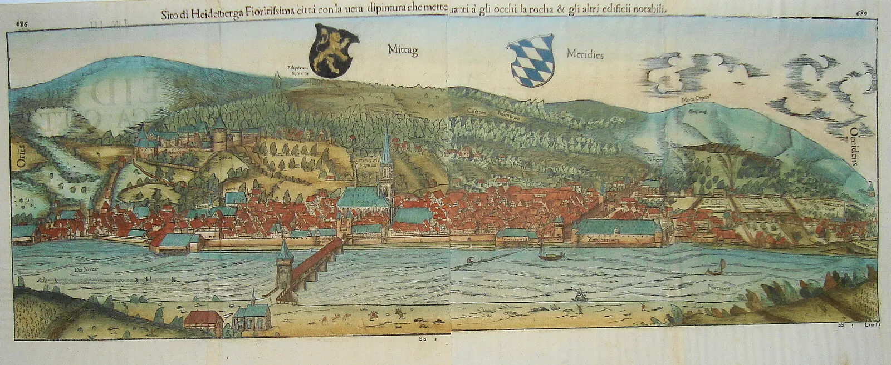
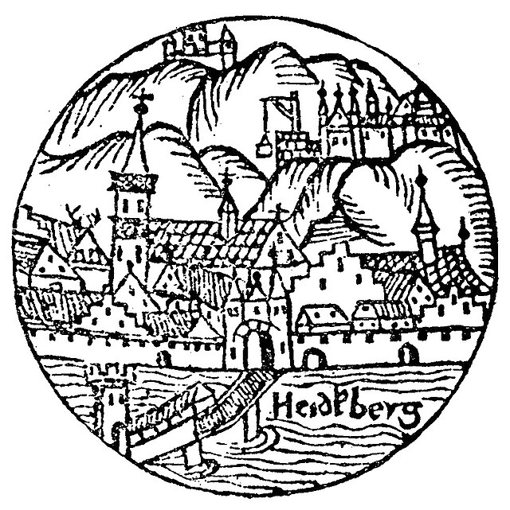
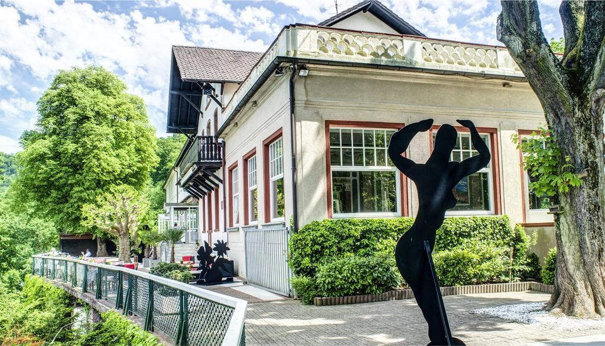

# Die obere Burg auf der Molkenkur

*Achim Wendt*

**Stationen** (Rundgang: circa 1 Stunde, mit festem Schuhwerk):

**[1]** Station Molkenkur

**[2]** Halsgraben der ehemaligen Burg (Molkenkurweg)

**[3]** Gedenktafel zum »alten Schloss«

**[4]** Fundament- und Mauerreste der südlichen Ringmauer

**[5]** Aussichtsterrasse über dem nördlichen Bering

**[6]** »Spiegelsaal« mit Wandgemälde der »oberen Burg«

**[7]** »Steinrusseln« und Bossenquader am Westhang der Molkenkur

**[8]** Plateau mit Burgschanze und »Plättelsweg«

> **Anfahrt zur Molkenkur**
>
> Bergbahn: Die Molkenkur ist bequem mit der Bergbahn (Station am Kornmarkt) zu erreichen (kostenpflichtig). Zwischen April und Oktober von 9 bis etwa 20 Uhr, November bis März von 9 bis etwa 17 Uhr.

*Reste der gemauerten Artilleriebastion auf der Molkenkur**

Die Frage nach einer zweiten Heidelberger Burg dürfte selbst die meisten Bewohner der Stadt ratlos zurücklassen - »aus dem Auge aus dem Sinn«: Eine verheerende Pulverexplosion machte sie im Jahr 1537 nahezu dem Erdboden gleich. »Das Schloß stürzte in seiner ganzen Größe in einem Augenblick zusammen«, so berichtete der Humanist Jacob Mycillus seinem Freund Joachim Camerarius in einem lateinisch verfassten Brief. »Die gewaltige Kraft des Pulvers, durch dicke Mauern eingeschlossen und verriegelt«, habe sich nämlich durch Blitzeinschlag entzündet. Sobald das Pulver aber »seine Fesseln gesprengt und sich mit Gewalt Bahn geschaffen« habe, sei es nicht nur hoch in die Luft gegangen, sondern habe auch das ganze Gebäude vom Gipfel gestürzt.

Wenige Jahre später wurden die Überreste der Burg auf der großen Stadtansicht des Cosmographen Sebastian Münster immer noch als »altehrwürdig« bezeichnet, in den Kriegsläuften des 17. Jahrhunderts dann aber mit mächtigen Schanzen überbaut. Im Schatten der prominenten Schlossruine sollte bald darauf auch die Erinnerung an die Burg entschwinden. Selbst ihr Name ist längst von der sogenannten »Molkenkur« überprägt, die 1856 auf dem ehemaligen Standort als Wanderziel mit Gastwirtschaft und herrlicher Aussicht entstand. Versuchen wir nun, die letzten Spuren dieser Burg zu erkunden, die einst das mittelalterliche Heidelberg bekrönte. 

*»Reliquiae vetustae arcis« — die »Ruinen der alten Burg« hoch über der Stadt und dem Schloss auf Sebastian Münsters Stadtansicht von 1550*

*Ansicht der Stadt Heidelberg mit den beiden Burgen im »Calendarium Hebraicum« des Sebastlan Münster, 1526/27: Der Holzschnitt wurde aus Versehen spiegelverkehrt gefertigt. Hier ist die Darstellung daher erneut gespiegelt, wie der Schriftzug »Heidelberg« zeigt.*

Man erklimmt die Höhe der Molkenkur am einfachsten von der Stadt oder dem Schloss aus mit der Bergbahn bis zur Station **"Molkenkur"** **[1]**. Von dort bietet sich eine weite Sicht über die Stadt und das Schloss, gewährt aber ebenso die Gelegenheit, den Standort der längst verschwundenen zweiten Burg zu betrachten. Im Jahrzehnt vor ihrem Untergang gab sie Sebastian Münster in einer Abbreviatur der Stadtansicht schematisiert auf hohem Gipfel mit Bergfried und einer von Rundtürmen flankierten Ringmauer wieder (siehe Abb. auf S. 57). Ihre damals noch unverzichtbare Bedeutung für die Wiedererkennbarkeit der kurpfälzischen Residenzstadt offenbart die älteste, 1485 gedruckte Darstellung ‚Heidelbergs, die das Konterfei auf die von beiden Burgen bekrönte Neckarbrücke und Heiliggeistkirche reduziert. Ganz ähnlich begegnet das Bild auch in der ältesten überlieferten Beschreibung der Stadt aus der Feder des Frühhumanisten Peter Luder (siehe Kasten auf S.57). Dieses Lob des Fürsten würdigt beide Heidelberger Burgen als gleichermaßen prächtig und reich ausgestattet. Besonders hebt er den »künglich sal«, den königswürdigen Saal einer der beiden Burgen hervor, welcher auch später noch in Beschreibungen des Heidelberger Schlosses gerühmt wird (siehe Rundgang 6). 

> **Die beiden Heidelberger Burgen in der ältesten Beschreibung Heidelbergs, 1458 verfasst von dem Frühhumanisten Peter Luder - ein Lob der Stadt zu Ehren der Landesfürsten**
>
> »Auf den Gipfeln stehen zwei Burgen, die aus so viel Steinwerk erbaut sind, dass ihrer Häuser Zier denen, die darin wohnen, zur Lust gereiche, aber die Höhe der Mauern, Türme und Vorwerke wie auch ihre natürliche Lage den Feinden ein Grauen sein möge. Wer vermöchte nun von der besonderen Größe der Bauwerke, im besonderen der einen Burg, zu erzählen, wo der einzigartige Saal, der auch der königliche heißt, mit dem Aufwand an Säulen, Zier der Wände und Deckenbalken von so großer Schönheit gebaut ist, dass darin selbst der allermächtigste König empfangen werden kann. Darum haben auch die Fürsten des Rheines vor längst vergangenen Zeiten nicht gezweifelt, den Stuhl der Pfalzgrafschaft, der früher woanders stand, mit vollkommener Einsicht in diese unübertreffliche Burg zu verlegen.« 

*Das im »Schweizer Stil« 1857 neu errichtete Gasthaus auf der Molkenkur, im Vordergrund liegen Trümmer als Reminiszenz an die alte Burg*

Zur Zeit der Zerstörung der oberen Burg im Jahr 1537 verband man das Gedächtnis an das Königtum Ruprechts im ersten Jahrzehnt des 15. Jahrhunderts und dessen Saalbau (»aula regia«) allerdings auch noch mit dem »Palast« der alten Burg. Mycillus pries die Burg in seinem Brief daher als einen Bau, »der einst das Zentrum des römischen Reiches gewesen war und die königliche Wohnung so vieler berühmter Fürsten«. Gestehen wir dieser im 16. Jahrhundert noch lebendigen Erinnerung an die obere Burg einen wahren Kern zu, dann spielte sie vielleicht noch bei Herrschaftsantritt des Königs im Jahr 1400 eine wichtige Rolle. Möglicherweise besiegelte erst der kurz darauf unternommene Ausbau der Residenz, von dem noch der »Ruprechtsbau« Zeugt (siehe Rundgang 6), die Bedeutungsverschiebung zu der näher Zur Stadt gelegenen unteren Burg, dem heutigen Schloss.

> **Die »Molkenkur«**
>
> In der Baugruppe der heutigen Hotelgebäude ist das alte Kerngebäude noch gut zu erkennen, welches der Gastwirt Albrecht Wagner 1856 erbaut hatte. Nahe zu der berühmten Schlossruine boten Waldeinsamkeit und Höhenlage ideale Voraussetzungen zur Errichtung einer »Molkenkur«, wie sie nach Schweizer Vorbild damals in Mode waren. Das ehemalige Burggelände diente nun Ziegen als Weide, deren Milch zu Molken verarbeitet wurde. Ihrem reichlichen Konsum schrieb man im Verein mit angenehmer Bewegung auf Spaziergängen in abwechslungsreicher Berglandschaft aufsehenerregende Erholungserfolge zu. Entsprechend wählte man auch keine architektonischen Reminiszenzen im neugotischen Burgenstil, sondern das alpin anmutende Gewand eines »Schweizer Hauses« mit umlaufendem Holzbalkon, weit vorstehendem Dach und Schnitzwerk. Nur auf den ältesten Darstellungen der »Molkenkur« platzierte man noch romantisch überwucherte Trümmerstücke, um auf die mittelalterlichen Ursprünge zu verweisen. Die Platz- und Namenswahl rechnete daher schon damals nicht mehr mit dem historischen Ort, sondern seinem vermarktbaren Gebrauchswert. 

*Annonce des Gastwirts Albrecht Wagner zur Eröffnung der »Molkenkur-Anstalt« 1857.*

Auf der Straße angekommen wenden wir uns nun nach rechts und blieken in einen tiefen, hohlwegartigen Geländeeinschnitt, durch dessen einst tiefer reichende Sohle heute die FahrStraße zum Schloss führt. Die markante Eintiefung wurde künstlich ausgehoben, um den Bauplatz der Burg mit einem breiten **Halsgraben** **[2]** als Schutz gegen Angriffe vom ansteigenden Bergsporn aus zu sichern. Über der nördlichen (in Blickrichtung rechten) teils von Schutt überlagerten Grabenkante erhob sich die hochaufragende Schildmauer, in deren Schutz die Bauten der Burg lagen. Am Westende des Einschnitts gelangen wir rechts auf eine Auffahrt, die vermutlich den alten, rampenartigen Burgweg überformt und heute auf den Parkplatz des Molkenkurhotels führt. Nach rund 100 Metern steht man vor den Hotelgebäuden (siehe Kasten auf S.59).

Bevor wir uns auf Spurensuche begeben, werfen wir am oberen Ende der Auffahrt einen Seitenblick auf die rechter Hand gut sichtbar aufgestellte **Sandsteintafel** **[3]**, die hier an den historischen Ort der verschwundenen Burg erinnert: »Hier stand einst das alte Heidelberger Schloss, urkundlich zum ersten Mal erwähnt im Jahre 1225, als obere Burg im Jahre 1303, durch Blitzschlag zerstört am 25. April 1537«. Als man die Tafel 1875 aufstellte, war eigentlich noch gar nicht bewiesen, auf welche der beiden Burgen das älteste Schriftzeugnis eines »castrum« wirklich zu beziehen ist. Die Quellen schweigen nämlich darüber, wann und warum es zur Errichtung der Burgen kam und in welchem Verhältnis sie zueinander standen. Im ganzen 13. Jahrhundert ist dafür stets nur ein pfalzgräfliches »castrum« zu Heidelberg erwähnt. Erst eine 1303 ausgestellte Urkunde nennt dann zwei Burgen. Hinfort wurde zwischen der »oberen« und »niederen Burg« unterschieden, wobei die untere das heutige Schloss bezeichnete. Ab 1421 begann man die höher gelegene Anlage auch das »alte Schloss« zu nennen. Ob sie deshalb aber tatsächlich die ältere der beiden Heidelberger Burgen war, blieb lange umstritten, denn im Mittelalter bezeichnete man Bauwerke gewöhnlich als neu, sobald dort Umbau ten stattgefunden hatten. Hatte man also auf dem unteren Schloss neu gebaut, wurde damit das obere Schloss als »alt« empfunden. Des Rätsels Lösung bergen also allein die geringen auf dem Bergsporn verbliebenen Reste. 

Auf dem Heidelberger Schloss kennen wir bis heute keine baulichen Zeugnisse, die weit vor das genannte Datum von 1225 zurückreichen. Dagegen traten auf der »oberen Burg« bei archäologischen Sondagen 2001 Funde zu Tage, die eine Nutzung des Standorts schon im 12. Jahrhundert beweisen. Dieses Ergebnis fügt sich in das archäologisch erschlossene Bild zu den Anfängen der Stadt, deren Kristallisationskern eine am Fuß des Burgberges gleichzeitig aufblühende Siedlung im Areal um die Peterskirche war (siehe auch Rundgänge 4 und 5). Bei Ausgrabungen wurden hier 1987 und 2003 die Überreste großer Hofanlagen nachgewiesen. Die Fundamente turmartiger Steinhäuser, Funde von Hufeisen, Reitersporen, Pfeilbolzen und der Abzugsbügel einer frühen Armbrust bezeugen die Anwesenheit von Ritteradel, den man wohl mit den Dienstleuten der älteren Heidelber ger Burg gleichsetzen darf. Der Kern der heutigen Schlossanlage entstand dann offenbar erst in direktem Bezug auf die planmäßige Anlage der späteren »Gründungsstadt« (siehe Rundgang 4). Dieser großzügige Neuansatz wurde wahrscheinlich erst von den Wittelsbacher Pfalzgrafen und Bayernherzögen initiiert, die 1214 die Herrschaft über Heidelberg antraten. Die ältere Burg dürfte ihren großzügigen Ausbau jedoch schon Pfalzgraf Konrad von Staufen verdanken. Die um 1220 verfasste Vita des Seligen Eberhard von Kumd erzählt davon, dass jener mit seinem Hof von Burg Stahleck am Mittelrhein auf das »castrum Heidelberg« gezogen sei. Nach allem was wir heute wissen, dürfte damit die »obere Burg« gemeint gewesen sein. Um 1180 markierte also wohl dieser heute so abseitig wirkende Ort den Ausgangspunkt zur Gründung der Stadt Heidelberg und zur Entwicklung der Pfalzgrafschaft zu einem der mächtigsten Territorien des »Alten Reichs«. 

*Archäologisch nachgewiesene Fundamentreste der Burg auf der Molkenkur*

Von der Auffahrt wenden wir uns nach rechts und blicken über die weite Parkplatzfläche, die etwa die Ausdehnung der ehemaligen Kernburg markiert. Geringe Fundamentreste der Ringmauer blieben nur an den tiefer liegenden Randzonen der Hangflanken erhalten. Sie wurden allerdings schon bei Steinbrucharbeiten im 18.Jahrhundert reduziert sowie verschüttet und sind für den Besucher daher nicht mehr sichtbar. Erkenntnisse zum erhaltenen Bestand brachten archäologische Untersuchungen: 

Zuerst hatte sich im Jahr 1901 der Heidelberger Lehrer und Altertumsforscher Karl Pfaff auf systematische Suche begeben, um die Entstehungszeit und Ausdehnung der Burg zu ermitteln. Trotz der tiefgreifenden Geländeveränderungen konnte er noch genügend Mauerreste zu Tage fördern, die den Mauerbering einer überaus großen, im Grundriss rechteckigen Burganlage ablesen ließen. Die Innenbebauung war allerdings weitgehend den späteren Planierungen des Burgplateaus zum Opfer gefallen. Schemenhaft war noch das massive Fundament eines Turmes hinter der gegen den Halsgraben gerichteten Schildmauer zu erfassen. Der Ausgräber verstarb jedoch wenige Jahre später. Unterlagen und Funde, die konkretere Auskunft hätten geben können, gingen verloren. Nur ein durchgepauster Grundrissplan blieb erhalten, der erst vor kurzer Zeit wieder aufgefunden wurde. Das Alter der verschwundenen Burg blieb daher weiter umstritten. Erst 2001 — genau ein Jahrhundert nach Karl Pfaffs Grabung - bot ein Projekt zur Erweiterung des Hotelbetriebs auf der Molkenkur wieder die Möglichkeit zu archäologischen Untersuchungen. Das Ergebnis offenbarte einerseits die zwischenzeitlich weiter fortgeschrittene Zerstörung der Fundamentreste. Es bestätigte andererseits aber auch exakt den von Pfaff dokumentierten Grundriss. 

Geht man von der Auffahrt aus diagonal über den Parkplatz, erhebt sich am anderen Ende der einzige noch über der Bodenoberfläche sichtbare Baurest der ehemaligen Burganlage. Es handelt sich um einen kleinen **Ausschnitt aus der Südostecke der Ringmauer** **[4]**. Bei näherer Betrachtung erweist sich der untere Teil als Fels mit darauf gesetztem Mauerwerk. Dieses ist nicht gleichartig gemauert: Der untere, ungeordnet wirkende Abschnitt zeigt die ursprünglich im Boden verborgene Fundamentzone an. Die wenigen darüber sorgfältiger aufgeschichteten Lagen aus quaderartigen Hausteinen - sogenannte »Handquader«, die man ohne Hebewerkzeuge mit der Hand versetzen konnte - kennzeichnen dagegen den letzten Rest des alten Sichtmauerwerks. Weshalb heute auch das einstige Fundament über der Geländeoberfläche zu sehen ist, erklärt sich aus nachträglichen Geländeabtiefungen, die bei der späteren Steinbruchtätigkeit auf dem ehemaligen Burggelände unternommen wurden. Die mittelalterliche Oberfläche des Burghofs, um den sich einst die Gebäude gruppierten, wurde im Laufe der Zeit so tief abgetragen, dass wir uns heute teils mehrere Meter unter dem historischen Bodenniveau befinden. Nur der noch sichtbare »Mauerzahn« blieb vermutlich als Rücklage für ein Nebengebäude der Gastwirtschaft — bestehen. Der hier etwa 1,5 Meter starke Bering dürfte ohne aufgesetzte Bauten einst wenigstens acht bis neun Meter Höhe erreicht haben. 

*Blick auf die einzigen noch sichtbaren Mauerreste der "oberen Burg" am Parkplatz der Molkenkur*

Die Breite der gegen den Berg gerichteten Schildmauer lässt sich abschätzen, wenn man von der (vom Parkplatz aus betrachten) rechten Abbruchkante ausgehend die Mauerflucht in gerader Linie bis knapp vor die Hangkante abschreitet. An dieser Stelle war 2001 die noch gut erhaltene Südwestecke der Burg aufgedeckt (siehe Abb. auf S.64). Der Bering gründet dort erheblich tiefer am Abhang und wurde an der Außenseite von einem mächtigen, diagonal vorspringenden Pfeiler abgestürzt. Heute liegt der Baurest von Erdreich überschüttet wieder tief unter der Parkplatzoberfläche.

Blicken wir über den Parkplatz zurück, so markiert die Bauzeile der Gaststätte heute in etwa die nördliche Bergrenzung des ehemaligen Burgbezirks. Für Besucher unzugänglich haben sich im Keller des alten "Schweizer Hauses" noch die Reste eines kleinen Rundturms erhalten. Wir gehen nun an der Auffahrt um die Gaststätte herum auf die **Terrasse** **[5]**, die zum Verweilen einlädt. Dort befinden wir uns etwa an der Stelle der talwärts gerichteten Ringmauer und können die weite Aussicht über das Neckartal sowie die Rheinebene genießen, die eindrucksvoll vergegenwärtigt, warum man im Mittelalter an dieser Stelle eine Burg errichtete. Wenn man den Blick rechts hinunter auf die Dächer des Heidelberger Schlosses wendet, wird die beherrschende Dominanz des Standorts offenbar. Ohne eine Burg an dieser Stelle war das untere Schloss bei Belagerungen von hier aus auch schon im Mittelalter stark gefährdet. Deshalb befestigte man die Position nach Zerstörung der oberen Burg wieder mit Schanzen und verteidigte sie bei der großen Belagerung Heidelbergs im Dreißigjährigen Krieg 1622 als Schlüsselposition. 

*Südwestecke der Burg mit Stützpfeiler, die bei der Grabung 2001 freigelegt wurden*

Von der Terrasse aus werfen wir beim Rückweg zur Auffahrt einen Blick in den **»Spiegelsaal«** **[6]**. Der 1925 als repräsentativer Tanz- und Veranstaltungssaal errichtete Anbau erstrahlt restauriert im alten Glanz. Im Inneren befindet sich ein großformatiges Wandgemälde, das dem Gast heute wieder eine anschauliche Vorstellung vom Erscheinungsbild der verschwundenen Burg vermitteln soll. Es beruht auf dem recht frei interpretierten Vorbild einer im Jahr 1537 angefertigten Federzeichnung, die dem kunstsinnigen Pfalzgraf Ott(o)-Heinrich zugeschrieben wird (siehe Abb. auf S.66). Ob das mit kurpfälzischem Wappen versehene Blatt wirklich die im gleichen Jahr zerstörte obere Heidelberger Burg darstellt, ist nicht ganz sicher. Sie müsste dann nämlich aus der Erinnerung oder nach einer älteren Vorlage gezeichnet worden sein. Die dargestellte Topografie und die Baumerkmale lassen sich aber durchaus mit den Gegebenheiten vor Ort verbinden: Zu sehen ist eine kompakte Kernburg mit einem hohen quadratischen Bergfried und um einen Hof gruppierten Wohnbauten. Talwärts erstreckt sich eine längliche Vorburg, die von zwei Rundtürmen flankiert wird. Wenn die Zeichnung tatsächlich die obere Heidelberger Burg darstellt, so zeigt sie mit großzügigen Dreibahnfenstern, Bogenfriesvorkragungen und Eckwarten ein spätgotisches Erscheinungsbild, das auf prägende Umbauten im späteren 14. oder frühen 15. Jahrhundert verweist. 

*Darstellung der »alten Burg« im Spiegelsaal der Molkenkur*

*Die »obere Burg« auf einer Federzeichnung von 1537, die dem Pfalzgrafen Ottheinrich zugeschrieben wird.*

Wir kehren zum Parkplatz zurück und laufen die Auffahrt wieder hinab, um hart rechts auf den nordwärts entlang der Hangstützmauern geführten **Waldweg** einzubiegen. Nach knapp 100 Metern zweigt ein Pfad hangabwärts in die Gegenrichtung ab. Der Abstieg ist unbefestigt und besonders im Winter nur sehr eingeschränkt zu begehen. In etwa linearem Bezug auf den ehemaligen Halsgraben der Burg sind beidseitig des Weges auffällige **Anhäufungen aus losem Steinmaterial im Unterholz** **[7]** auszumachen, die in langen Reihen den Hang abwärts ziehen. Es handelt sich um sogenannte »Russeln«, die aus Steinen aufgeschichtet wurden, um die Zwischenräume landwirtschaftlich - vorzugsweise als Weinberge - nutzen zu können. Sie grenzten zugleich die Parzellen voneinander ab und schützten in den Steillagen vor Erosion. Ihr Alter ist unbekannt, doch dürften sie vor weit mehr als 200 Jahren entstanden sein, als hier noch kein Wald bestand (siehe Rundgang 5). An verschiedenen Stellen finden sich darin auch Trümmer der »alten Burg« verbaut. Besonders im Bereich unterhalb der bergseitigen Ringmauer liegen - schwer zu sehen - vereinzelt so genannte Buckel- oder Bossenquader. Diese mächtigen Werksteine blieben an der einst im Mauerverband nach außen gewandten und von einem breiten Randschlag gesäumten Stirnseite bruchrauh - man ließ also die sogenannte »Bosse« stehen, daher die Bezeichnung. Ein so gemauerter Block bewirkte einen martialischen Eindruck, der für anspruchsvolle Bergfriede der Stauferzeit charakteristisch ist. Ein beeindruckendes Vergleichsbeispiel ist etwa auf der Hinterburg in Neckarsteinach 15 Kilometer östlich von Heidelberg zu besichtigen. Auf der Ober- und Unterseite der Quader, den Lagerflächen, die einst im Mauerverband verbaut waren, sind mitunter sogenannte Wolfslöcher eingearbeitet. Sie dienten dazu, die Steine mit Hilfe des »Wolfs« anzuheben und zu versetzen. Dieses Hebewerkzeug wurde jedoch schon im 13. Jahrhundert allmählich durch die Hebezange verdrängt, deren Löcher allenthalben auf den Quadern des heutigen Schlosses zu sehen sind (siehe Rundgang 6). Die am Abhang verstreuten Bossenquader legen zugleich Zeugnis vom gewaltsamen Untergang der Burg ab, ganz so, wie das Jacob Mycillus unter dem Eindruck der Katastrophe geradezu apokalyptisch beschrieb: »So, wie der Turm als Viereck gebaut war und seine vier Öffnungen den vier Weltengegenden zuwandte, so schleuderte er auch im Fall die Steinbrocken in ebenso viele Himmelsrichtungen und zersprang unter dem Druck gleichsam in Kreuzesform. Hoch flogen überall die Bruchstücke der stürzenden Mauer und schlugen unten auf den Feldern ein ...«. 

*»Buckelquader« wohl vom stauferzeitlichen Burgfried der »alten Burg«, die heute am Westhang der Molkenkur verstreut liegen*

Wir gehen den Waldweg wieder zurück und wenden uns auf dem Hauptweg links in Richtung Stadt. Nach wenigen Metern bergabwärts erreicht man ein **Plateau, an dessen rechter Seite sich eine Felskuppe erhebt** **[8]**. Die dominante Aufhügelung wird wegen ihrer künstlich wirkenden Form vielfach als Rest einer ältesten Burg des 11.Jahrhunderts gedeutet. Die These konnte bisher aber nicht bestätigt werden, da Wall-Gräben, Baureste oder archäologische Funde fehlen. Die Beurteilung wird erschwert durch nachträgliche Veränderungen des Geländes wie die Steinbrüche an der Ostseite und die neuzeitlichen Befestigungen an der Westseite (siehe Rundgang 5 zum Steinbruch am Gaisberg auf S.101).

*Reste einer ehemaligen Artellerieplattform mit dem "Plättelsweg" im Bereich der »Burgschanze«*

Reste dieser Schanzenanlagen lassen sich am besten links vom Weg erkennen, entlang des Westabhangs. Es handelt sich um trocken (das heißt ohne Mörtelbindung) aus Lesesteinen aufgeschichtete, heute stark verfallene Wälle mit angeböschter Außenseite, die man als feste Wandschale ohne Mauerkern gegen den Steilhang gesetzt hatte. Darüber waren aus losen Steinen Wälle aufgeschichtet, die als Brustwehren Schutz für die dahinter aufgestellte Artillerie boten. Wenn man den Weg Richtung »Molkenkur« zurückgeht, kann man am ansteigenden Fels auf einem schmalen Pfad weitere Wallreste und Laufgräben erkennen, die eine kleinere »Redoute« - also ein geschlossenes Vorwerk - bildeten. 

*Die »Burgschanze« auf der Molkenkur im Befestigungsplan der Stadt Heidelberg aus dem Jahr 1622*

Die Wallanlagen gehörten zu einer als »Burgschanze« bezeichneten Bastion, die sich um den ganzen ehemaligen Burgbezirk zog. Eine plastische Vorstellung davon vermittelt ein Plan der Befestigungen Heidelbergs aus dem Jahr 1622. Die Notwendigkeit zu einer derart ausgedehnten Befestigung des Areals hatte sich bald nach Beginn des Dreißigjährigen Krieges ergeben, als nach der Niederlage des »Winterkönigs« in der Schlacht am Weißen Berg 1620 die Truppen der Katholischen Liga die kurpfälzische Hauptstadt anzugreifen drohten. Die alles überragende Lage der »alten Burg« markierte eine entscheidende Schlüsselposition für die Verteidigung der zu ihren Füßen liegenden Residenz. Feindliche Geschützstellungen auf den Abhängen von Königstuhl und Gaisberg konnten von hier aus wirkungsvoll unter Feuer genommen werden. Entsprechend zäh wurde die »Burgschanze« bei der Belagerung im Jahr 1622 gegen die übermächtigen Truppen des berühmten bayerischen Feldherren Johann Tilly über mehrere Monate verteidigt. Auch im Orleansschen Krieg Ende des 17. Jahrhunderts setzte man die Stellungen wieder instand. Erst im 18. Jahrhundert geriet die Position in Vergessenheit und verfiel. 

Wenn man zwischen der Molkenkur und dem Weg um die »Burgschanze« den Blick zu Boden richtet, fällt die linear aus großen Sandsteinplatten gebildete Wegbefestigung ins Auge, auf die sich die volkstümliche Bezeichnung »Plättelsweg« bezieht. Die archaische Anmutung des Belages gab seit jeher Anlass zu Spekulationen über das hohe Alter - etwa als römischer oder mittelalterlicher Höhenweg, auf den sich später auch die Burg bezogen habe. Beweisbar ist das - wie erwähnt - schon aufgrund derumfassenden Geländeveränderungen durch die Schanzenanlagen nicht. Nicht unwahrscheinlich ist aber ein Zusammenhang als Zugang zur »Burgschanze«, die auch Merian mit einer befestigten Wegrampe abbildete.

Im 19.Jahrhundert war der »Plät telsweg« zu einem beliebten Waldpfad geworden, dessen bemooste Steinhalden dem Ruinenbegeisterte Wanderer das Bild urwüchsiger Romantik vermittelten. Die Verbindung zum Schloss wurde später durch den Steinbruch und die Bergbahn zerschnitten, so dass wir heute wieder auf gleichem Wege zur Bergbahnstation zurückkehren, den wir hergekommen sind. Von dort können aber auch den Molkenkurweg links hinab wandern und erreichen nach etwa zehn Minuten den Abzweig zum Schloss-Wolfsbrunnenweg. Nach 200 Metern rechts führt uns ein Treppenabgang direkt in den »Hortus Palatinus«, den berühmten Renaissance garten des Heidelberger Schlosses (siehe Rundgang 6).

> **Zum Author**
>
> Achim Wendt ist seit 15 Jahren als Leiter eines selbständigen Büros für Bauforschung, Dokumentation & Konzeption (BDK) bundesweit engagiert mit Schwerpunkten in der Sanierungsbetreuung staatlicher und kommunaler Baudenkmäler. Langjährig für die Stadtkernarchäologie in Heidelberg tätig, ist er durch zahlreiche Veröffentlichungen zur Stadt- und Baugeschichte in Heidelberg hervorgetreten.

*Gedenkstein zur Einnerung an die obere Burg auf der Molkenkur*