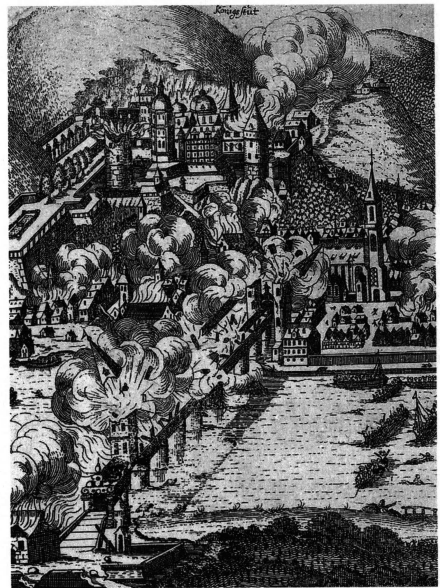
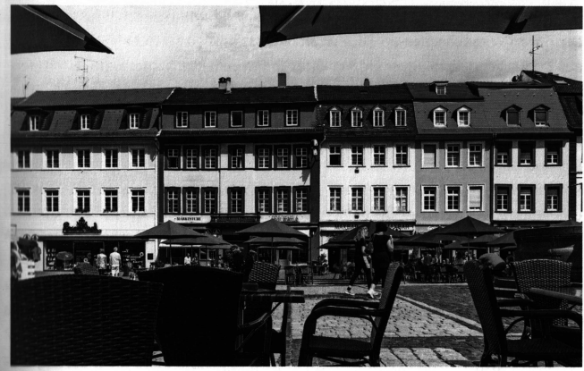
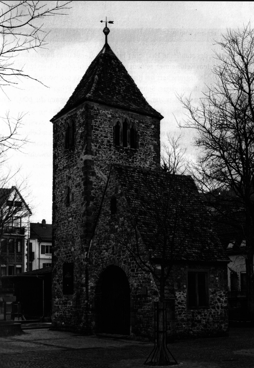
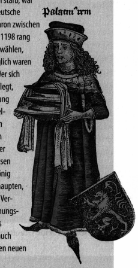
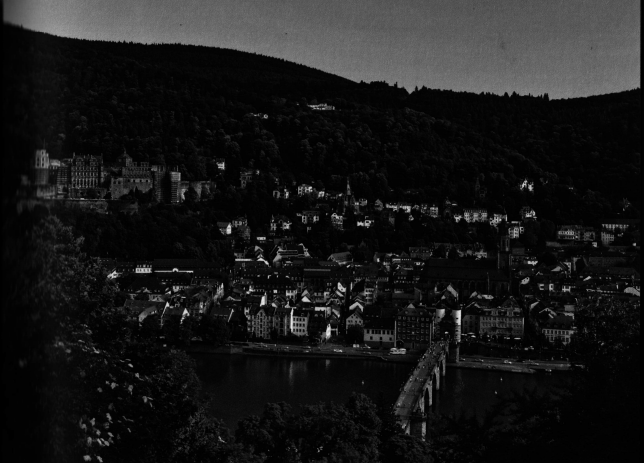

# Хайдельберг в Средневековье и Ренессансе. Историческое введение

*Карла Майер и Кристоф Маунтель*

«Старый Гейдельберг» — так назвал Неккарский город поэт Виктор фон Шеффель в своем стихотворении 1854 года, тем самым задав имя для места, которое до сих пор манит туристов со всего мира. Этот «старый Гейдельберг» был открыт в эпоху романтизма, когда город под замковыми руинами вдохновлял целое поколение молодых поэтов, таких как Гёльдерлин, Брентано и Айхендорф. Но их внимание было обращено не к оживленному научному центру XIX века. «Старый Гейдельберг» — это была, по мнению романтиков, гордая резиденция пфальцграфов Рейна в Средневековье и эпоху Ренессанса, когда прошлое казалось почти осязаемым в руинах на Замковой горе.

До сих пор узкие извилистые улочки под замком создают впечатление средневекового города. С противоположного берега реки панорама Гейдельберга выглядит столь же живописной и компактной, как и на старых изображениях города, таких как рисунок Себастьяна Мюнстера 1550 года или гравюра Маттеуса Мериана 1620 года. Однако стоит пройтись по улицам и площадям, и взору откроются барочные ряды домов. Из около 900 памятников архитектуры в Старом городе только 22 здания, то есть лишь 2,4 процента, относятся к периоду до XVIII века. «Старый Гейдельберг» — это название города, который уже не существует, города, погибшего в девятилетней войне за пфальцское наследство в конце XVII века.

Французские войска, вторгшиеся в Пфальц в 1688 году и оккупировавшие его, в конечном итоге не смогли удержаться против армий Священной Римской империи; самостоятельность Курпфальца была защищена. Но знаменитый приказ короля-солнца Людовика XIV «Brülez le Palatinat!» — «Сожгите Пфальц дотла!» дал его армии полномочия на систематическое уничтожение завоеванных территорий. В огне оказались не только пфальцские земли, но и города Вормс и Шпайер, а также территории Вюртемберга. Гейдельберг пострадал дважды: в 1689 году замок был взорван, а в 1693 году город у его подножия был превращен в руины. Когда осенью 1693 года войска ушли, только несколько десятков жилых домов остались стоять.

*Разрушение Гейдельберга во время Орлеанской войны 1689 года на современном ему листовке.*

Когда в 1697 году после заключения Рисвейкского мира началось восстановление, Гейдельберг стал совершенно другим городом: для новых правителей из ветви Виттельсбахов — Пфальц-Нойбургской линии, чьи владения располагались в основном на Нижнем Рейне и которые следили за ходом восстановления из их столицы Дюссельдорфа, — идеалом был современный город с прямыми улицами и единой архитектурой. Вместо того чтобы восстановить замок на Йеттенбюле, они задумали построить новую резиденцию по образцу Версаля на зелёных лугах в районе Бергхайм. Однако большинству их амбициозных проектов не суждено было осуществиться из-за сопротивления жителей Гейдельберга. В результате город в стиле барокко был построен в основном на основе уцелевшей уличной сети и средневековых фундаментных стен, сохранившихся под завалами.

Но не только восстановление породило конфликты. К этому добавились ожесточенные религиозные разногласия между новыми католическими правителями и протестантским населением. Кульминацией этого противостояния стало многолетнее противоборство за право пользования церковью Святого Духа на рыночной площади. В 1720 году герцог Карл Филипп, отчаявшись, покинул Гейдельберг со словами проклятия, что трава должна вырасти на его улицах. С этого момента расцветающая «Квадратный город» Мангейм стала новым центром власти Курпфальца. Городской план Мангейма, тщательно продуманный до мельчайших деталей, был полностью подчинен новой резиденции — гигантскому дворцу с фасадом длиной более 400 метров.

В результате серьезных разрушений, произошедших в Орлеанской войне, Гейдельберг потерял свою прежнюю «визитную карточку». Хотя барочные фасады XVIII века и создают впечатляющий ансамбль, новые здания, скромные по размеру и украшениям, не могли сравниться с величием средневековых и ренессансных строений. Более того, город утратил свое значение. Будучи одной из важнейших резиденций немецкоязычного мира, Гейдельберг, который в XIII веке мог соперничать с Прагой Люксембургов и Веной Габсбургов и служил образцом для соседних правящих династий, превратился в провинциальный город.

Этот путеводитель отправит нас на поиски утраченного Гейдельберга Средневековья и Ренессанса. Несмотря на разрушения и перестройки, следы этих эпох встречаются чаще, чем может показаться на первый взгляд. Под слоем штукатурки скрываются остатки городских стен; подвалы в Старом городе, которые не были перепланированы после разрушений, отличаются от планировки современных зданий и указывают на прежние линии улиц. Но даже над землей можно разглядеть «старый город», если внимательно присмотреться. Примером служат большие площади Старого города, такие как Университетская площадь или Карлсплац, которые — за исключением Рыночной площади — были бы невозможны в средневековом городе с его плотной застройкой. Когда-то на этих местах располагались обширные монастырские комплексы: под Университетской площадью до сих пор можно найти фундаменты августинского монастыря, а для устройства Карлсплаца около 1800 года пришлось снести францисканский монастырь.

*Барочные фасады на Рыночной площади Гейдельберга, построенные в начале XVIII века.*

Тем не менее речь идет не только о Старом городе Гейдельберга, который по сравнению с его ближайшими окрестностями еще молод. В то время как название «Гайдельберх» впервые появляется в 1196 году, сегодня присоединенные районы, такие как Хандшусхайм, Виблинген или Нойенхайм, имеют более глубокие корни, уходящие в VI век. Видимые следы на Хайлигенберге даже простираются вглубь римской эпохи и дальше, к кельтским поселениям. Этот путеводитель, рассматривая Хандшусхайм и монастыри на Хайлигенберге, также уделяет внимание этим ранним этапам истории (маршруты 1 и 2). Однако большинство маршрутов переносит нас в эпоху расцвета Гейдельберга с конца XII века, когда первая крепостная деревня под старым замком на Молькенкуре начала планомерно расширяться на восток вокруг центральной оси нынешней Главной улицы (маршруты 3 и 4).

Сначала пфальцграфы Рейна попеременно держали свои дворы в разных центрах своих владений — в Нойштадте, Альцае или Бахарахе. Но первые Виттельсбахи, ставшие правителями Пфальца в 1214 году, всё чаще возвращались в стены Гейдельберга. Со временем традиционная модель «путешествующего правления» сменилась на правление из постоянных, роскошных резиденций. Как Гейдельберг развивался под их покровительством, как город привлекал ремесленников, торговцев, а также аристократов, духовенство, а позднее и учёных и профессоров — всё это раскрывается в маршрутах 5–10, рассматривающих город с разных тематических сторон.

*Старая церковь Святого Иоанна XV века на рыночной площади Нойенхайма*

Тематическая структура этого издания предполагает, что выдающиеся достопримечательности, такие как церковь Святого Духа или церковь Святого Петра, будут упомянуты несколько раз из-за их многофункциональной роли для города и его правителей. Другие сохранившиеся постройки — среди них важные здания, такие как старая церковь Святого Иоанна на рыночной площади Нойенхайма или же часовня Святого Лаврентия в Шлирбахе, — здесь не рассматриваются. Задача этого издания не состоит в том, чтобы перечислить все сохранившиеся до 1700 года памятники. Вместо этого были выбраны остановки, на которых можно наглядно проследить, как функционировал средневековый город под властью князей. Таким образом, на примере Гейдельберга создается панорама резиденциального города, подобного тем, что можно было встретить в других княжеских центрах того времени — например, в Мюнхене, Тюбингене или Штутгарте.

## Виттельсбахи на Рейне

1214 — правитель династии Штауфенов Фридрих II пожаловал баварскому герцогу Людвигу I Кельхаймскому, своему верному соратнику, Пфальцграфство на Рейне. Людвиг управлял этим владением от имени своего малолетнего сына Отто, помолвленного с наследницей последнего пфальцграфа. Этот акт 1214 года положил начало 600-летнему правлению этой династии на землях Рейна и Неккара.

1294 — Людвиг II Строгий скончался в возрасте 64 лет в своем родном городе Гейдельберге. Говорят, что смерть настигла его в той же комнате, в которой он родился. Он стал последним Виттельсбахом, правившим одновременно Пфальцем и Баварией, и считается общим родоначальником обеих линий.

1329 — Виттельсбах Людвиг IV Баварский, несмотря на то, что с 1314 года занимал трон короля Священной Римской империи, был вынужден по Павийскому договору отказаться от регентства над Пфальцграфством. С этого момента управление Пфальцем перешло к потомкам его брата Рудольфа I, и династия Виттельсбахов разделилась на две линии: пфальцскую и баварскую.

> **Пфальцграф Рейна**
> Название «Пфальц» происходит от латинского слова palatium, которое означает королевский дворец или укрепленную резиденцию, возводимую римско-германскими королями и императорами в ключевых точках их владений до эпохи Штауфенов. «Пфальцграф» — титул, известный со времен Меровингов, обозначал местного наместника, который отвечал за управление двором и судебные дела. В X веке этот титул носили представители знати в герцогствах Швабия, Лотарингия, Бавария и Саксония. Однако к XIII веку все титулы пфальцграфов, за исключением лотарингского, исчезли. Впервые в 1131 году лотарингский пфальцграф был назван comes palatinus de Rheno, то есть «пфальцграфом Рейна». Изначально этот титул принадлежал семьям, чьи основные владения находились на Нижнем Рейне, но уже в первой половине XII века центр пфальцграфских территорий переместился в Среднерейнскую область вокруг Бахараха. Только когда в 1156 году император Фридрих Барбаросса передал титул пфальцграфа своему сводному брату Конраду фон Штауфену, владения были расширены к югу, включив в себя бывшие королевские земли Салиев вокруг Альцая. Одновременно Барбаросса наделил брата сюзеренитетом над целым рядом рейнских графств, а также передал ему управление монастырями, в том числе важной имперской аббатией Лорш и епископством Вормса, которые с эпохи Каролингов имели особое значение. На территории Вормсского епископства находился и замок, позже получивший название Гейдельберг, который Конрад сделал центром расширения своей власти на Нижнем Неккаре. В эпоху Штауфенов должность и статус пфальцграфа были значительно подняты: с этого времени пфальцграфы могли претендовать на равное положение с герцогами.

> Курфюрст
> Когда в 1196 году император династии Штауфенов Генрих VI неожиданно рано скончался, последняя попытка превратить власть над Римско-Германской империей в наследственную монархию потерпела крах. В борьбе за трон, разразившейся в 1198 году между братом Генриха — Филиппом Швабским и Вельфом Оттоном Брауншвейгским, начались споры о том, какие именно князья имеют право избирать короля и каким образом должна проводиться эта процедура. Изначально все имперские князья имели право участвовать в избрании короля. Однако круг лиц, входящих в эту группу, не был четко определен, что не раз приводило к двойным выборам и появлению антикоролей. Поэтому в 1198 году вельфами впервые была предложена идея создания небольшого привилегированного совета выборщиков, который противостоял большинству имперских князей. В него входили рейнские архиепископы Майнца, Трира и Кельна, а также пфальцграф Рейна. Со временем к ним добавились герцог Саксонии, маркграф Бранденбурга и, наконец, король Богемии. Уже в 1273 году эта группа получила исключительное право избрания короля — «курфюрсты» (от küren, что означает «избирать»). Курфюрстам была присвоена особая ответственность за судьбу Империи, что отражалось и в церемониях коронации. Пфальцграф, например, считался главным сенешалем империи, ответственным за содержание двора и организацию королевского стола. Символически он обслуживал нового короля на коронационном обеде.
> Правила избрания короля этим советом, включавшим трех духовных и четырех светских курфюрстов, были окончательно закреплены только в 1356 году в знаменитой «Золотой булле» императора Карла IV. Этот документ, запечатанный золотой печатью и считавшийся в раннее Новое время «Основным законом Империи», разрешил династический спор между Мюнхенской и Гейдельбергской линиями Виттельсбахов в пользу Пфальца. С этого времени правители Гейдельберга не только блистали как главные светские «корольмейкеры», но и пфальцграф Рупрехт III смог в 1400 году единственный раз среди Виттельсбахов занять трон короля Священной Римской империи.

*Пфальцграф Рейна как имперский сенешаль в «Всемирной хронике» Шеделя 1493 года*

1386 — Пфальцграф Рупрехт I с одобрения папы основал Гейдельбергский университет, ставший третьим старейшим университетом на немецких землях. Так он сравнялся с королевскими династиями Люксембургов и Габсбургов, которые ранее основали университеты в Праге (1348 г.) и Вене (1365 г.).

1400 — его внучатый племянник Рупрехт III был избран римско-германским королем, став первым и единственным Виттельсбахом из Пфальцской линии, взошедшим на этот престол. Это произошло после того, как курфюрсты объявили об отстранении Люксембурга Вацлава. Однако, как и Вацлав, Рупрехт считался многими современниками и историками неудачным королем с ограниченными политическими и финансовыми возможностями. Его правление в наследственных владениях, напротив, считается успешным, благодаря чему Рупрехта называли «маленьким королем, но великим пфальцграфом».

1462 — Пфальцграф Фридрих I Победоносный, которого враги называли «злым Фрицем», одержал победу над имперским войском в битве при Зеккенхайме. При его правлении владения рейнских Виттельсбахов достигли наибольшего расширения.

1552 — Известный своей любовью к книгам и архитектуре, Оттгайнрих ввел Реформацию в Курпфальце, несмотря на сопротивление других Виттельсбахов. До XVIII века Гейдельберг еще семь раз менял свою религиозную принадлежность по принципу cuius regio, eius religio («чья власть, того и вера»).

1619 — Пфальцграф Фридрих V принял предложенную ему корону Чехии после того, как император Габсбургов Фердинанд II был объявлен низложенным в результате знаменитого «Пражского дефенестрации» годом ранее. Фридрих, который правил всего 18 месяцев, вошел в историю как «зимний король» после сокрушительного поражения в битве на Белой Горе. Его родной Гейдельберг в 1622 году был захвачен Католической Лигой в ходе Тридцатилетней войны и сильно пострадал. Библиотека Палацина была перевезена в Рим.

1685 — Карл II Пфальцский скончался неожиданно рано, не оставив наследников. В результате Курпфальц перешел к Виттельсбахам из Пфальц-Нойбургской линии. Однако французский король Людовик XIV также заявил права на наследство через свою невестку, сестру Карла, Лизелотту. Это привело к началу Орлеанской войны (также известной как Пфальцская война за наследство), последствия которой оказались катастрофическими для Курпфальца. В честь разрушения его столицы Гейдельберга триумфальный Людовик даже отчеканил медаль с надписью «Heidelberg deleta» — «Гейдельберг разрушен».

*Вид на Старый город Гейдельберга с Философской тропы*

> **Маттеус Мериан и Гейдельберг (см. обложку книги)**
> На Философской тропе в Гейдельберге, на высоте около 280 метров, находится «Площадка Мериана» — каменная платформа, которую заново обнаружили только в 1967 году после проведения обширных измерений. Считается, что именно с этого места гравер и издатель Маттеус Мериан создавал своё знаменитое панорамное изображение Гейдельберга, опубликованное в 1620 году.
> Имя Маттеуса Мериана известно благодаря многочисленным гравюрам, на которых уроженец Базеля запечатлел более 2000 городов, замков и монастырей Священной Римской империи германской нации. Его работы, исполненные с исключительной тщательностью, до сих пор являются важными источниками по истории многих мест, разрушенных в войнах XVII века. Гравюра Мериана с видом на Гейдельберг, гораздо более точная и детально проработанная, чем созданная около 1550 года ксилография Себастьяна Мюнстера, считается почти масштабным изображением города, по которому можно восстановить фасады зданий и размеры участков. Однако, если взглянуть на город с «Площадки Мериана», становится очевидно, что художник стилизовал панораму для своего гравюры: улицы расширены и открыты для зрителя, крыши уменьшены, а знаковые здания увеличены. Только так художник смог вместить в своё изображение как можно больше городских деталей.

