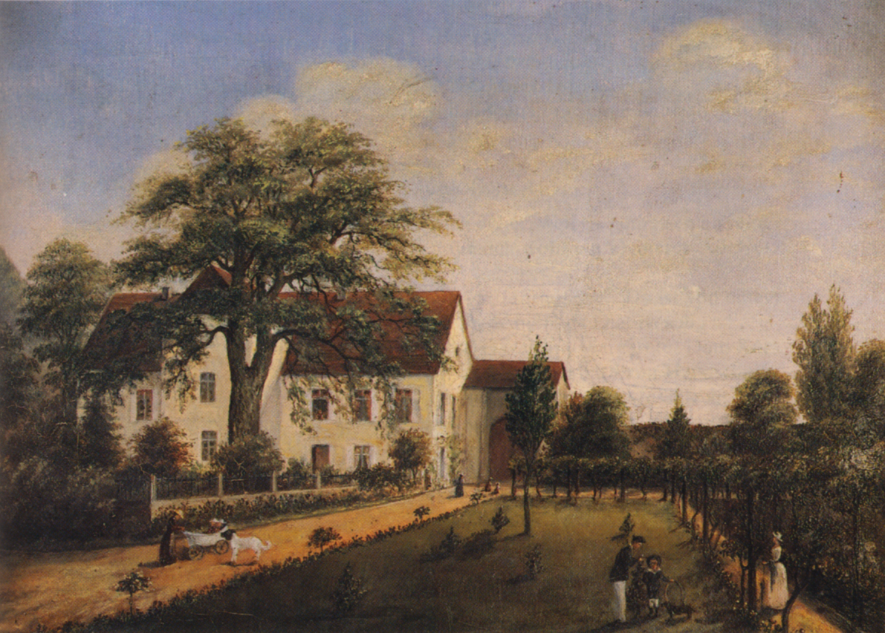

# Helmstätter Herrenhaus

> Понятие *герренхаус* (нем. **Herrenhaus**) или *усадебный дом* (нем. **Gutshaus**) относится к жилому зданию, в котором проживает помещик, и которое связано с его поместьем. В зависимости от региона или размеров здание может также называться **замком** (нем. *Schloss*). Кроме того, существуют и другие термины, характерные для определённых областей и местных традиций.

Helmstätter Herrenhaus — историческое здание в Хайдельберге, районе Хандшуҳсхайм. В настоящее время оно используется как ресторан и охраняется государством как памятник архитектуры. Здание восходит к **свободному дворянскому поместью** деревни, которое в прошлом было тесно связано с расположенной по соседству крепостью Тифбург. После разрушений, причинённых войнами XVII века, представители рода фон Хельмштатт оставили крепость в качестве жилого помещения и примерно в 1700 году построили новое здание на месте прежнего усадебного двора.

### История

Усадьба Хельмштаттерского герренхауса, вероятно, всегда была связана с соседним Тифбургом и входила в состав единого укрепленного комплекса. На месте нынешнего герренхауса до 1600 года, по всей видимости, находился усадебный двор прежних владельцев замка — господ фон Хандшуҳсхайм. После того как этот род угас, в 1624 году крепость и усадьба перешли во владение семьи фон Хельмштатт. Войны XVII века сильно разрушили как крепость, так и усадьбу и поселение в целом. Нынешний герренхаус был построен около 1700 года Георгом Адамом фон Хельмштаттом и оставался в собственности графской семьи вплоть до 1930 года. В то время он образовывал единый комплекс с соседней Тифбургом.

Большие ворота герренхауса, относящиеся к периоду около 1600 года, вероятно, служили основным входом в крепостной комплекс. На месте нынешней улицы An der Tiefburg раньше простирался сад, принадлежащий поместью. В непосредственной близости от герренхауса до недавнего времени располагались различные хозяйственные постройки. Справа от главного здания примыкал дом управляющего имением. За жилыми и административными постройками располагался большой цветочный сад, за которым параллельно герренхаусу находились свинарники и курятники, а перпендикулярно — конюшня, коровник и овчарня. Усадьба была окружена большой амбарной постройкой, погреб которой, вероятно, сохранился под улицей An der Tiefburg. У амбара был отдельный выход на задний двор, где сейчас располагается здание протестантской церкви и пасторат.

*Свободное дворянское поместье около 1870 года, картина Максимиана фон Хельмштатта.*

До 1905 года поместьем управлял Виктор фон Хельмштатт (1851–1935), который жил там сам и активно занимался хозяйственной деятельностью. После смерти матери он переехал в Некарбишофсхайм и передал управление имением доверенному управляющему. Позднее его племянник Блейкард фон Хельмштатт (1871–1952) переселился в герренхаус, но уже в 1930 году покинул его, переехав в замок Хоххаузен. Поскольку стало очевидно, что в семье не осталось прямых наследников мужского пола, Блейкард фон Хельмштатт, после смерти своего отца Рабана в 1932 году и дяди Виктора в 1935 году, постепенно продал всю собственность семьи в Хандшуҳсхайме. 

Свободное дворянское поместье было приобретено в 1935 году Карлом Куном. Впоследствии оно перешло в собственность Вальтера Нибеля, который переоборудовал его под ресторан.