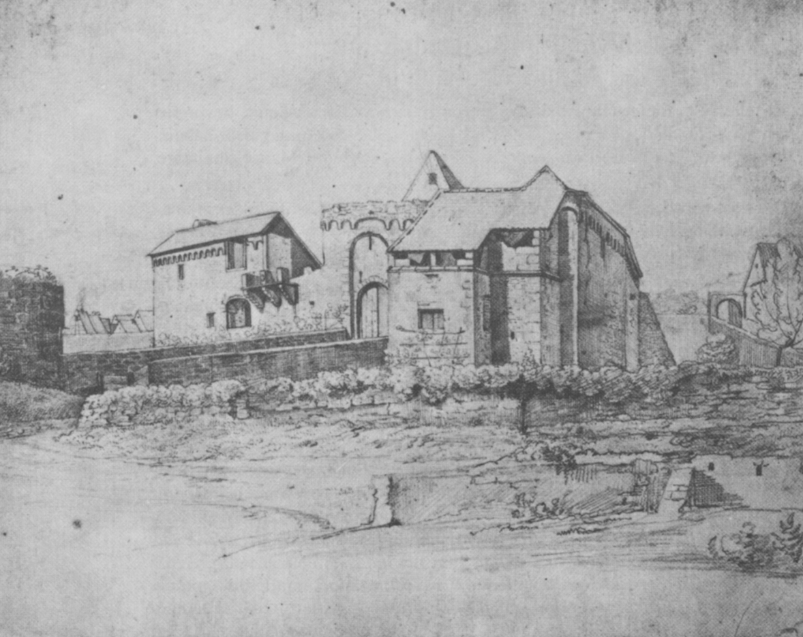
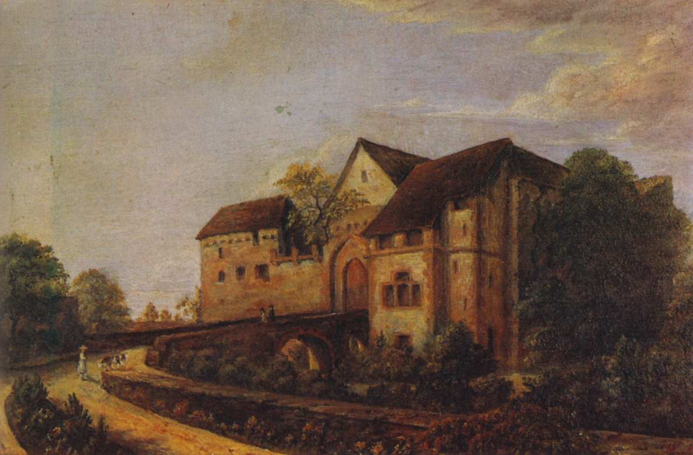

# Tiefburg

Tiefburg представляет собой руины средневекового водного замка, расположенного в районе Хандсхусхайм города Хайдельберг.

## Расположение
Замок находится северо-западнее бывшего деревенского центра Хандсхусхайма и когда-то был окружён рвом, наполненным водой из ручья Мюльбах. На северо-восточном углу здания все еще виден заделанный вход, который ранее служил местом притока воды в ров. После осушения рва этот соединительный канал использовался как проход к соседнему поместью. Фрагменты окружавшей замок стены до сих пор сохранились на прилегающих участках.

## История
Самый старый дворянский замок в Хандсхусхайме, предположительно, находился на западной вершине горы Хайлигенберг в местности Бюргель. Согласно старым преданиям, там когда-то находились своды и стены древней крепости. Существует много споров о том, действительно ли там стоял замок и когда он был покинут, а также о времени появления Tiefburg. Однако точно известно, что к XIII веку Tiefburg уже существовал. Согласно записям XIII и XIV веков, замок представлял собой водный замок, окружённый рвом шириной 12 метров, который заполнялся водой из ручья Мюльбах.

В то время как основной периметр оборонительных стен и своды подвала сохранились с Высокого Средневековья, остальные элементы комплекса носят черты архитектуры эпохи Ренессанса, что свидетельствует о крупной перестройке замка между 1500 и 1600 годами. Декоративные гербы на балюстрадах, датированные 1544 годом, подтверждают эту реконструкцию.

Замок был родовым гнездом рода Хандсхусхаймов, который вымер по мужской линии в 1600 году. В 1624 году Tiefburg перешел во владение рода фон Хельмштадтов, в собственности которого он оставался более трёх столетий.

В XVII веке замок сильно пострадал от войн, начиная с Тридцатилетней войны и заканчивая войной за Пфальцское наследство. В 1642 году замок был неоднократно подожжён, а в 1674 году оказался полностью разрушен и непригоден для проживания. Георг Адам Кристоф фон Хельмштадт (1676–1741) около 1700 года построил на месте руин новое благородное поместье, тогда как центральный замок оставался в полуразрушенном состоянии и поддерживался лишь минимально.

*Tiefburg um 1820, Zeichnung von Johann Christian Xeller (1784–1872)*

*Tiefburg um 1870, Gemälde von Maximilian Graf von Helmstatt (1810–1893)*

С 1911 по 1913 годы Tiefburg был отреставрирован владельцем, графом Рабаном фон Хельмштадтом (1844–1932), и жилое здание снова стало пригодным для проживания. Некоторое время оно сдавалось в аренду местным жителям, а в 1921 году здесь была организована молодёжная туристическая база. В 1950 году сын Рабана, Блейкард фон Хельмштадт (1871–1952), продал замок городу Хайдельберг, который передал владение Ассоциации городского района Хандшусхайм. Молодёжная база была закрыта в 1951 году, и с тех пор замок используется для проведения различных мероприятий.

## Легенда об замурованном рыцаре
В 1770 году тогдашний владелец Tiefburg, Иоганн Фердинанд Иосиф фон Хельмштадт, обнаружил в полости за стеной замурованный скелет в средневековых доспехах. О «замурованном рыцаре» ходит множество легенд. Одна из них гласит, что рыцарь был любовником одной из жительниц замка Хиршхорн и в наказание за эту связь был замурован заживо.

Считается, что его доспехи были переданы курфюрсту Карлу Теодору и позже отправлены в королевскую коллекцию древностей в Мюнхен. Однако в настоящее время следы доспехов потеряны. С 1977 года на месте находки установлена реплика, подаренная городским объединением.

## Строительная структура
Сегодня Tiefburg можно попасть через мост, пересекающий засыпанный ров шириной 12 метров. От центральной крепости сохранились лишь фундаментные стены, своды жилой башни и оборонительные стены. Около 1700 года было возведено новое главное здание с конюшнями и амбарами. Лишь в 1911–1913 годах граф Рабан фон Хельмштадт восстановил и расширил жилое строение, известное как «Дом рыцаря», расположенное во внутреннем дворе.

## Современное использование
Отреставрированное жилое здание Tiefburg в настоящее время используется в качестве культурного и общественного центра. Здесь находятся помещения для проведения мероприятий местных организаций и объединений, а также офисы и краеведческий архив Ассоциации городского района Хандсхусхайм. В замковом дворе регулярно проводятся различные городские и культурные мероприятия, включая концерты, фестивали и ярмарки, что делает Tiefburg важным местом для встреч и общения жителей Хандсхусхайма.

## Литературное упоминание
Замок Tiefburg является центральным элементом исторического романа Вальтера Лауфенберга «Рыцарь, смерть и дьявол», который был издан в 1992 году издательством Langen Müller в Мюнхене.