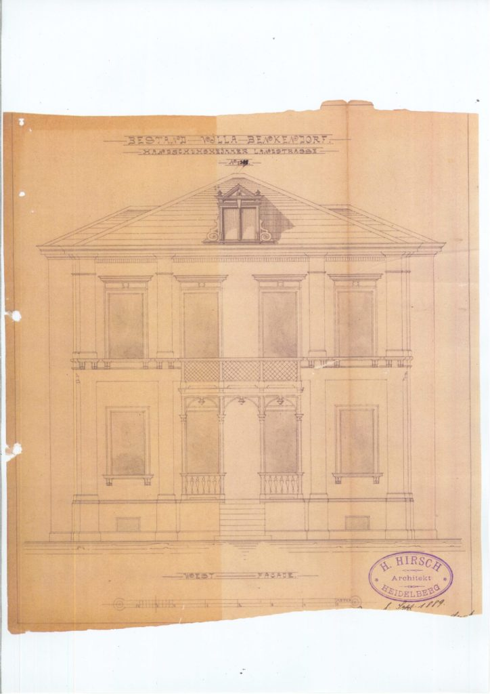
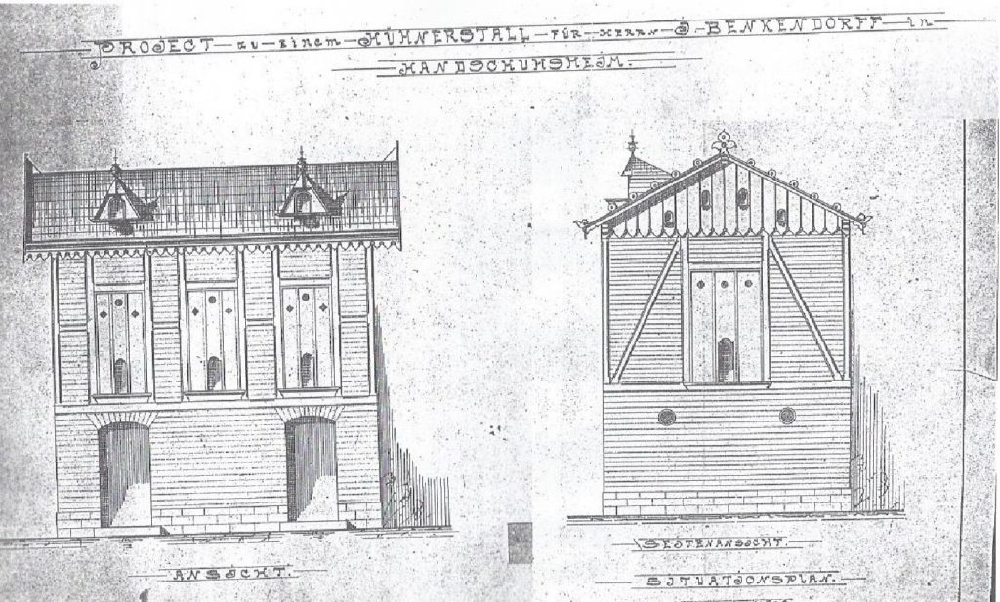
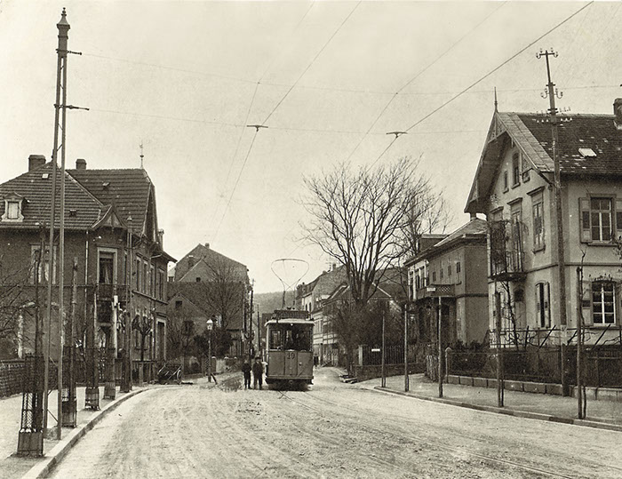

# Вилла Оротава

Вилла Оротава (ранее также известная как Вилла Денкендорф) — это охраняемое как памятник архитектуры здание, расположенное в районе Хандсхухсхайм в Гейдельберге. В 1902 году здесь произошло значимое событие — встреча двух известных русских композиторов: Николая Римского-Корсакова и Игоря Стравинского.

## Описание
Вилла Оротава — это двухэтажное здание, расположенное по адресу Хандсхухсхаймер Ландштрассе, 72. Западный фасад, выходящий на улицу, оформлен четырьмя оконными осями на верхнем этаже. Две внешние оси фасада украшены пилястрами, тогда как две средние оси на первом этаже выделены порталом, над которым расположен балкон, занимающий оба центральных окна на втором этаже.

## История
На участке, который изначально использовался как сад, в 1871 году было построено одноэтажное здание с мансардой и сводчатым подвалом. В 1882 году его приобрел Джозеф де Несль из Филадельфии, но вскоре продал мисс Хэллан из Тивертона. В 1886 году здание купил Генрих Фрейер, а в 1889 году оно перешло к Генриху Денкендорфу, который поручил архитектору Г. Хиршу перестроить его в нынешнем виде. В проектных документах здание еще называлось "Вилла Денкендорф" по имени владельца. Точные причины и время, когда вилла была переименована в "Виллу Оротава" (вероятно, в честь курорта Ла Оротава на Тенерифе), остаются неизвестными.

*Эскиз здания западного фасада 1.9.1889*

*Эскиз здания птичника*

Денкендорф приобрел в 1896 году еще несколько соседних участков, однако вскоре начал сдавать виллу в аренду гостям. В июле и августе 1902 года здесь проживал Николай Римский-Корсаков со своей семьей. Его сын Андрей учился в Гейдельберге в летнем семестре, чтобы слушать лекции Куно Фишера, а сам композитор работал над своей оперой "Пан Войевода" за арендованным пианино. В то же время в Гейдельберге находился и молодой Игорь Стравинский, который жил в доме Римских-Корсаковых и каждую неделю занимался с Николаем Андреевичем, изучая анализ музыкальных произведений и инструментовку. Стравинский сохранил теплые отношения с семьей Римского-Корсакова на протяжении многих лет. В 1908 году он написал траурный марш в память о своем наставнике, а затем свадебную музыку для его дочери Надежды.

В 1907 году вилла перешла к торговцу лесом и углем, а позднее члену городского совета Луису Келлеру, а затем к его наследнику Иоганну Людвигу Келлеру, который в 1930 году продал здание католической церковной общине. Вилла стала приютом для монахинь из Хандсхухсхайма, а в саду были обустроены небольшой крытый переход (в стиле крестового коридора) и грот с образом Девы Марии. В 1955 году вилла снова перешла в частные руки семьи Брандель, а в 1992 году здание приобрела семья Лейц.

*Конечная остановка трамвая на перекрестке H`landstr./ Kapellenweg, перед виллой Оротава (третий дом справа). Слева на фотографии - крест на месте бывшей часовни.*

После 1992 года начались масштабные работы по реставрации здания, которое к тому времени находилось в ветхом состоянии. Во время восстановления террасы в саду был обнаружен 20-метровый колодец, подобные которому в конце XIX века имели все виллы этого района для автономного водоснабжения. После присоединения Хандсхухсхайма к Гейдельбергу в 1905 году район был полностью канализирован, и подобные колодцы постепенно засыпали. Освобожденный от грунта колодец виллы Оротава теперь является последним сохранившимся автономным колодцем в Хандсхухсхайме.