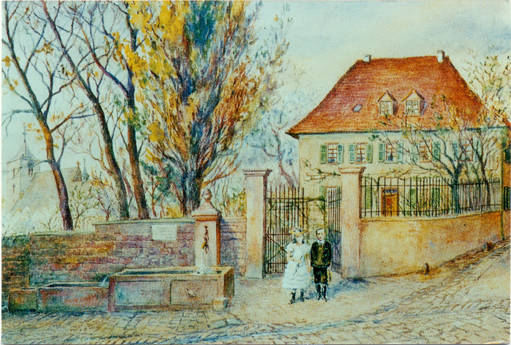

# Церковь Святого Вита в Хандшусхайме

Церковь Святого Вита (St. Vitus) — католическая приходская церковь в районе Хандшусхайм города Гейдельберг. Это старейшая церковь в Гейдельберге и одна из старейших в регионе, непрерывное использование которой задокументировано на протяжении веков. Храм назван в честь святого Вита (Вейта), раннехристианского мученика и одного из Четырнадцати святых помощников, к которым верующие обращались за заступничеством.

Приходская община Святого Вита и сама церковь входят в состав пастырского объединения Католической церкви Гейдельберга, которое принадлежит к деканату Гейдельберг-Вайнхайм в архиепархии Фрайбурга.

## История церкви Святого Вита

Церковь Святого Вита впервые упоминается в 774 году в исторических документах, когда она, вероятно вместе с прилегающим поместьем, была передана Лоршскому аббатству. Изначально она была посвящена святому Назарию, покровителю аббатства Лорш. Первая церковь на этом месте была каменной. Остатки стены, относящиеся, предположительно, к этой эпохе, до сих пор можно увидеть в триумфальной арке и восточной стене башни.

В период между 1053 и 1057 годами, во времена аббата Арнольда из Лорша, начался очередной этап строительства. В этот период была возведена новая раннероманская церковь. До наших дней сохранились фрагменты западной стены южного нефа, бывшая капелла Святого Николая с криптой, расположенной к югу от хора, и фронтонная стена над круглой аркой хора. Примерно в 1200 году основное здание церкви было расширено и превращено в трехнефную базилику с колоннами, украшенными кубическими капителями. В это время влияние Лоршского аббатства уже уменьшилось, и в 1232 году церковь перешла в подчинение архиепископства Майнца. Святой Назарий был заменен новыми покровителями — святыми Витом и Георгием.

Третий крупный этап перестройки церкви пришелся на позднеготический период, после того как здание пострадало во время войн под предводительством курфюрста Фридриха Победоносного. В 1483 году в северном нефе была возведена галерея для монахинь соседнего монастыря августинок, основанного около 1470 года и разрушенного в XVII веке. Монахини получили отдельный вход в церковь со стороны монастыря. В этот же период была построена новая аркада южного нефа и трехгранный хор. Его архитектурное убранство и нервюрные своды были обновлены в 1629 году.

После заключения Бергштрасского соглашения в 1650 году, согласно которому Хандшусхайм перешел от католического Курмайнца к протестантской Курпфальцу, церковь Святого Вита стала использоваться как симультанкирха, то есть как храм для совместного использования католиками и протестантами. Католики проводили богослужения в хоре, а протестанты — в основном зале церкви. В 1905 году церковь Святого Вита была полностью передана католической общине, после чего протестанты приступили к строительству собственной церкви — Фриденскирхе, освященной в 1910 году.

В 1933–1934 годах церковь была расширена примерно на 15 метров в северном направлении по проекту гейдельбергского архитектора Франца Салеса Куна. Это расширение привело к изменению внутренней планировки храма: старый готический хор стал использоваться как боковая капелла. В 1970–1972 годах интерьер был адаптирован к литургической реформе Второго Ватиканского собора, что потребовало обновления и согласования внутреннего убранства. В 1980 году церковь подверглась капитальной реставрации, а также была установлена новая органная установка.

## Описание церкви Святого Вита

### Внешний вид

Церковь Святого Вита и сегодня сохраняет свой средневековый облик, особенно если смотреть на нее с южной стороны, со старинного огороженного кладбища. Крутая крыша лишь незначительно возвышается над массивной романско-готической башней высотой 25 метров. Главный вход в настоящее время расположен на южной стороне, в бывшем правом боковом нефе.

### Внутреннее убранство

В церкви сохранились массивные колонны романского периода, а также два фресковых цикла на западной и южной стенах. Один из них, созданный после 1400 года и открытый в 1911 году, изображает сцены из жизни и страданий Иисуса Христа. На откосах заложенных романских окон южной стены находятся также фрески с изображением святых, относящиеся к первой половине XV века и обнаруженные в 1961 году.

Готический хор имеет полигональную форму с закрытием 5/8, двухчастные окна с масверком и нервюрные своды. Сегодня он используется как часовня для повседневных служб и крестильных обрядов. Витражные окна, созданные в 1964 году Валентином Петером Фойерштейном, изображают сюжеты из Ветхого и Нового Завета.

Основное убранство нового пространства церкви было создано в ходе обновления в 1970–1972 годах. Свободно стоящий алтарь из Кирххаймерского известняка, алтарный крест, подсвечники и крышка купели были изготовлены Карлом Рисслером, частично с элементами, вдохновленными раннеготическими формами. Стенной ковер размером 7,40 × 2,80 м в алтарной части был создан в мастерской Инге Хайнце-Кресс. Он изображает сцены из Откровения Иоанна: Христа на троне, под которым находятся семь факелов и Земля.

Алтари в боковых нефах посвящены, соответственно, справа — святым Конраду Парцхаму и Иосифу, а слева — Деве Марии и святому Виту. Скульптуры святого Иосифа и святого Вита были выполнены Эмилем Сутором. Крестный путь из бронзы в левом боковом нефе также принадлежит Карлу Рисслеру. В этом же нефе находится барочная статуя Девы Марии в образе "Марии Победоносной".

Орган, установленный на эмпоре в 1980 году, имеет 22 регистра и 1555 звучащих труб.

### Надгробные памятники

Церковь Святого Вита служила местом захоронения для знатного рода фон Хандшусхайм вплоть до их исчезновения в 1600 году. Внутри и на внешних стенах храма находится множество надгробий, среди которых четыре крупных двойных надгробия, которые считаются одними из выдающихся произведений позднеготической и ренессансной скульптуры в регионе Гейдельберга. В частности, датированное 1519 годом надгробие Иоганна фон Ингельхайма и Маргариты фон Хандшусхайм признано «важным произведением немецкого раннего Ренессанса, представляющим значительный стилистический интерес».

На правой стене хора находится эпитафия, созданная «Мастером гейдельбергских надгробий с коленопреклоненными фигурами», в память о Дитере фон Хандшусхайме († 1487) и его супруге Маргарите фон Франкенштайн († 1483), изображенных на коленях в молитвенной позе.

В готическом хоре расположено ренессансное надгробие Генриха фон Хандшусхайма († 1588) и его жены Амале Бойссер фон Ингельхайм († около 1622), выполненное из серого кёйперского песчаника. Напротив него находится надгробие их рано умерших детей Барбары († 1599) и Ханса († 1600) фон Хандшусхайм. Вероятным автором этих памятников является скульптор Иеремия Шварц из Леонберга, который работал придворным скульптором в Гейдельберге с 1583 по 1589 годы.

В правом нефе нового строения установлен надгробный камень Маргариты фон Хандшусхайм († 1509) и ее мужа Иоганна фон Ингельхайма († 1517). Этот памятник из серого кёйперского песчаника представляет собой две фигуры, стоящие в полный рост и выполненные в виде полнорельефных скульптур. Надгробие было создано в 1519 году и, по всей вероятности, принадлежит резцу Ленхарта Зейфера.

### Колокола

В башне церкви находится семизвучный колокольный ансамбль. Самый старый и маленький колокол (g″), отлитый Ансельмом Спеком в Гейдельберге в 1791 году, пережил обе мировые войны. Колокол с нотой h′ был создан в 1921 году на колокольном заводе Бахерт в Карлсруэ. Остальные бронзовые колокола (e′, g′, d″, e″) были отлиты в Гейдельберге на заводе Шиллинг в 1951 и 1964 годах. Самый новый колокол (a′) был добавлен в 2015 году после обновления колокольного ансамбля по случаю юбилея Хандшусхайма. Его также отлила фирма Бахерт в Карлсруэ. Этот колокол, посвященный святому Франциску, был освящен в честь нынешнего Папы Римского. Звучание колокольного ансамбля соответствует мотиву "Salve Regina" в минорной тональности.

## Приходской дом

Бывший приходской дом церкви Святого Вита (в настоящее время находящийся в частной собственности) расположен восточнее перекрестка улиц Пфарргассе и Хандшусхаймер Ландштрассе. Его современный вид относится к 1741 году и является примером позднебарочной архитектуры. Здание построено из массивных каменных блоков, имеет подвал и состоит из двух этажей под вальмовой крышей с несколькими мансардными окнами. Год постройки выбит над южным входом, который ранее вел в приходской сад.

Изначально обширный приходской сад занимал всю площадь между церковью Святого Вита на западе и представительским зданием приходского дома на востоке, прерываемую лишь Верхней церковной улицей (Obere Kirchgasse), ведущей к деревенской липе Хандшусхайма (Липовая площадь — Lindenplatz). В начале XX века это первоначальное архитектурное и ландшафтное единство было разрушено: пространство между церквью и приходским домом застроили, однако бывшая ограда сада в значительной степени сохранилась.

Старый пасторат в Хандсхусхайме, построенный в 1741 году, служил протестантской общине в качестве пасторского дома до 1910 года. После этого община переехала в новый пасторат в фахверковом стиле, расположенный рядом с Фриденскирхе (Церковью мира) недалеко от Тифбурга.

### **Ранние пасторатские здания и предыдущие постройки**
После окончания Тридцатилетней войны на другом месте уже упоминается пасторат реформатской общины в Хандсхусхайме. В 1674 году во время нападения французских войск это пасторатское здание было разрушено, но к 1700 году его снова привели в пригодное для проживания состояние. Согласно «Бергштрассерскому договору» 1650 года, регулирующему конфессиональное использование храмов, тогдашний пасторат реформатской общины был передан католикам.

После этого реформатская администрация планировала отреставрировать разрушенное здание бывшего монастыря, находящееся неподалеку от нынешнего парка Грэм, чтобы использовать его в качестве пасторатского дома. Однако жена пастора категорически отказалась туда переезжать, так как считалось, что там «нечисто и днем и ночью водятся привидения». В результате пастор временно поселился в здании «Вайзенхаусшаффней», но вскоре был вынужден переехать в «Шультхойзенхаус». Когда и там ему отказали в праве проживания, его принял у себя Ханс Шликсупп, и там пасторатская администрация оставалась около двадцати лет. После того, как это здание также было разрушено во время войны, пастору пришлось более десяти лет скитаться по разным временным жилищам.

### **Предыдущее здание на этом месте**
17 января 1685 года церковная администрация приобрела дом с прилегающей территорией у дворянина по фамилии фон Хорнек. Этот дом был поврежден во время Пфальцско-Орлеанской войны в 1689 году, но позже его восстановили. Однако в начале XVIII века здание стало настолько ветхим, что его решили снести.

### **Современное здание пастората**
Нынешнее здание было построено на этом месте в 1741 году. Изначально в саду пастората находился красивый трехчастный фонтан, из-за чего садовые ворота были установлены не по центру здания. 

*Рисунок Вильгемины фон Крузенштерн, примерно 1845*

*Акварель Генриха Гоффмана, конец 19-го века*

*Фото 1900г., еще с фонтанами*

Позже этот фонтан был убран, чтобы освободить место для установки «памятника воинам». Средняя часть фонтана еще несколько лет назад находилась на площади перед аптекой у Тифбурга, но после повреждений, нанесенных автомобилями, его демонтировали и заменили новым фонтаном.

*Фото 1913г., с памятником войне*

*Фото 1915г.*

Это историческое здание является наглядным свидетельством непростой истории протестантской общины Хандсхусхайма и многочисленных испытаний, с которыми приходилось сталкиваться церкви и ее пасторам на протяжении веков.