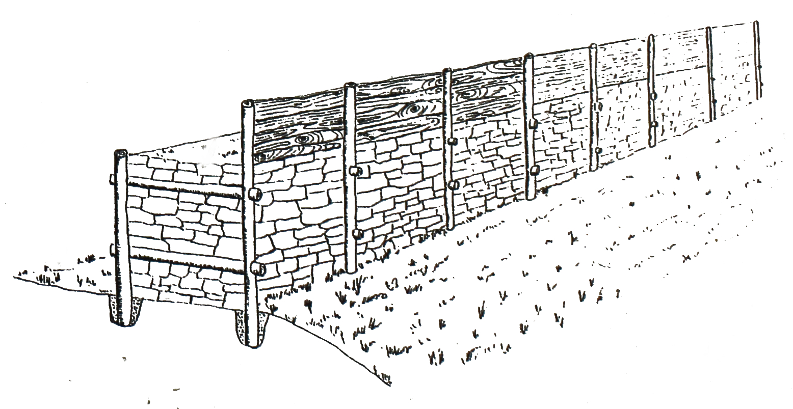

# Хайлигенберг

Хайлигенберг — это гора высотой 439,1 метра над уровнем моря, расположенная в окрестностях городских районов Гейдельберга — Нойенхайма и Хандсхухсхайма, на западной окраине Оденвальда. Она является одной из двух доминирующих возвышенностей Гейдельберга, уступая по высоте только соседнему Кёнигштулу (570,3 м). Гора состоит из двух вершин: более высокой северной основной вершины и южной, обращенной к старому городу Гейдельберга.

Хайлигенберг с древних времен использовался как место поселений. Наиболее активное освоение приходится на железный век, когда здесь находилось крупное кельтское поселение (оппидум). В римский период гора была практически незаселенной и служила лишь местом расположения святилища. В раннем Средневековье на основной вершине был построен королевский двор, на смену которому позже пришли два монастыря: Михаэльс-клостер и Стефан-клостер. В Новое время гора использовалась редко, за исключением периода национал-социализма, когда на её территории была построена тингштетте — амфитеатр, предназначенный для проведения идеологических собраний.

## Название
В каролингскую эпоху гора была известна под названием Аберинсберг, а её постройки именовались Аберинсбургом. Последнее упоминание этой топонимики датируется 1179 годом. В тот период в латинских источниках использовалось название Mons Sancti Michaelis («гора Святого Михаила»), пока в XIII веке его не сменило новое наименование Mons Omnium Sanctorum («гора всех святых»), которое постепенно закрепилось как современное немецкое название Heiligenberg («Святая гора»).

Изменение названия в XII-XIII веках часто связывают с тем, что оба монастыря на Хайлигенберге — Святого Михаила и Святого Стефана — в 1265 году были переданы монахам-премонстрантам из монастыря Allerheiligen (Монастырь Всех Святых) в Шварцвальде. Однако существует и альтернативная теория, согласно которой современное наименование происходит от более древнего прозвища Михаэльс-клостера. В одном из источников 1023 года монастырь упоминается с добавлением фразы *et omnium supernorum civium* («и всех небесных граждан»), что можно интерпретировать как «всех святых».

Название Heiligenberg также породило путаницу в научных кругах, поскольку немного севернее, в районе Зеехайм-Югенхайма, находится ещё одна гора с таким же названием, на которой в Средние века также располагался монастырь премонстрантов.

## География

Хайлигенберг расположен на западной окраине Оденвальда, выходя к Бергштрассе и широкой Верхнерейнской низменности. Гора находится в черте города Гейдельберга, к востоку-северо-востоку от района Нойенхайм и к востоку-юго-востоку от Хандсхухсхайма. К югу от Хайлигенберга расположен более низкий холм Михельсберг высотой 375,5 м. 

Хайлигенберг круто обрывается на запад в сторону низменности, а на юг — в долину Неккара, за которой возвышается Кёнигштуль, доминируя над историческим центром Гейдельберга, расположенным в долине реки. На севере его отделяет долина с потоком Ромбах (или Мюльбах), который впадает в реку Канцельбах, от соседней горы Хоэ Нистлер. На северо-востоке Хайлигенберг соединяется горным перевалом с более удаленным массивом Вайсер Штайн.

В естественной системе районирования Хайлигенберг относится к главной природной единице Оденвальда, Шпессарта и Южного Рёна (группа 14) и к основной единице Песчаниковый Оденвальд (144), где он выделен как подгруппа Центральный Песчаниковый Оденвальд (144.6). С юго-восточной стороны территория переходит в подгруппу Восточный Малый Оденвальд (144.2). На юге она переходит в подгруппу Гейдельбергский Воротник (226.2), а на западе — в подгруппу Южная Бергштрассе (226.3), которые в свою очередь относятся к основному району Бергштрассе (226) в главной природной группе Северной Верхнерейнской низменности (22).

Геологически Хайлигенберг сложен в основном нижним бунтсандштейном, который представлен красно-коричневыми и песчаными слоями.

## История

### Доисторическое использование

Благодаря своему выгодному положению Хайлигенберг обеспечивал широкий обзор на равнину и долину Неккара, а также естественную защиту. Поэтому люди заселяли его территорию еще с эпохи неолита. Самые ранние археологические находки относятся к культуре линейно-ленточной керамики (около 5500–5000 гг. до н. э.). Однако они настолько редки, что, вероятно, свидетельствуют скорее о временных посещениях горы, а не о постоянном поселении людей.

С середины неолитического периода (5000–4400 гг. до н. э.) фрагменты керамики культуры Рёссен, каменные топоры и другие бытовые инструменты свидетельствуют о постоянном проживании людей на Хайлигенберге. В позднем бронзовом веке, во времена культуры полей погребальных урн (около 1200 г. до н. э.), на горе существовало первое крупное поселение, которое, вероятно, играло роль центра для окружающей территории. В этот период на склонах Хайлигенберга были обустроены террасы, для которых использовались естественные, геологически обусловленные участки плоской поверхности. Эти террасы либо выравнивались, либо разрабатывались для создания горизонтальных участков. Их точное назначение пока не установлено.

Примерно в середине I тысячелетия до н. э. на Хайлигенберге возникло крупное кельтское поселение (оппидум). О его существовании сегодня свидетельствуют остатки двойного кольцевого оборонительного вала, общей протяженностью около пяти километров, который охватывал как основной, так и передний вершины, заключая территорию площадью около 52,5 гектаров. Вероятно, плавка местной железной руды сыграла важную роль в развитии и процветании этого кельтского поселения в латенский период. Воду кельты добывали из колодцев и цистерн, в которых собирали дождевую воду, а также из источника Биттерсбруннен, который они оборудовали для постоянного водоснабжения.

С V века до н. э. поселение на Хайлигенберге стало религиозным и культурным центром региона. Однако к III веку до н. э. оно, вероятно, начало утрачивать это значение. Возможно, его функции постепенно переняла другая, западнее расположенная и ближе к Рейну, местность. Однако точное местоположение нового центра до сих пор не установлено. С римским завоеванием и освоением региона во второй половине I века н. э. центр власти переместился в римское Лоподунум — современный Ладенбург.

Непонятно, использовался ли Хайлигенберг непрерывно вплоть до римского времени. Археологические находки не дают однозначного ответа на этот вопрос.

### Римский период

В римскую эпоху на вершине Хайлигенберга, которая тогда еще не была покрыта лесом, располагался священный комплекс с каменными постройками, о чем свидетельствуют сохранившиеся фундаменты храма с апсидой, ориентированного на север, расположенные в руинах базилики Святого Михаила. Здание было украшено мрамором и порфиром, а его стены были покрыты росписями. Обнаруженная серебряная пластина с надписью подтверждает, что этот храм был посвящен богу Меркурию. Помимо этого храма и других небольших культовых строений на горе находились инфраструктурные постройки, такие как отапливаемый дом для жрецов, а также столп Юпитера.

Среди археологических находок на Хайлигенберге были обнаружены посвятительные камни с латинскими надписями. Большинство из них были посвящены богу Меркурию, которого в рамках римской интерпретации часто отождествляли с местными не-римскими божествами, в данном случае — с божеством кимвров (Mercurius Cimbrianus, то есть Меркурий кимвров) и с кельтским богом Висуцием (Mercurius Visucius). Обнаружение столпа Юпитера и упоминание статуи богини Дианы в более ранних источниках свидетельствуют о том, что на Хайлигенберге поклонялись и другим богам. Самые ранние римские находки датируют начало использования храмового комплекса концом I века н. э. После окончания прямого римского правления на правом берегу Рейна (так называемое падение Лимеса около 260 года н. э.) храмы, вероятно, пришли в упадок. Однако даже в VII веке вокруг святилища, на месте которого позже была построена базилика Святого Михаила, продолжали устраивать захоронения.

Возможно, храм на Хайлигенберге был центральным храмом *Civitas Ulpia Sueborum Nicretum*, местного административного округа (*Civitas*) с центром в Лоподунуме (современный Ладенбург).

Иногда Хайлигенберг отождествляют с горой под названием Mons Piri, которую упоминает позднеримский историк Аммиан Марцеллин в своем произведении. Согласно его описанию, на этом возвышении войска императора Валентиниана I в 369 году н. э. во время военной кампании проводили инженерные работы, но были изгнаны германскими племенами. Действительно, на Хайлигенберге были обнаружены некоторые находки позднеантичного периода, включая надпись, относящуюся к римскому вспомогательному подразделению (*Numerus*). Возле ворот с камерными проемами, которые были встроены в более поздний период в кельтские оборонительные валы, предполагается возможное строительство в позднеантичное время. Однако эти свидетельства недостаточны для того, чтобы с уверенностью отождествить Хайлигенберг с Mons Piri.

С точки зрения современных исторических исследований, при нынешнем уровне знаний точная локализация Mons Piri остается невозможной.

### Королевский двор и монастырские постройки

Из IV-V веков на Хайлигенберге сохранились лишь отдельные находки, однако к концу VI века он был снова заселен. В этот период была возведена новая оборонительная стена, следовавшая в основном за контуром более старого кельтского рингвала, но на юге проходившая по более узкой траектории. Не позднее VII века здесь начинают проводиться христианские захоронения. В эпоху Каролингов, в VIII веке, на месте древних святилищ были возведены несколько каменных построек. Предполагается, что они могли быть предназначены для представителя короля. В IX веке монастырь Лорш, частично используя римское строение на главной вершине, построил здесь первую церковь, посвященную архангелу Михаилу. Ее внешние стены повторяли контуры римского храма Меркурия. Посвящение церкви святому Михаилу могло быть связано с продолжением традиции почитания этого места, так как в ряде случаев храмы, построенные на месте древних святынь Меркурия, также посвящались архангелу Михаилу.

В 882 году Хайлигенберг впервые упоминается в письменных источниках под именем "Aberinesberg", когда Людовик III передал его монастырю Лорш в ходе похорон своего отца Людовика Немецкого.

Сохранившаяся до наших дней в виде руин церковь раннероманского стиля на месте монастыря Святого Михаила была построена в восточной части в конце X века, а западная часть датируется приблизительно 1030 годом. Проект постройки монастырского комплекса приписывают аббату Регинбальду II из Диллинген. Примерно в то же время, около 1000 года, была проложена водопроводная система, соединявшая источник на Вайсенштайне с монастырем. Это значительно снизило значение слабого источника Биттерсбруннен для водоснабжения монастыря.

В 1094 году на Абериенсберге был основан второй монастырь — монастырь Святого Стефана. Около 1100 года здесь была похоронена дама Хазеха, чья надгробная плита считается самым старым средневековым письменным памятником в Гейдельберге.

После того как в 1226 году архиепископ Майнца взял под контроль монастырь Лорш, бенедиктинская эпоха на Хайлигенберге закончилась. После короткого периода пребывания здесь цистерцианцев, монастыри были переданы монахам-премонстрантам из монастыря Всех Святых (Allerheiligen) в Шварцвальде. Во время Майнцской епископской войны в 1460 году монастырь Святого Михаила был разрушен, а затем восстановлен. В 1503 году на Хайлигенберге обрушилась колокольня, под обломками которой погибли три монаха. Вскоре после этого монастырь, вероятно, был окончательно покинут, так как Якоб Мициллус в 1537 году уже описывает его как руины.

### Разрушение монастырских построек

В ходе Реформации монастыри на Хайлигенберге были конфискованы пфальцграфом в 1555 году. Еще сохранившийся монастырь Святого Стефана в 1589 году был передан Гейдельбергскому университету. Университетский сенат принял решение о сносе монастырских построек и продаже строительных материалов.

С XVI века Гейдельберг регулярно изображался на гравюрах и картах, которые иногда включали подробные сведения о Хайлигенберге и находившихся там лесах и строениях. Самое раннее детализированное изображение монастыря Святого Михаила принадлежит Маттеусу Мериану и было опубликовано в его "Topographia Palatinatus" в 1645 году. На нем монастырь изображен уже в руинированном состоянии, но с еще хорошо сохранившимися стенами и центральной башней. В то же время, в период Ренессанса начался первый этап исторического изучения Хайлигенберга. Будущий реформатор Филипп Меланхтон в 1508 году исследовал римские надписи в монастыре Святого Михаила и предположил, что этот холм мог быть местом позднеантичной "Битвы у Mons Piri". В последующие десятилетия многие античные каменные памятники с Хайлигенберга были демонтированы и установлены в окрестностях, например, в Хандшусхайме. Гейдельбергский ученый Марквард Фреер в своем труде *Origenes Palatinae*, впервые опубликованном в 1599 году, описал части монастыря Святого Михаила, однако ошибочно принял их за римское укрепление.

Во время Тридцатилетней войны и Пфальцской войны за наследство Хайлигенберг отошел на второй план в историческом развитии региона. В ходе этих войн Гейдельберг был полностью разрушен и только в 1697 году начал восстанавливаться. В период немецкого романтизма руины Гейдельбергского замка стали основным туристическим объектом, в связи с чем Хайлигенберг посещался в основном ради видов на замок.

_b_090_3.jpg)
*Руины монастыря и Heidenloch (1645), гравюра Маттеуса Мериана*

### Исследования в Новое время

Тем не менее, с XIX века Хайлигенберг вновь начал привлекать внимание, например, благодаря описаниям Виктора Гюго, который упоминал свои прогулки вокруг Гейдельберга. В середине XIX века здесь начались многочисленные охотничьи раскопки, которые привели к повреждениям и разрушению археологических объектов. В 1837–1841 годах на южном склоне горы был проложен знаменитый Философский путь, с которого открывается великолепный вид на старый город и замок. Вскоре после этого виноградники на южном склоне были заброшены. Остались только многочисленные сухие террасные стены, которые сегодня структурируют парки и сады вдоль этого пути.

Научные исследования руин на Хайлигенберге начались только с Карла Криста, который в 1860 году заново открыл рингвалы и правильно отнес их к кельтскому периоду, а в 1882 году провел небольшие раскопки. Археолог и архитектор Вильгельм Шлойнинг инициировал первые крупные исследования и раскопки в базилике Святого Михаила в 1886 году, поддержанные археологом из Гейдельберга Фридрихом фон Дуном и профинансированные баденским правительством.

В 1885 году новый наблюдательный пункт был открыт на руинах монастыря Святого Стефана, для строительства которого также использовали камни из руин монастыря. В 1903 году на южном склоне Хайлигенберга был построен Бисмарктурм. В этом же году весь горный массив перешел в собственность города Гейдельберга, который инициировал дальнейшие археологические исследования руин. В 1907 году под руководством студента-археолога Эрнста Шмидта начались раскопки рингвалов, результаты которых не были опубликованы из-за преждевременной смерти Шмидта в Первой мировой войне. В это же время Баурад Макс Випперман начал исследования в монастыре Святого Михаила, однако его методы были недостаточно точными и он практически не публиковал своих результатов. Его работу продолжил архитектор Карл Кох, который вел исследования с 1921 года и особенно активно работал в 1932–1934 годах. Во время строительства ресторана "Waldschenke" в 1929 году были обнаружены кельтские артефакты, которые исследовал Эрнст Вале. Во время строительства Тингштетте в 1934 году археологические работы практически не проводились. В последующие годы Пол Ханс Стеммерман исследовал Хайденлох. В первой половине XX века историки, такие как Альберт Кригер и Максимилиан Хуффшмид, исследовали письменные источники по средневековой истории Хайлигенберга.

### Сохранение и консервация руин

После Второй мировой войны на Хайлигенберге проводил исследования Берндмарк Хойкемес, которому удалось подтвердить наличие кельтской металлургии, уточнить сведения о римском святилище и вновь открыть источник Биттерсбруннен.

Несмотря на продолжающиеся исследования, руины на горе продолжали разрушаться и подвергались вандализму, а также использовались в качестве свалки. В 1967 году, учитывая угрозу обрушения некоторых частей монастыря Святого Михаила, начались первые работы по укреплению, включая установку бетонного сердечника в северо-западной башне церкви. В 1973 году была создана ассоциация "Schutzgemeinschaft Heiligenberg", целью которой стало сохранение руин. С 1977 года город Гейдельберг и земельное ведомство по охране памятников разработали концепцию для дальнейших раскопок и укрепления базилики Святого Михаила. С 1980 по 1984 год Рупрехт-Карлс-Университет Гейдельберга участвовал в этих работах в рамках учебных и исследовательских раскопок. В 1984 году монастырь Святого Михаила был открыт для посещения. Каменными маркерами была отмечена часть римского храма Меркурия, находящегося под церковью. В 1980 году был восстановлен источник Биттерсбруннен, а в 1987 году – колодец Хайденлох. В 1996 году завершилась реставрация монастыря Святого Стефана. В том же году в Курпфальцском музее Гейдельберга был создан отдельный зал, посвященный истории Хайлигенберга. В 2011 году археологические находки с Хайлигенберга были объявлены охраняемым памятником.

С укреплением и благоустройством руин Хайлигенберг вновь стал популярным туристическим объектом. Тингштетте, который после войны использовался городом для культурных мероприятий, с 1980-х годов стал местом проведения ежегодных праздников в Вальпургиеву ночь, привлекая до 20 000 человек.

## Исторические постройки на Хайлигенберге

### Кельтский кольцевой вал

На Хайлигенберге находятся остатки двойного кельтского кольцевого вала, сооруженного в IV веке до н. э., который некогда окружал и защищал крупное поселение на вершине холма.

Состояние сохранности кольцевого вала в почве до сих пор остается недостаточно изученным. В 2019 году проводились раскопки в юго-восточной части внутреннего кольцевого вала, которые показали, что от 7,5-метровой стены в этом районе сохранились лишь фрагменты нижних двух рядов каменной кладки. Раскопки подтвердили более ранние выводы о том, что укрепление было построено в виде так называемой Pfostenschlitzmauer — сухой каменной кладки, встроенной в каркас из деревянных столбов.

*Пример кельтской столбчатой щелевой стены на холме Кордигаст*

### Источник Биттерсбруннен

Источник [Биттерсбруннен](./bittersbrunnen.md) использовался для водоснабжения еще кельтами и находился внутри внешнего кольцевого вала. В эпоху романики он был заново оборудован. Романские элементы сохранялись до конца Второй мировой войны, однако затем источник был разрушен из-за оползня. В 1980 году его восстановили в нынешнем виде.

### Монастырь Святого Михаила и монастырь Святого Стефана

Развалины базилики и монастыря [Святого Михаила](./michaelskloster.md), построенных в 1023 году, расположены на главной вершине горы, где в римскую эпоху уже находилось языческое святилище. 

Руины монастыря [Святого Стефана](./stephanskloster.md) представляют собой остатки второго монастыря на Хайлигенберге, который был основан около 1090 года монахом-бенедиктинцем Арнольдом.

### Колодец Хайденлох

Точное время постройки и назначение 56-метрового [колодца Хайденлох](./heidenloch.md) остаются неизвестными. Предполагается, что это был водозаборный колодец, который должен был обеспечивать водоснабжение на Хайлигенберге. Иногда колодец связывают с античным периодом, трактуя его как кельтский жертвенный колодец. Однако находки из колодца и текущий уровень исследований указывают на его создание в высокое Средневековье для снабжения близлежащего монастыря Святого Стефана. В 1987 году колодец был расчищен, и над ним была возведена защитная конструкция. В прошлом на Хайлигенберге существовало множество других колодцев и цистерн, которые также именовались «Хайденлох».

### Философская тропа, башня Хайлигенберг и колонна Бисмарка

С середины XIX века и в начале XX века интерес к Хайлигенбергу возрос благодаря влиянию романтического движения и растущему туризму, что привело к активному благоустройству горы дорожками и дополнительной инфраструктурой. Самая известная прогулочная тропа — это [Философская тропа](./philisophenweg.md), которая проходит вдоль южного склона Хайлигенберга, начинаясь от Нойенхайма. Она была проложена в 1837–1841 годах по старым винодельческим тропам и постепенно обустроена небольшими парковыми зонами. Памятные камни вдоль тропы посвящены, среди прочего, поэту Фридриху Гёльдерлину и исчезнувшему поселению Дагерсбах.

[Башня Хайлигенберг](./heiligenbergturm.md), расположенная возле монастыря Святого Стефана, представляет собой смотровую башню, построенную в XIX веке из камней монастыря. В 1903 году на южном склоне горы, выше Философской тропы, была возведена [колонна Бисмарка](./bismarckturm.md) — памятник первому рейхсканцлеру Отто фон Бисмарку, снабженный лестницей для посещения.

### Тингштетте

[Тингштетте](./thingstaette.md) — это большая открытая сцена, построенная в 1934–1935 годах по проекту архитектора Германа Алькера на основе древнегреческих театров. Она находится на перевале между Хайлигенбергом и горой Михельсберг.