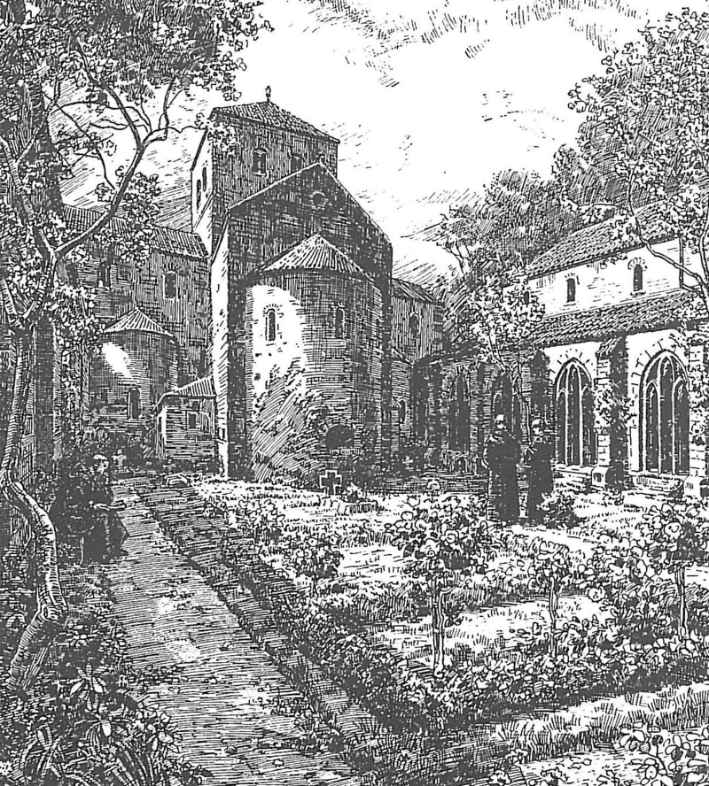

### Михаэльсклостер (Хайлигенберг)

**Михаэльсклостер** на Хайлигенберге близ Гейдельберга был основан как филиальный монастырь Лоршского аббатства в IX веке на месте древнего культового сооружения. От монастыря, заброшенного в XVI веке, сохранились лишь фундаментные остатки и два башенных сооружения разной высоты.

*Художественная интерпретация монастырского сада Михаэльской базилики*

#### История
До появления монастыря на этом месте находились более ранние постройки. Территория Михаэльсклостера является высшей точкой внутри двойного кольцевого вала на Хайлигенберге. Под руинами монастырской базилики найдены остатки римского культового здания, которое, согласно обнаруженному посвященному камню, относилось к богу Меркурию Кимбрийскому (Mercurius Cimbrianus). План римского храма с апсидой на северной стороне обозначен каменными плитами на полу церковного корабля.

Уже в VII веке это место использовалось в христианских целях, что подтверждается захоронениями эпохи Меровингов. Аббат Тиотрог из Лоршского бенедиктинского монастыря получил церковь в дар и расширил её. Хотя в Лоршском кодексе упоминается монастырское строительство в 870 году, это не подтверждено археологическими находками и, возможно, является более поздней интерпретацией последующих событий.

Лишь в 1023 году аббат Регинбальд (позднее епископ Шпайера) заново отстроил монастырь святого Михаила и Михаэльскую базилику, использовав каролингские элементы старой постройки. В 1070 году аббат Фридрих из Хирсау был похоронен в монастыре (его надгробная плита находится в крипте базилики), что сделало монастырь местом паломничества (хотя аббат так и не был канонизирован).

*Реконструкция*

Одновременно с восстановлением монастыря была построена водопроводная система, которая поставляла воду из источника на Вайсенштайне (Weißen Stein) и тем самым заменила ослабевший источник Биттерсбруннен как главный источник воды на Хайлигенберге.

В 1094 году от Михаэльсклостера основали еще одно аббатство — монастырь святого Стефана на южной вершине горы. Строительство было профинансировано из пожертвований участников Первого крестового похода (1096–1099).

Когда Лоршское аббатство перешло под управление архиепископа Майнца в 1226 году, закончилось и время бенедиктинцев в этих местах. После короткого периода пребывания цистерцианцев в обоих монастырях поселились премонстранты из монастыря Allerheiligen в Шварцвальде.

#### Упадок и разрушение
В 1460 году, в ходе конфликта между Курпфальцем и Курмайнцем, монастырь был сожжен, но вскоре восстановлен. В 1503 году зафиксирован случай обрушения одной из башен Михаэльской базилики, при этом трое монахов погибли во время сна. Однако, вероятно, это был не основной восточный башенный комплекс, так как он четко изображен на гравюре Маттеуса Мериана (опубликован в 1654 году, основан на рисунках до 1619 года) и даже имеет заостренную крышу на более раннем изображении из Курпфальцской коллекции рисунков (вероятно, XVI век). Заброшенность монастыря началась вскоре после этого, и к 1537 году он уже считался покинутым.

_b_090_3.jpg)
*Руины монастыря и Heidenloch (1645), гравюра Маттеуса Мериана*

В ходе секуляризации руины монастыря перешли к Гейдельбергскому университету. В 1589 году университетский сенат постановил снести монастыри и продать камни, чтобы предотвратить заселение руин "бродягами". Однако, как показывает гравюра Мериана, этот приказ был исполнен лишь частично. Современное состояние руин объясняется тем, что местные крестьяне, особенно из Хандшухсхайма, использовали остатки монастыря как каменоломню.

Две башни в западной части комплекса сохранились и используются как смотровые площадки. Из них только более высокая северо-западная башня (около 14 метров) предоставляет вид на Рейнскую долину.

