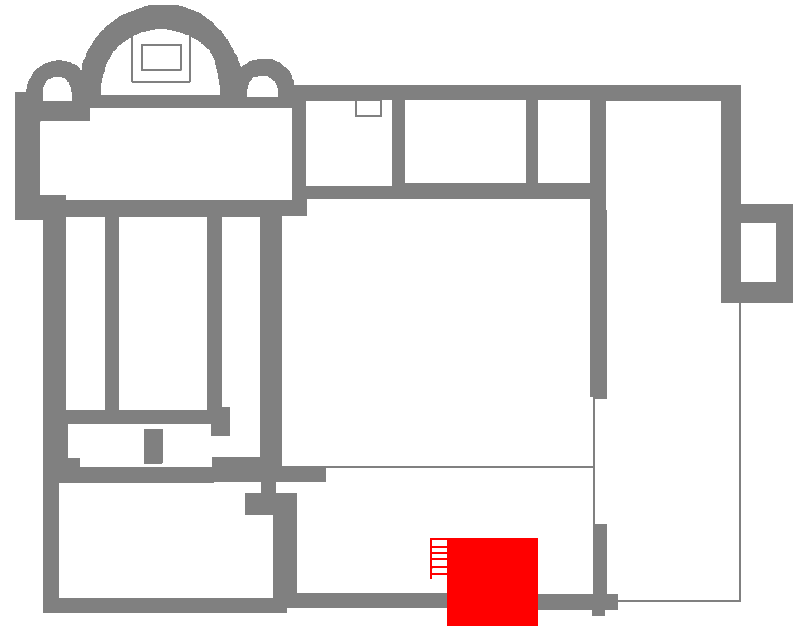

# Монастырь Святого Штефана

Мо астырь Святого Штефана на высоте 375,5 метров над уровнем моря на горе Михельсберг в Хайдельберге был основан в XI веке как второй филиал Лоршского монастыря рядом с Михельским монастырем. Сегодня от монастыря сохранились только фундаментные остатки.

## История

Монастырь Святого Стефана, основанный примерно в 1090 году бенедиктинцем Арнольдом, был вторым монастырем на Хайлигенберге наряду с монастырем Святого Михаила. Арнольд, недавно принявший монашеский постриг, построил на переднем пике горы Аберинсберг келью и небольшую капеллу. Пропст Михельского монастыря Цундебольд, оценив стремление Арнольда к аскезе, решил в 1094 году с разрешения Лоршского монастыря расширить келью, добавив к ней монастырские постройки. Основным жертвователем выступил рыцарь из Хандшухсхайма, который участвовал в крестовых походах. Его вдова, Хазеха, похоронена в западной части бывшей монастырской церкви, что подтверждается сохранившейся надгробной плитой. Церковь монастыря была построена в готическом стиле в XII веке.

*План монастыря (красным обозначено место сегодняшней смотровой башни)*

Со временем устав бенедиктинцев ослаб, и в середине XIII века монастырь был передан строгому ордену премонстрантов из монастыря Всех Святых в Шварцвальде. Именно в это время, в XIV или начале XV века, были построены монастырские здания, примыкающие к церкви с юга. До этого жилые и хозяйственные постройки монастыря располагались, вероятно, в другом месте. После Реформации в XVI веке монастырь был распущен, и здания начали разрушаться. В 1589 году Хайдельбергский университет, который унаследовал монастырь, решил разрешить гражданам использовать руины в качестве каменоломни. В 1885-1886 годах из оставшихся камней монастыря был построен смотровой башня, откуда открывается вид на замок и долину Неккара.

Во времена монастыря с вершины горы можно было наблюдать за любыми передвижениями в долине Неккара, поскольку тогда холм был лишен растительности. Для строительства и отопления был вырублен значительный участок леса. В это же время была восстановлена старая цистерна (ныне известная как Хайденлох). Монастырю Святого Стефана был выделен собственный земельный участок, что обеспечивало его экономическую независимость.

На сегодняшний день от монастырского комплекса сохранились только фундаментные остатки и копия надгробной плиты вдовы основателя Хазехи с латинской надписью. Надпись гласит:

> HAZECHA RICFRIDII DEPOSCENS HIC SEPELIRI PREDII QUARTUM SUI CESSIT HUIC DOMUI HIC CONSISTENTES EIUS OBITUM RECOLENTES SINT UT PERPETUO VIVAT ET IPSA DEO VIIII KL DECEMBRIS OBIIT HAZECHA.

Перевод:

> Хазеха, жена Рикфрида, пожелала быть погребенной здесь и передала четверть своего имущества этому дому (монастырю), чтобы те, кто здесь поселился, помнили о ее смерти и чтобы она могла вечно жить в Боге. Хазеха скончалась 23 ноября (9-е календы декабря, точный год неизвестен, начало XII века).

Эта информация подчеркивает историческую значимость монастыря и роль Хазехи, которая внесла вклад в его развитие, обеспечив его часть своего имущества.