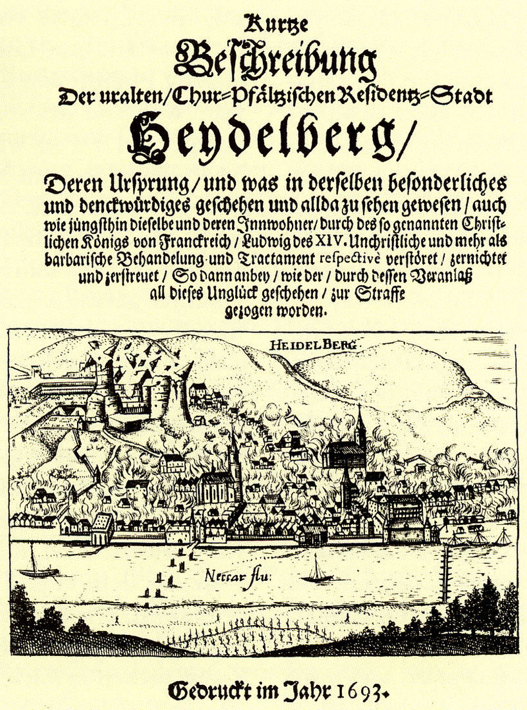

# Тингштетте

Тингштетте — это открытый амфитеатр на горе Хайлигенберг в Хайдельберге, построенный в эпоху национал-социализма. Он был задуман как место для массовых собраний и театральных постановок, якобы по образцу древнегреческих театров.

Закладка первого камня для «Тингштетте Хайдельберг» состоялась 30 мая 1934 года, а 22 июня 1935 года это место было торжественно открыто министром пропаганды Йозефом Геббельсом под новым названием «Feierstätte Heiligenberg» (Праздничное место на Хайлигенберге). Тингштетте играла значительную роль в набиравшем популярность, но быстро утратившем свое значение, **Тингдвижении**. После окончания Второй мировой войны и в последующие послевоенные годы амфитеатр находился в запустении, и лишь спустя время там начали снова изредка проводить различные мероприятия. Со временем название «Тингштетте» вновь закрепилось за этим местом. До 2018 года амфитеатр в основном использовался для неофициальных празднований Вальпургиевой ночи. В настоящее время эта постройка является охраняемым культурным памятником.

## История

### Предыстория
В первые годы после прихода национал-социалистов к власти и в рамках нацистской культурной пропаганды сформировалось так называемое *Тингдвижение*. Его цель заключалась в том, чтобы «... через переживание коллективного единства формировать и создавать нового немецкого человека согласно воле фюрера».

### Планирование строительства

*Разрушенный Гейдельбергский замок стал символом Войны за Пфальцское наследство. Современное изображение (1693), взрыв замка и горящий город.*

Комплекс на горе Хайлигенберг был задуман как центральное место для *Тингдвижения*, а Гейдельберг должен был превратиться в «Зальцбург немецкого юго-запада», чтобы принести национал-социализму мировое признание . Старые Гейдельбергские фестивали (1926–1929) планировалось возродить на новой тинг-площадке, но уже под покровительством нацистского режима. Было придумано название «Рейхсфестшпиле», и начиная с 1934 года такие представления использовались в идеологических целях под руководством рейхсминистра пропаганды Йозефа Геббельса. Однако идея превращения Гейдельберга в «Зальцбург немецкого юго-запада» восходит к эпохе Веймарской республики . Город пытались пропагандировать как «мировой центр духа», как «живое дыхание немецкой души» или как «фокус имперской идеи», тем самым придавая ему идеологическое значение. Гейдельберг таким образом становился «городом Рейхсфестшпиле». В 1934 году эти мероприятия впервые прошли во внутреннем дворе Гейдельбергского замка и должны были стать началом «революции немецкого театра» и «представительными свидетелями нового понимания искусства».

Гейдельберг, с его репутацией студенческого города со Средневековья и бывшего любимого места учебы и пребывания Геббельса, имел хорошие шансы получить это монументальное строительное задание. В те годы он получил название «место паломничества», что подчеркивало его значение как центрального места проведения *Рейхсфестшпиле*. При выборе места для Тингштетте учитывались сравнения с другими культовыми памятниками в географической близости, такими как Гейдельбергский замок, Шпайерский собор и Вормсский собор. Дополнительное значение имела и близость к Гейдельбергскому мемориальному кладбищу, строительство которого началось в 1934 году. Это создавало возможность объединить память о павших в Первой мировой войне с возводимым новым культовым местом. Это значительно способствовало выбору Гейдельберга в качестве местоположения . Культ смерти, характерный для нацистского времени, нашел свое отражение в этих памятниках. Руины замка, находящиеся в пределах видимости, использовались в пропагандистских целях как символ «великой и трагичной немецкой истории» (материалы прессы от 20 июня 1935 года) .

Ссылаясь на якобы «древнее наследие предков», на Хайлигенберге была возведена площадка для собраний, архитектурное оформление которой опиралось на германское «Тинг» — некий народный собраний под открытым небом, точно не определенный археологами. В этом контексте легендарный Хайлигенберг с Хайденлохом и множеством древних поселений стал идеальным местом для такого сооружения.

Тингштетте должна была быть завершена по проекту архитектора Германа Алькера. В общем плане она задумывалась как единый архитектурный ансамбль, объединяющий Гейдельбергский мемориальный кладбищенский комплекс на «Амеизенбуккель» (горный хребет на противоположной стороне реки Неккар) и находящийся между ними замок.

### Функция в эпоху нацистского режима

Идеология национал-социализма часто представлялась в его пропагандистских материалах как некая форма «веры» и стремилась к формированию «народного сообщества» (Volksgemeinschaft). В этом контексте Тингштетте (Thingstätte) рассматривались как места поклонения и проявления этой «веры». Например, в 1935 году газета *Heidelberger Volksgemeinschaft* опубликовала статью под заголовком: «Тинг как культовое место национал-социалистической веры». Таким образом, Тингштетте можно рассматривать как «святые» места, предназначенные для выражения национал-социалистического «культа». Сакральное оформление архитектурных объектов Тингштетте отражало и поддерживало этот замысел, придавая им вид храмов нацистской идеологии.

*Nationalblatt* в марте 1935 года, описывая Тингштетте в Кобленце, которая была построена в спешке и без учета местной архитектурной среды перед Курфюрстским дворцом, объясняла, что экономическая целесообразность и высокие затраты не должны играть роли, так как в строительстве этих объектов заключался «глубокий смысл»:

> «Трудовая служба принципиально выполняет только те работы, экономическая польза которых очевидна и которые не могли бы быть осуществлены в условиях свободного рынка из-за высокой стоимости. С тех пор как Трудовая служба перешла под полное руководство национал-социалистов, этот принцип всегда строго соблюдался. Единственным исключением, которое было одобрено имперским руководством, стало строительство Тингплацов. Это имеет глубокий смысл. Тингплацы должны стать очагами новой культуры и искусства, рожденных национал-социалистической творческой силой».  
> — *Nationalblatt* (округ Кройцнах), март 1935 г.

Дирк Цорбах из Университета Кобленца анализирует альтернативное значение Тингплатцев. Он подчеркивает, что с помощью обширной пропаганды и мистически-ритуальных праздников пытались создать политическую религию-заменитель. В этих местах всегда должен был присутствовать культ нацистских героев. В целом, движение Тингштетте стремилось извлечь на свет якобы древние германские правовые традиции и преобразовать их в массовые идеологические события в соответствии с нацистскими представлениями. Хотя слово «Тинг» первоначально означало германское народное собрание для принятия правовых решений, его значение часто изменялось в зависимости от региона и исторического контекста. Германское «Тинг» или «Динг» изначально представляло собой собрание войска, народа или суда, возглавляемое королем, племенным или родовым вождем и проводившееся под открытым небом. Описание такого собрания встречается в произведении Тацита *Германия*. С течением времени значение изменилось, и в эпоху раннего Средневековья термин «Динг» стал обозначать только судебные собрания, которые проводились под председательством судьи.

Тингштетте Третьего рейха служили для «воспитания и дисциплинирования» новых граждан в духе национал-социалистической идеологии, которая передавалась посредством художественных и театральных постановок. Зрителей намеренно вовлекали в происходящее, чтобы достичь пропагандистской цели слияния народа в единую нацистскую Volksgemeinschaft (народное сообщество). Представления на этих сценах, более точно описываемые как культовые речевые хоры, изображали нацистскую идеологию визуальными и звуковыми средствами. В Гейдельберге такие постановки проходили с 1935 по 1939 год в рамках ежегодных рейхсфестивалей.

Нацистские медиа всегда подчеркивали большой идеологический смысл движения Тингштетте, который приносил пользу и различным трудовым организациям, и самому строительству таких площадок. Создавая масштабные культурные объекты, которые широко освещались за пределами Германии, нацистский режим стремился представить свою политику как мирную. Участие трудовых служб, особенно позже реорганизованной в парамилитарную Имперскую трудовую службу (RAD), служило маскировке истинных намерений. Введение всеобщей шестимесячной службы в RAD и последующей обязательной военной службы в 1935 году имело скрытую цель военной подготовки. Строительство таких объектов помогало отвлечь внимание от подготовки к войне с помощью кажущихся безобидными проектов.

### Закладка первого камня

Закладка первого камня состоялась 30 мая 1934 года с участием гауляйтера Роберта Вагнера и обер-бургомистра Карла Найнхауса. В своей торжественной речи мэр Гейдельберга подчеркнул мифическое значение «священной горы» и описал строительство площадки в образном ключе, говоря о том, что из «красного, цвета крови песчаника [...] вырастает народная площадка для нового зрелища и слуха».

Так называемые «освящения Тингштетте» (Thingstättenweihen) имели особое культовое значение и также именовались «праздниками становления народа».

### Строительство и забастовка

На строительстве, при поддержке студентов из Гейдельберга, работали около 1200 мужчин из Имперской службы труда (RAD). Проект, созданный профессором из Карлсруэ Германом Алкером, предусматривал амфитеатр с 8000 сидячих и примерно 5000 стоячих мест, двумя шестиугольными башнями с флагами для освещения и звука, а также широкими рампами для шествий, предназначенными как для хора и актёров, так и для зрителей.

Согласно пробному чертежу плана постройки, который, возможно, основывался на рисунке архитектора, полукруглое здание сцены и гримёрных должно было завершать раковинообразную конструкцию, не имея разделяющего зрителей и сцену большого архитектурного барьера, как в греческих амфитеатрах. Таким образом предполагалось создать тесную связь между актёрами и публикой. Изначально планировалось построить открытый театр в форме яйца, рассчитанный на 10 300 сидячих мест и около 20 000 стоячих мест, а также с танцевальным кругом позади сцены. Работы начались в апреле 1934 года и должны были завершиться уже в июле. Этот амбициозный план был признан невыполнимым, строительство было приостановлено и продолжилось с уменьшенным проектом. Архитектурное оформление места культовых собраний всё же сохраняло черты фашистской архитектуры — монументальность и простоту.

Общая стоимость проекта, включая создание парковок и подъездных дорог, а также обеспечение водой и электроэнергией, составила около 600 000 рейхсмарок, из которых лишь 40 000 рейхсмарок были покрыты за счёт города. Участие работников из Имперской службы труда (RAD) носило, главным образом, пропагандистский характер. Большую часть работ выполняли профессиональные строители. В первоначальном проекте Алкера не предусматривалась электронная звуковая система. Постройка, где должны были располагаться электронные усилители и гримёрные — в задней части сцены — отсутствовала в планах. Изначально предполагалось возвести визуальный барьер, отражающий звуки публики. Однако в ранних тингштеттах, таких как на Брандберге под Халле, архитектурная акустика не достигала уровня древнегреческих амфитеатров. В результате в Гейдельберге было предусмотрено 8 линий микрофонов, питавшихся от 17 сценических микрофонов, и 7 громкоговорителей на краю сцены и на сценическом здании, которое было построено ниже запланированного и дополнено боковыми рампами. Это позволило использовать его как дополнительную сцену. Теперь амфитеатр мог быть окружён целой вереницей факельщиков или знаменосцев. Две башни на заднем плане и верхней части трибун содержали контрольные элементы для звука и освещения, включая пульт управления. Электрооборудование позволило воспроизводить звуковые записи, передавать радиопередачи на сцену и усиливать голос актёров, что считалось важным для постановок тингшпиль-драм.

На основе акустического опыта Thingstätte в Гейдельберге были внесены изменения в планы аналогичных тингштетте на Лорелее и в Барнсторфер Вальде (Росток).

Во время строительства на Хайлигенберге были нанесены непоправимые повреждения археологическим памятникам. Работы велись в центре крупного кельтского поселения, окружённого частично сохранившимися двойными кольцевыми валами. Скалистый грунт местами приходилось взрывать для его обработки. Несмотря на находки кельтских черепков, археологические данные не были должным образом зафиксированы.

Предполагалось, что в последующие годы в Третьем Рейхе будет построено около 400 малых тингштетте вместимостью от 5 до 10 тысяч человек. Однако уже к 1936 году движение угасло — всего было построено 66 таких объектов. Точная дата начала строительства в Гейдельберге остаётся неизвестной. Добровольная трудовая служба (Freiwilliger Arbeitsdienst, FAD) начала работы, предположительно, не ранее апреля 1934 года. Их деятельность была представлена в прессе как участие в «национальной трудовой битве», с широким освещением в подконтрольных СМИ. Трудовой службой работы проводились в две, а затем в три смены, при оплате труда в одну рейхсмарку за день. Для земляных работ был установлен узкоколейный путь без локомотива — с вагонетками, которые приходилось толкать вручную.

Окончание строительства планировалось приурочить к празднику летнего солнцестояния 1934 года, но из-за проблем с грунтом сроки были нарушены, и открытие состоялось только 22 июня 1935 года. Перед этим на стройке началась забастовка среди привлечённых к работам рабочих службы по борьбе с безработицей. Политический эмигрантский журнал *Deutschland-Berichte* Социал-демократической партии Германии (SoPaDe) писал: «На строительной площадке Thingstätte в Гейдельберге на прошлой неделе перед завершением строительства произошла своего рода забастовка в форме пассивного сопротивления. Рабочих службы по борьбе с безработицей, за исключением работников Имперской службы труда, обязали работать ночью без доплаты. Они потребовали 30-процентную надбавку к зарплате, которую им отказались предоставить. Тогда рабочие отказались от ночных смен. Спустя три ночи их требование было удовлетворено». Сообщения журнала *Deutschland-Berichte* основаны на широком сети информаторов из самого Рейха и являются важным, не подвергавшимся цензуре источником информации о повседневной жизни и общественных настроениях в нацистской Германии.

### Использование в Третьем рейхе

На 56 зрительских рядах, поднимающихся вверх под углом 25 метров, по официальным данным, во время открытия могло разместиться 20 000 человек, хотя изначально объект был рассчитан на гораздо меньшее количество зрителей. Полукруглую форму «Места торжеств» открыл 22 июня 1935 года министр пропаганды Йозеф Геббельс. Это мероприятие проходило в традиционный день празднования летнего солнцестояния. В своей речи Геббельс заявил:

> «В этом монументальном строении мы воплотили наш стиль и наше мировоззрение в живом пластическом и монументальном выражении. [...] Эти места являются на самом деле земскими собраниями нашего времени. [...] Придёт день, когда немецкий народ будет приходить в эти каменные святыни, чтобы культивировать на них своё новое, вечное существование».

После двенадцати месяцев строительства, что на девять месяцев больше, чем было запланировано, Геббельс во время торжественного празднования летнего солнцестояния превознес это место как «истинную церковь Рейха» и место «окаменевшего национал-социализма». Сообщалось, что Thingstätte (место проведения тинга) была построена на предполагаемом древнегерманском культовом месте, что делало её частью национал-социалистического мифа о «крови и земле». Сцена предназначалась главным образом для пропагандистских мероприятий. В последующие годы здесь проводились спектакли тингшпилей, такие как «Путь в Рейх» и «Оратория труда». Однако вскоре нацисты утратили интерес к объекту, поскольку радио оказалось более эффективным средством пропаганды. До 1939 года здесь продолжались праздники в честь солнцестояния, и использовалось для проведения торжественных ритуалов, при этом стоит отметить высокотехнологичное для того времени оборудование с микшерским пультом, акустической системой и световым оснащением. В 1939 году Гейдельбергский городской театр поставил на Thingstätte драму Фридриха Шиллера «Невеста Мессины».

Thingstätte использовалась для проведения так называемых «народных торжественных и священных часов». Эти мероприятия не имели ничего общего с безобидными летними театральными постановками на открытом воздухе: парады и массовые митинги под открытым небом, сопровождаемые идеологическими тингшпилями, были направлены на воспитание «нового немецкого человека» под строгим контролем нацистских властей. Гейдельбергская Thingstätte демонстрирует, как нацистский режим адаптировал и искажал историческую идею тинга. Вместо предполагаемого исторического собрания и обсуждения вопросов общества, нацистские тингштетте, в том числе и в Гейдельберге, благодаря своему центральному расположению, использовались для ритуализации культа фюрера.

Пример показательного подхода можно увидеть в заявлении районного руководства НСДАП после тингшпиля «Путь в Рейх», когда посетители попытались укрыться от внезапного ливня. Это заявление чётко отражает «новый образ человека» нацистской идеологии:

> «Было очень поучительно видеть, как (…) многие соотечественники снова ставили своё маленькое „я“ в центр своей жизни, когда начали падать первые капли дождя и тучи омрачали небо.»

Проблема возможной паники была замечена, но указания организаторам были даны следующим образом:

> «...объяснить каждому, что новое платье и красивый головной убор, а также риск возможной простуды не так уж и важны.»

Призыв «люди с „я“ и трусы не имеют права находиться на тингштетте!» был использован в обращении дважды.

Thingstätte в Гейдельберге считалась образцовой в нацистских кругах и моделью для аналогичных сооружений, таких как тингштетте на Лорелее, в Бад-Зегеберге и на сцене имени Дитриха Эккарта в Берлине. В особенности, установленное звуковое и световое оборудование считалось чудом техники. Оно привлекало специалистов из разных стран. Открытие с лесом флагов, большим количеством униформированных участников, музыкой и огромным хором стало рекордным по числу зрителей. Впоследствии количество участников на праздниках солнцестояния и тингшпилях никогда не достигало таких высот. В целом движение Thingstätten не оправдало возлагавшихся на него надежд. Специально созданные для этих мест вещи и их монотонная смесь из хоровых и «страстных» выступлений не смогли удержать интерес публики. Капризная погода и отсутствие укрытия сделали такие мероприятия непопулярными и создали дополнительные проблемы для нацистских организаторов.

В то же время идеализированные попытки объединить «соотечественников» под открытым небом в местах с предполагаемой германской древностью никак не соответствовали провозглашённому прогрессивному духу «новой эры». Таким образом, нацистская пропаганда постепенно утратила интерес к псевдогерманскому движению Thingstätten.

Во время Второй мировой войны площадка использовалась редко. Уже в 1936 году по указу название «Thingstätte Heidelberg» было изменено на «Feierstätte Heiligenberg». Ранее являвшаяся местом проведения тингшпилей, торжественных церемоний с флагами Гитлерюгенда, театральных постановок и других пропагандистских мероприятий, Thingstätte утратила свою первоначальную функцию и завершила свою историю в качестве символа «окаменевшего национал-социализма» в 1942 году с установкой зенитной башни для противовоздушной обороны.

### Использование в послевоенное время

После Второй мировой войны Thingstätte, теперь известная как «место для торжеств», была оставлена на произвол судьбы и постепенно приходила в упадок. Несколько лет американская община в Гейдельберге проводила там свои Пасхальные восходные службы, и периодически на этом месте собирались молодёжные или спортивные группы.

На данный момент Thingstätte находится под охраной как памятник культуры. В прошлом её использовали для проведения концертов под открытым небом, таких как оперные постановки и выступления известных артистов, например, Удо Юргенса, Пласидо Доминго и Монсеррат Кабалье. Однако организация мероприятий на этом объекте всегда сталкивалась с трудностями из-за отсутствия необходимой инфраструктуры (нехватка санитарных помещений, затруднённый подъезд и т. д.).

С 1980-х годов и до 2017 года Thingstätte ежегодно становилась местом неофициального празднования Вальпургиевой ночи, что сделало её крупнейшим неформальным мероприятием Гейдельберга. В ночь на 1 мая на Холме собирались тысячи людей, чтобы отметить праздник без официальных организаторов. На этом мероприятии не было коммерческих палаток и электрического освещения. Вход на Thingstätte ночью официально запрещён по соображениям безопасности, однако запрет часто игнорировался. Полиция, пожарные и службы технической помощи (THW) обычно разрешали зажигать большие костры, а также поддерживали безопасность на мероприятии, включая сопровождение огненных шоу. Часто сотрудники THW обеспечивали аварийное освещение.

Однако после праздника территория Thingstätte была покрыта огромными количествами мусора. В некоторые годы число участников достигало 20 000 человек. В декабре 2017 года городские власти Гейдельберга запретили проведение будущих Вальпургиевых ночей из-за пожаров в лесу, вызванных неосторожностью посетителей, а также из-за случаев, требовавших эвакуации пострадавших.