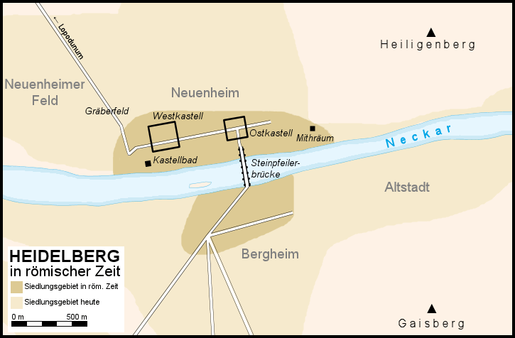

# Neuenheim

Нойенхайм (на местном диалекте "Neiene") — это один из районов города Гейдельберг.

Район расположен на северном берегу реки Неккар, напротив районов Бергхайм и Старого города. На востоке Нойенхайм граничит с районом Цигельхаузен, где находится холм Хайлигенберг с известной панорамной тропой — Философенвегом. На севере район соседствует с Хандсхусхаймом, а на западе Нойенхайм отделен от района Виблинген рекой Неккар.

*Heidelberg in römischer Zeit*

## История

На территории современного Нойенхайма в римские времена располагался римский лагерь и мост через Неккар (см. Гейдельберг в римскую эпоху). Также были обнаружены остатки двух храмов Митры (митрэумов) и кирпичного завода, которым управлял римлянин Публий Аттий Руфин (на кирпичах находились клейма: **PAR**).

Нойенхайм старше самого Гейдельберга: деревня впервые упоминается в *Lorscher Codex* в 765 году, но, вероятно, была основана еще в VI веке, во времена франков. До начала интенсивной урбанизации в эпоху промышленной революции это было преимущественно крестьянское, винодельческое и рыбацкое поселение. В 1891 году Нойенхайм стал первым районом Гейдельберга, образованным путем включения соседней деревни в городскую территорию.

В 1961 году граница с районом Хандсхусхайм была перенесена на север, чтобы университетский кампус в Нойенхаймер Фельде не оказался разделенным между двумя районами. В результате восточная часть, включая престижный жилой район на Людольф-Крель-штрассе, стала частью Нойенхайма.

Основная часть района ограничена двумя крупными транспортными магистралями: Брукенштрассе на востоке и Берлинер-штрассе на западе. Эти улицы сходятся на севере в Хандсхусхайме и обслуживаются трамвайными и автобусными линиями компании RNV.

На западе от старого деревенского центра, в Нойенхаймер Фельде, расположены несколько институтов и факультетов Университета Рупрехта-Карла в Гейдельберге, новый кампус Педагогического университета, студенческие общежития и большая часть университетской клиники. Здесь же находится Немецкий онкологический центр (DKFZ).

Нойенхайм привлекает своим удачным расположением, архитектурой, представленной множеством вилл, развитой инфраструктурой и большим количеством зеленых насаждений, что делает этот район очень популярным среди обеспеченных жителей региона и ведет к повышению цен на аренду недвижимости.

## Церкви

Для района характерны католическая церковь Святого Рафаила и евангелическая церковь Святого Иоанна. В 1989 году к ним добавилась евангелическая церковь Святого Иакова на Кастелльвег, что иллюстрирует рост района на запад и традиционно высокий процент евангелического населения в Нойенхайме. От первоначальной деревенской церкви — [старой церкви Святого Иоанна](./alte-johanneskirche.md) на рыночной площади — сохранились только башня и алтарная часть.

55-метровая неоготическая башня евангелической церкви Святого Иоанна является одной из архитектурных достопримечательностей района. Церковь была спроектирована и построена старшим строительным советником Германом Бехагелем, который также спроектировал церковь мира (Фриденскирхе) в Хандшусхайме и церковь Христа (Христускирхе) в западной части Хайдельберга.

## Другие достопримечательности

### Философская тропа (Philosophenweg)
Философская тропа в Хайдельберге проходит по солнечному склону горы [Хайлигенберг](../heiligenberg/README.md), напротив старого города, и предлагает уникальные виды на Хайдельберг. Над тропой находится «Философский сад» — солнечная природная терраса, украшенная множеством экзотических растений.

### Змеиная тропа (Schlangenweg)
Змеиная тропа соединяет Старый мост с Философской тропой на крутом склоне северного берега Неккара. Это очень крутой маршрут длиной около полукилометра, который преодолевает значительную разницу высот между берегом реки и садами Философской тропы.

### Ботанический сад
Ботанический сад Хайдельбергского университета был основан в 1593 году профессором медицины Хенрикусом Сметиусом как сад лекарственных трав («Hortus Medicus»). Он является одной из старейших подобных учреждений и занимает третье место по возрасту среди ботанических садов Германии.

### Хайдельбергский зоопарк
Хайдельбергский зоопарк был основан в 1934 году лауреатом Нобелевской премии Карлом Бошем и орнитологом Отто Ферингером.

### [Отель «Хиршгассе» (Hotel "Die Hirschgasse")](./hirschgasse.md)
«Хиршгассе» — один из старейших и наиболее известных ресторанов Хайдельберга, а также старейший дом для студенческих дуэлей в Германии. Марк Твен, проведший целое лето в Хайдельберге в 1878 году, упомянул поединки в Хиршгассе в своей книге «На подъемах и спусках» (том 6). Историю студенческих дуэлей можно узнать в небольшом музее, расположенном в отеле.

### Геолого-палеонтологический музей Хайдельбергского университета
Центральный экспонат музея, расположенного в Нойенхаймер Фельд, — знаменитая нижняя челюсть Homo erectus heidelbergensis, которая долгое время считалась древнейшей находкой предков человека в Европе. Также в музее представлены типичные породы Хайдельберга и его окрестностей.

### Зоологический институт Хайдельбергского университета
Музей, интегрированный в здание Зоологического института в Нойенхаймер Фельд, представляет выставки по зоогеографии, систематике и сравнительной анатомии. Другие темы включают эволюцию и развитие человека, одомашнивание животных и охрану видов.