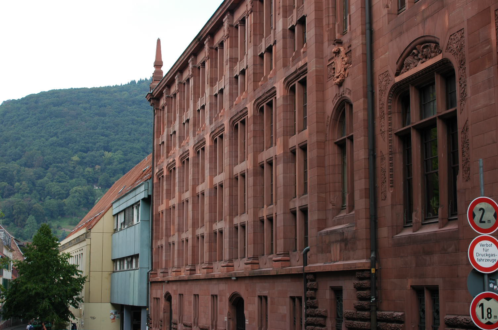
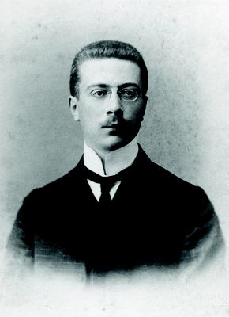

# Математический тур

Автор: Габриэла Дёрфлингер, 2017

Эта экскурсия проведет вас по домам и рабочим местам многих знаменитых математиков, живших в Гейдельберге. Большинство из них были преподавателями или студентами Гейдельбергского университета. Основное внимание уделяется периоду около 1870 года - расцвету естественных наук в Гейдельберге.

Самым важным человеком для математики в эту эпоху был Лео Кенигсбергер (1837-1921), который работал в Гейдельберге с 1869 по 1875 год, а затем с 1884 года и до самой смерти. Его автобиография, которая в расширенном виде доступна на Гейдельбергском сервере документов [HeiDOK](http://www.ub.uni-heidelberg.de/archiv/19762) с 2015 года, содержит много информации об академической жизни в Гейдельберге в этот период.

Кроме того, рассказывается о примечательных зданиях - Гейдельберг является городом, для которого характерна эпоха барокко. Описание зданий, как правило, взято из книги Бернда Мюллера "Архитектурный путеводитель Гейдельберга: Здания 1000-2000 годов"

Экскурсия проходит по маршруту:
- Университетская библиотека - Улица Ингрима - Карлсплац
- Карлсплац - Марктплац - Старый Мост - Улица Трёх Волхвов - Университетская площадь
- Университетская площадь - Главная Улица - Мартовский переулок - Аллея Эберта - Площадь Бисмарка
- Площадь Бисмарка - Главная Улица - Friedrichsbau - Stadthalle

Если не указано иное, фотографии в этом томе взяты из коллекции автора. Большинство фотографий были сделаны ее мужем Хельмутом Дёрфлингером.

## A1. Университетская Библиотека

Plöck 107-109

Экскурсия начинается в университетской библиотеке. Библиотека располагается в здании, построенном по проекту Йозефа Дурма 1905 года. В декоре исторического здания присутствуют элементы модерна (Jugendstil). Хотя здание планировалось как библиотека, уже через несколько лет после его постройки библиотекари жаловались на недостатки функциональности.

Карл Цангемайстер (1837-1902), директор библиотеки и профессор классической филологии на протяжении многих лет, был движущей силой строительства нового здания библиотеки, до завершения которого он не дожил. В 1887 году он написал для Берлинской академии наук математико-историческую статью под названием «Происхождение римских цифр». В ней он объяснил, что римские цифры до 1000 были изобретены независимо от греческого алфавита, и признал, что закон образования - основанный на числовых линиях - заключается в пересечении каждого числа с другой линией. 

Римскую цифру десять (X) он рассматривал как числовую линию с линией пересечения, а римскую цифру пять (V) - как уменьшенную вдвое римскую цифру десять.

Цифровое издание статьи Цангемайстера можно найти [тут](http://www.ub.uni-heidelberg.de/archiv/12977)

*Карл Цангемайстер | титульный лист*

## A2. Песчаный Переулок

Sandgasse - одна из типичных кривых улиц в старом центре города. Улица осталась неизменной со времен Средневековья.

*Барочные фрамуги на Сандгассе*

На дверях барочных домов в Гейдельберге часто можно встретить световые люки. Вот пример из Сандгассе. Дверная рама представляет собой гейдельбергское *засечное окно*. Этот тип обрамления использовался различными мастерами-строителями в первой половине XVIII века.

*Университетская библиотека и триплекс*

Старые дома на восточной стороне Сандгассе, некоторые из которых относятся к эпохе барокко, были снесены для строительства трехэтажного здания в 1974 году.

На участке городской карты 1903 года показана более ранняя ситуация: церковь Святого Петра (№ 34), университетская библиотека (№ 116), которая еще строилась, и начальная школа (№ 45) в южном конце Сандгассе.

Дом № 9, расположенный в двух домах к северу от библиотеки, отмечен темно-красным цветом. Его расположение соответствует расположению желтого здания в трехэтажном доме на фотографии.

*Stadtplan 1903*

*Stadtplan 2025*

Гейдельбергский математик Георг Ландсберг (1865-1912) жил здесь с 1897 по 1901 г. Он приехал из Бреслау, где также учился и получил докторскую степень в 1890 г. с диссертацией [«Untersuchungen uber die Theorie der Ideale»](https://archiv.ub.uni-heidelberg.de/volltextserver/12723/). В 1893 году он поселился в Гейдельберге и был высоко оценен Лео Кенигсбергером. В 1904 году он последовал призыву в Бреслау, а в 1907 году переехал в Киль. Его сферой деятельности была теория функций.

Эрнст Хеллингер (1883-1950) также жил на Sandgasse 9 в качестве студента в летнем семестре 1902 года. Гейдельберг был очень популярен в качестве летнего университета; в летнем семестре студентов регулярно было больше, чем в зимнем. Эрнст Хеллингер, например, провел в Гейдельберге только лето 1902 года. Вместе с ним приехал его друг Макс Борн (1882-1970), который жил на Neue Schloßtraße 26. В биографической справке к своей диссертации Борн рассказал о своем пребывании в Гейдельберге: «На втором году обучения в Гейдельберге я в основном посещал лекции Лео Кенигсбергера по дифференциальной геометрии, которые не претендовали на строгость, но представляли огромную область с практическими и ясными методами».

Как и Ландсберг, Хеллингер был родом из Силезии. Он защитил докторскую диссертацию под руководством Давида Гильберта в Геттингене в 1907 году, а затем был переведен во Франкфуртский университет, когда тот был основан в 1914 году. Хеллингер работал над интегральными уравнениями.

## A3. Plöck 68

Прямо напротив библиотеки находится дом конституционного юриста швейцарского происхождения Иоганна Каспара Блюнчли (1808-1881), который был важным человеком и «политиком университета» в эпоху Кенигсбергера. Блюнчли был активным членом гейдельбергской масонской ложи Ruprecht zu den funf Rosen и вел ожесточенную борьбу против политического католицизма, лояльного Риму.

*Портрет Блюнчли на его могиле*

Архитектором был его сын Альфред Фридрих Блюнчли (1848-1930), ученик Готфрида Земпера, который в основном строил в Цюрихе. 

Дом был построен в 1868/69 годах в стиле загородного дома, популярного в XIX веке (треугольный фронтон и балкон в центре). Деревянный фронтон на южной стороне был специально спроектирован в швейцарском стиле.

С 1931 года домом владеет Ассоциация немецких студентов, основанная в 1883 году.

Философ Карл Ясперс жил в соседнем доме с 1923 по 1948 год.

